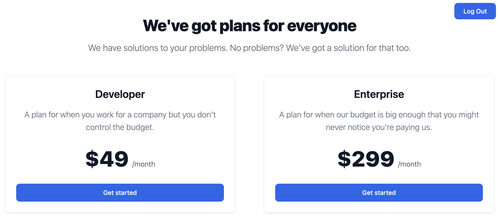
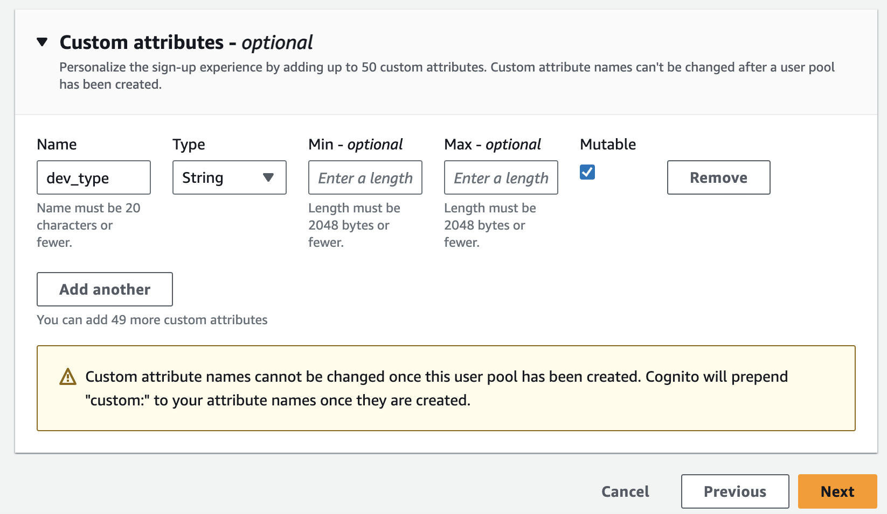
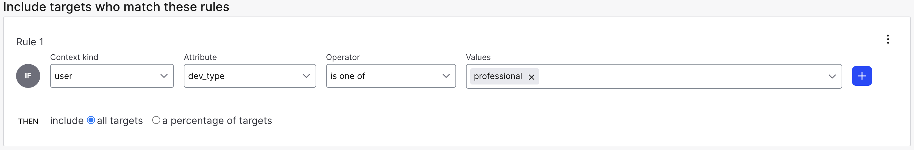
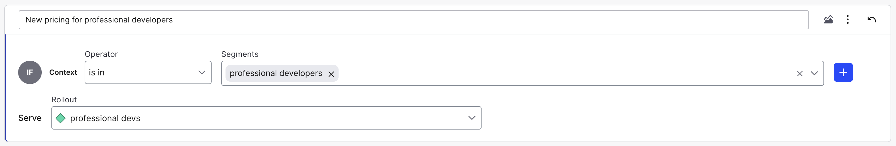
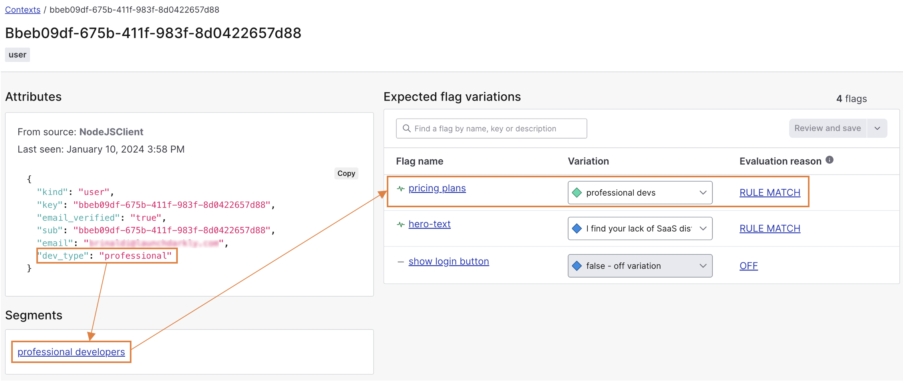

# Targeted Experiences with LaunchDarkly and Amazon Cognito

Targeting is one of the most powerful aspects of using a feature management service like LaunchDarkly, especially when compared to the typical capabilities of a homegrown feature flag solution. The ability to offer different experiences based upon the context (i.e. current user, environment, geolocation, etc.) opens up a ton of possibilities.

> Don't know much about targeting with LaunchDarkly yet? Check out [my beginner's guide](https://launchdarkly.com/blog/beginners-guide-to-targeting-with-feature-flags/)

One of the most common ways to use targeting is user targeting, where user profile data is passed to LaunchDarkly in a user context and this data is subsequently used to create segments and rules that impact which flag variations that LaunchDarkly will serve them. In many cases, this user profile data exists within an identity and authentication service.

[Amazon Cognito](https://aws.amazon.com/cognito/) is a popular choice for authentication for anyone within the AWS ecosystem. It offers APIs that make it easier to implement the full scope of identity and authentication within your apps and it is, of course, integrated with the full suite of AWS offerings. In this tutorial, we'll demonstrate how to implement user targeting in an application built with Cognito and LaunchDarkly.

## Exploring the Example Application

We're going to explore a sample application I have built that implements identity and authentication via Amazon Cognito and uses the data passed back from Cognito to create customized experiences for individual users depending on the type of developer they identified as during the registration process (the options are "hobbyist" or "professional"). The example code can be found [on GitHub](https://github.com/remotesynth/launchdarkly-cognito).

This is an intentionally simple application with only a handful of pages:

* A home page that displays different hero text depending upon whether the user is a "hobbyist" or "professional".
* A pricing page that displays different pricing plans depending upon  whether the user is a "hobbyist" or "professional".
* A sign up page for registering a new user.
* A login page for logging in an existing user.



The application itself is full-stack JavaScript built using a combination of client-side rendering integrated with the [LaunchDarkly JavaScript client SDK](https://docs.launchdarkly.com/sdk/client-side/javascript) and server-side rendering using the [LaunchDarkly Node.js SDK (server-side)](https://docs.launchdarkly.com/sdk/server-side/node-js). It is built using the [Astro framework](https://astro.build) and uses the [Amazon Cognito Identity SDK for JavaScript](https://www.npmjs.com/package/amazon-cognito-identity-js) that is part of AWS Amplify.

With all that being said, you can apply the same general principles to integrate Cognito with LaunchDarkly using whatever language, tools and technologies you choose. Just select the [appropriate SDK](https://launchdarkly.com/features/sdk/).

### The Cognito User Pool

For the purposes of this example, I've kept the Cognito User Pool configuration simple, using email sign up with default password requirements, email verification (sent by Cognito) with no multi-factor authentication (MFA). While these may not be your configuration settings, none of these aspects should impact the integration and targeting with LaunchDarkly.

In most cases, you won't be targeting by the user's email, so the important part is that Cognito allows you to define up to 50 custom attributes for users. These custom attributes are where you might have information about the user's company, job title, location and more. These types of details can be especially useful for targeting.

The example only has a single custom attribute named `dev_type` that saves whether the user has self-identified as a "hobbyist" or "professional" during registration.



### Passing User Data from Cognito to LaunchDarkly

The user attributes data that is passed back from Cognito to the application comes in the form of an array of custom attributes objects with name and value keys as seen below.

```json
[
    {
        "Name": "sub",
        "Value": "bbeb08df-674b-411f-983f-8d0422657d89"
    },
    {
        "Name": "email_verified",
        "Value": "true"
    },
    {
        "Name": "custom:dev_type",
        "Value": "professional"
    },
    {
        "Name": "email",
        "Value": "foo@bar.com"
    }
]
```

However a LaunchDarkly user context object with similar attributes would look like the following:

```json
{
  "kind": "user",
  "key": "bbeb08df-674b-411f-983f-8d0422657d89",
  "email": "foo@bar.com",
  "email_verified": true,
  "dev_type": "professional"
}
```

In many cases you may know exactly the attributes that you want to pass back to LaunchDarkly for targeting purposes and you can map the Cognito attributes to the context object accordingly. In fact, you may or may not want to pass personally identifiable information like email (or pass them as [private attributes](https://docs.launchdarkly.com/sdk/features/private-attributes)).

In the example application I chose to simply pass all of the attributes, first by converting the attributes array to an object with keys using a helper method. The helper function also removes the `custom:` prefix from the key name.

```typescript
// Cognito returns attributes in an array but this helper function makes it easier to get them as an object
// while also removing the "custom:" prefix from any custom attribute names
export async function getAttributesAsObject() {
  const attributesArray: Array<any> = (await getAttributes()) as Array<any>;
  const attibutesStruct = attributesArray.reduce((acc, cur) => {
    acc[cur.getName().replace("custom:", "")] = cur.getValue();
    return acc;
  }, {});

  return attibutesStruct;
}
```

Finally, I convert the attributes into a context object using the Cognito user ID as the user's key which identifies them as a unique context within LaunchDarkly. Note that in the case of the user not having an active Cognito session, I pass an [anonymous context](https://docs.launchdarkly.com/home/contexts/anonymous-contexts/).

```javascript
// this converts attributes returned by Cognito
// to an object that can be easily passed to LaunchDarkly
const attributes = await getAttributesAsObject();
const context = {
  kind: "user",
  key: attributes.sub,
  ...attributes,
};
```

Depending on whether this context is being used on the client side or server side, contexts are passed to LaunchDarkly slightly differently. On the client side, the context is defined when the SDK client is initialized. So in the case that a user is creating an account or logging in, I call the `identify()` method to update the current context.

```javascript
client.identify(context);
```

For server side, the context is passed in with each `variation()` call to get the value of a flag for that context.

```javascript
const heroText = await client.variation("hero-text", context, "");
```

## Setting Up LaunchDarkly Targeting Rules

From a code standpoint, everything is set, but, in order for the targeting to work, there needs to be rules within LaunchDarkly to determine when to show specific variations to Cognito users depending on their attributes. Thankfully, this is incredibly straightforward to set up.

The optimal way to set up targeting is by using segments. This allows you to define the rules in a single place and then use the segment to target across multiple flags. Since this is a simplified example, I created a single segment for "Professional Developers" with a single rule to look for user contexts with a `dev_type` of `professional`.



In a more complex application, I might have any number of segments and I might combine rules to create more refined logic for determining who is in the segment.

Now that the segment is defined, I can apply a segment rule to any relevant flags that says that anyone in this segment gets served the appropriate flag variation.



## Tying It All Together

Now if I run my application, I can see that it picks up new contexts, receives the user data passed from the Amazon Cognito user attributes, uses those to assign them to the correct segment and finally targets my plan pricing flag with the correct variation. You can see the complete details about a context, its assigned segments and the variations it is served via the [contexts list](https://docs.launchdarkly.com/home/contexts/contexts-list) in the LaunchDarkly dashboard.



While this example is simple, using the same principle laid out here, you could enable members of your organization to get new features still being tested, enable a group of beta access users to get advance access to upcoming features for feedback, create complex entitlements for your SaaS application and so much more.
