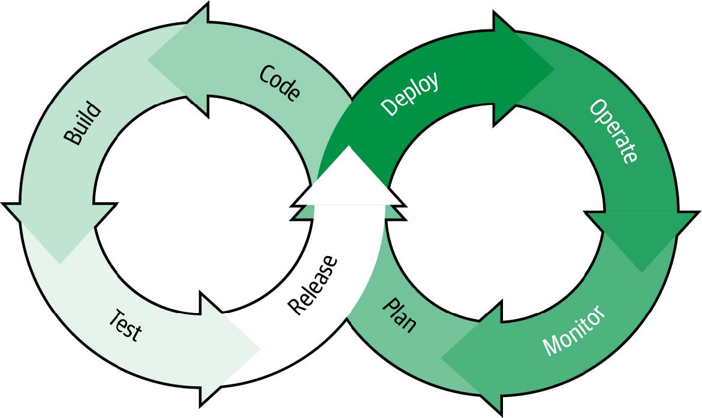
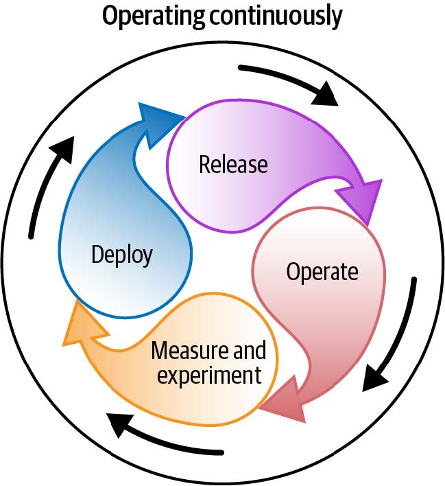

# Just Ship It: 5 Best Practices to Ship Fast Without Compromises

A number of years ago, I worked for a large financial company as a software developer. Our projects followed a common path on their way to production. First, the project would be scoped out by a project manager. Then the engineering team would build the software, which could take weeks to months depending on the project. Once QA testing was done, we'd release to production, which would be scheduled for a couple hours on a Saturday morning. But problems frequently arose that caused it to take the entire weekend, with teams working feverishly (even overnight) to complete the release before Monday. If this failed, the entire thing would be rolled back and the process repeated on another weekend.

I think we can agree that things have improved since then, but that doesn't mean that there isn't potentially room for improvement. In this post, I'll look at some best practices for shipping and releasing software – without ruining your weekends!

## 1. Operate Continuously

> "What if the real problem is that the step-by-step model that the DevOps infinity loop represents has become outdated?""
> _Edith Harbaugh, LaunchDarkly Founder, [Operating Continuously](https://www.oreilly.com/library/view/operating-continuously/9781098117283/)_

Part of what's driven the improvements in software delivery from the days that I describe in the introduction is the adoption of continuous integration/continuous delivery (CI/CD) tools and the methodology of DevOps. Many companies have moved towards a process that is illustrated by the DevOps infinity loop.

Despite being a decade old, it is still a useful model, but it is a step-by-step process wherein the next step (for example, deploy) only happens after the prior step (release). As we outline in our recent book, [Operating Continuously](https://www.oreilly.com/library/view/operating-continuously/9781098117283/), companies today rarely function with this kind of sequential handoff because it can slow down iterations and inhibit their ability to move quickly.

An updated model could look like the one outlined in the image below, where all the steps operate in parallel. For example, [trunk-based development](https://launchdarkly.com/blog/git-branching-strategies-vs-trunk-based-development/) allows your development team to deploy code continuously, even multiple times a day, but, using feature flags, these changes may not yet be released or may only be released to select segments. In this scenario, deploying and releasing are occurring simultaneously and just because code is deployed to production doesn't mean it is released.

There's much more to the idea of operating continuously than I can reasonably cover in this post, but you can grab a [copy of the book here](https://learn.launchdarkly.com/operating-continuously/) for a detailed guide on how to implement it at your organization.

## 2. Test in Production

> "Software and cathedrals are much the same; first we build them, then we pray."
> _Anonymous_

Going back to my experience at that large financial company, one of the most common causes of release failures was some component of that release that worked fine in our QA environment, but failed in production. In the traditional model, exemplified by the above quote, there was no way to truly predict production issues until the application was deployed. While tooling has improved to where companies can more reliably replicate their production environments for testing, differences between environments will most likely always exist and those differences can cause unforseen issues.

However, as we discussed in the above section, deployed does not need to mean released. Using feature flags, we may have code in production that isn't released publicly. These same feature flags allow us to selectively enable features, even allowing our development and QA teams to test these features live in the actual production environment, without exposing them to the public.

An example scenario might start by limiting access to a feature in production to the development team actively building it. This allows them to get away from a "works on my machine" mentality by quickly moving from testing locally to testing in a real production environment. Once the feature is ready to be reviewed, the audience could expand to include the QA team and then perhaps even a broader group of internal users. Finally, we can use a progressive or [percentage-based rollout](https://launchdarkly.com/blog/how-percentage-rollouts-minimize-deployment-risks/) to ensure that the feature rolls out smoothly as it scales to the full audience.

Creating a release process like this is even easier using LaunchDarkly's new [Release Assistant](https://docs.launchdarkly.com/home/release-pipelines), which lets you create reusable release pipelines for features. The beauty of using feature flags for this process is that, if at any point in this process there is a problem with the feature, we can safely turn the feature off without a redeploy or rollback. You get all the benefits of testing in production, without the risk.

## 3. Gather Early Feedback

> "Strive for continuous improvement, instead of perfection."
> _Kim Collins_

As you saw in the prior section, shipping fast isn't just about increasing the velocity of commits and deploys, but also about getting early validation of features. This shouldn't just come from our software and QA engineers but from actual external users. Shipping fast isn't going to improve your business if you aren't shipping the right features.

One way to gather early feedback is through things like beta programs, where you have a segment of early access users that you can rely on to try new features and share feedback. These are typically active members of your customers and/or community who've been selected for early access to a specific relevant beta feature or who have been given general access to an ongoing beta program that opens up a range of beta features on an ongoing basis. The best part is that, when managed properly, these programs give you the benefit of early validation of a feature while also giving the customer/user a sense of special access and influence. It's a win-win.

If you're looking for a more data-driven and objective way of gathering early feedback, then use [experimentation](https://launchdarkly.com/solutions/experimentation-and-feature-management/) or A/B testing. This lets you put different feature variations in front of actual users and let the data determine which is the right feature.

It's worth pointing out that a common misperception is that experimentation applies only the the front-end content or UI features. Experimentation works for the server side as well (at least using LaunchDarkly). For example, an experiment might try to determine if new API functionality is actually providing a benefit to end users of the application.

Finally, you may wonder how adding a process for gathering feedback actually increases velocity. This is because it ensures that the feature meets the needs and expectations of our users as we iterate as opposed to waiting for a big bang release only to find yourself continually going back to the drawing board post-release to get it right.

## 4. Reduce the Risk

> "[A]s we know, there are known knowns; there are things we know we know. We also know there are known unknowns; that is to say we know there are some things we do not know. But there are also unknown unknowns—the ones we don't know we don't know. And if one looks throughout the history of our country and other free countries, it is the latter category that tends to be the difficult ones."

This is a famous (and controversial) quote from Donald Rumsfeld when he was Secretary of Defense that I think, controversy aside, applies to any release. Essentially, even careful planning of any release has risk. There's the risk that we misidentified the "known unknowns" and then there are the "unknown unknowns", which we cannot plan for. So there is no way to eliminate risk, but you can mitigate it.

Clearly, feature flags can assist with this. Being able to flip a kill switch and have a misbehaving feature disabled within milliseconds, without rollbacks or redeploys, can save you a lot of pain. But there's a lot more to it than just flagging everything. It's also about how you set up your observability tooling and knowing which metrics to watch out for. And it's about setting up the right processes for handling an incident when it occurs and evaluating and improving your response once the issue is resolved.

In "Operating Continuously", we identified four characteristics of a healthy incident response that can help reduce the impact of any incident while also continuously improving your identification and response to any future incidents:

> * **Self-identification** – Your team aims to uncover incidents before your customers discover them.
> **Continuous improvement** – Incidents inform areas for continuous improvement.
> **Runbook operability** – Any engineer can map the problem to a runbook and execute the plans.
> **High volume, low impact** – Incident frequency may potentially be high, but incident severity should remain low.

## 5. Communicate and Collaborate

> "Usually the things that make or break a project are process and people issues. The way that you work on a day-to-day basis. Who your architects are, who your managers are, and who you are working with on the programming team. How you communicate, and most importantly how you solve process and people problems when they come up. The fastest way to get stuck is to think that it's all about the technology and to believe that you can ram your way through the other things. Those other things are the most likely ones to stop you cold."
> _Bruce Eckel, [The Mythical 5%](https://www.artima.com/weblogs/viewpost.jsp?thread=221622)_

One of the things the prior section makes clear is that, while software and tools are important, ultimately the way to improve your release processes is about people. Even more than that, it's about how people across the company communicate. For example, are they able to problem solve in a collaborative environment? Are they empowered to bring up potential issues or incidents without fear? Or does the team foster a culture of blame that discourages communication and problem solving?

Sure, there are software tools that can enable communication and collaboration, but they can't solve it. Shipping faster only makes communication all the more critical. As we discussed earlier, if all the steps of DevOps infinity loop now operate in parallel, breaking down silos and enabling cross-team communication and collaboration is all the more critical.

So, yes, use platforms and tools for feature management, experimentation, observability and more to improve your ship and release processes, but don't lose sight of the fact that it is your people – your team – who will ultimately determine whether you are successful.
