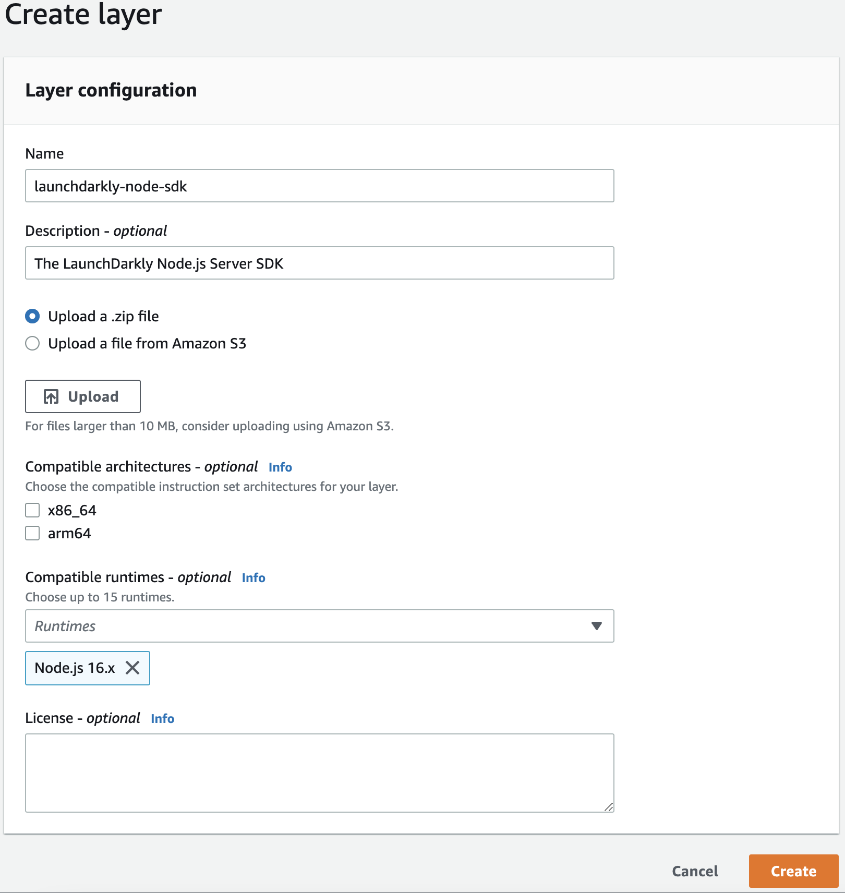
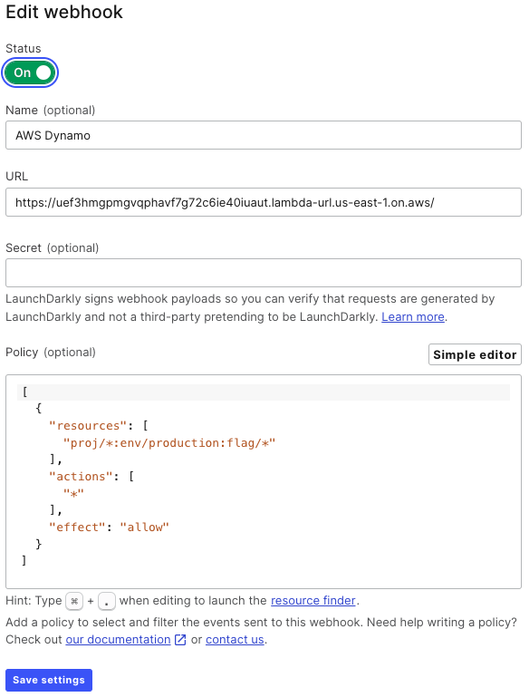

# Using LaunchDarkly in a Serverless Environment

As more and more companies have moved to the cloud, serverless and microservices have increasingly become a key piece of application architecture for a variety of application types – web, desktop, APIs, IoT, games and more.  In fact, Datadog's [State of Serverless](https://www.datadoghq.com/state-of-serverless/) report for 2022 found that more than half of customers on each cloud provider have adopted serverless, including over 70% of AWS customers.

As your team broadens their usage of feature flags across your organization, adding LaunchDarkly to your serverless functions will be critical. The good news is that integrating LaunchDarkly in serverless code is straightforward. In this chapter, we'll discuss:

* How to handle the basics of integrating the LaunchDarkly SDK into serverless functions.
* How to use LaunchDarkly within full-stack frameworks that include automatic serverless deployments.
* How to integrate data stores to get the latest flag data in a function without needing to make external calls.
* Some things you need to consider that are unique working with LaunchDarkly in a serverless context.
* How you can use flags within serverless functions that exist on the edge (i.e. deployed to a CDN).

## Integrating the SDK in a Serverless Function

Similar to integrating LaunchDarkly within any application, the first step is to find the appropriate [SDK](https://docs.launchdarkly.com/sdk). In the case of serverless, this depends heavily upon which language environments your cloud provider supports.  JavaScript/Node support is near universal and is often the most popular choice but Python is also a popular option.

> **About the Examples**
> 
> For this chapter, we'll stick with JavaScript examples as they will almost universally across all providers. If you are using a different language, be sure to check the appropriate documentation for that SDK. In most cases, few, if any, changes are required for SDK client initalization and flag evaluation in a serverless context.
> 
> Additionally, the example will all be formatted for AWS Lambda. This is because Lambda continues to have the lion's share of the serverless market. Based upon data from  the CNCF [State of Cloud Native Development](https://www.cncf.io/wp-content/uploads/2021/12/Q1-2021-State-of-Cloud-Native-development-FINAL.pdf) in January 2022, "AWS Lambda continues to be the most popular serverless solution, with 53% of serverless developers using it." However, many of the code samples and principles remain similar on other providers.

### Installing the appropriate SDK

In general, installation of the SDK will work effectively the same in a serverless environment as a non-serverless environment. Follow the documentation for the appropriate [SDK](https://docs.launchdarkly.com/sdk) for the language you are deploying.

For example, if you are creating a Lambda on AWS using the Node.js runtime, you can still use npm to install the SDK for your Lambda.

```bash
npm install launchdarkly-node-server-sdk
```

One thing to keep in mind is that each function is a self-contained environment, so this will need to be installed individually on every function. For some cloud providers, this is sufficient as dependencies are automatically installed for you. For example, when developing functions in JavaScript, Google Cloud and Azure will automatically install npm dependencies if they are specified in the `package.json`.

In other cases such as AWS, for example, you will also need to ensure that the installed dependencies (in this case `npm_modules`) are deployed with your code. Another option is to upload dependencies in a format that is shareable across multiple functions. For example, if you are developing using Python or Java in Azure, you could [upload dependecies to Azure Files](https://learn.microsoft.com/en-us/azure/azure-functions/bring-dependency-to-functions?pivots=programming-language-python).

#### Using a Lambda Layer

If you are using AWS, you can easily add common dependencies like the LaunchDarkly SDK to a [Lambda Layer](https://docs.aws.amazon.com/lambda/latest/dg/configuration-layers.html). Here's how to do it for the Node.js runtime:

1. Create a local folder and, within that folder, create a `nodejs` subdirectory. If you are using a different language runtime,  you can find the relevant [location for dependencies here](https://docs.aws.amazon.com/lambda/latest/dg/configuration-layers.html#configuration-layers-path).
2. Within the `nodejs` directory, run `npm install launchdarkly-node-server-sdk`.
3. Compress the contents of your layer directory (i.e. the `nodejs` directory) but not the containing directory. For example, if the path to the project and `nodejs` folder is `/layer/nodejs`, ensure your zip does not contain the outer `/layer` directory.
3. Go to the [Layers page](https://console.aws.amazon.com/lambda/home#/layers) within the AWS Lambda console and click "Create layer".
4. Give the layer a name. For example, `launchdarkly-node-sdk` and choose appropriate Node runtime. Finally, upload the zip file containing your layer.



Now that you have the layer set up, it's relatively easy to use in any Lambda function that requires the LaunchDarkly SDK.

1. In the AWS Lambda console, open the function that you want to add the layer to and scoll down to the Layers section at the bottom of the page. Choose "Add a layer".
2. Select the "Custom layers" option and then, from the dropdown, choose your "launchdarkly-node-sdk" layer. Click "Add".

Using a Lambda Layer ensures that the dependency exists for your function without the need to install and upload it for every new function.

### Inititalizing the SDK and getting flag variations

Once you have installed the dependecy, there is typically no need to change the way you initialize the LaunchDarkly SDK for serverless.

```javascript
const LaunchDarkly = require('launchdarkly-node-server-sdk')
const client = LaunchDarkly.init(process.env.LAUNCHDARKLY_SDK_KEY)
```

One important consideration when initializing is to be sure that the initialization is placed in a location within the code that will not rerun when the function is still warm. Initialization should be performed on a cold start of a function, but, to improve performance, it does not need to be rerun each time the function.

For example, a typical Lambda function runs the code inside the handler on every invocation, so placing the initialization outside the handler will ensure that it is not rerun.

```javascript
// this code will only be run on a cold start
const LaunchDarkly = require("launchdarkly-node-server-sdk");
const client = LaunchDarkly.init(process.env.LAUNCHDARKLY_SDK_KEY);

exports.handler = async (event) => {
  // this code will be run on every invocation
};
```

However, flag evaluations should occur in a place that is run on every invocation to be sure that you are working with the most up-to-date flag values. In this case, that would be within the handler. It is also important to verify that the client initialization has run successfully before evaluating flags.

```javascript
exports.handler = async (event) => {
  // this code will be run on every invocation
  await client.waitForInitialization();
  const flagValue = await client.variation("my-flag", { key: "context-key-123abc" });
};
```

## Using LaunchDarkly in full stack web frameworks

There are many "full stack web frameworks" for web development that will automatically deploy serverless functions for you as part of a web application project when deployed to a host that supports it. A popular example is [Next.js](https://nextjs.org/), which will automatically deploy serverless functions for things like server rendering, API routes and more. In most cases, you can LaunchDarkly's existing SDK support to integrate into a full-stack web framework.

It's important to consider where the flag is going to be evaluated. In most cases, full-stack frameworks will mix front-end and back-end JavaScript code into the same file. For example, in Next.js, a page file can contain client-side code that will run in the browser and server-side code within functions like `getServerSideProps` that will run on the server. The latter case will deploy to a serverless function that will be used for server-side rendering.

If your code will run in the browser, you'll want to use one of the JavaScript client-side SDKs like the [JavaScript SDK](https://docs.launchdarkly.com/sdk/client-side/javascript), the [React SDK](https://docs.launchdarkly.com/sdk/client-side/react), the [Vue SDK](https://docs.launchdarkly.com/sdk/client-side/vue) or the [Node.js client-side SDK](https://docs.launchdarkly.com/sdk/client-side/node-js). However, these SDKs will not work for code that runs on the server. In these cases, you'll want to use the [Node.js server-side SDK](https://docs.launchdarkly.com/sdk/server-side/node-js). In some cases, this may mean that your page imports two SDKs if it is evaluating flags both server-side and client-side.


Let's look at a quick example using Next.js. The first thing you'd need to do is install the server SDK into the project:

```bash
npm install launchdarkly-node-server-sdk
```

If you're using the SDK on a page within a Next.js project, you'll need to import the SDK and then initialize it and wait for the intialization to complete before evaluating a flag as in the example below which uses a flag to determine which category to load from an API of blog posts.

```javascript
export async function getServerSideProps() {
  const client = LaunchDarkly.init(process.env.LAUNCHDARKLY_SDK_KEY);
  await client.waitForInitialization();
  let featuredCategory = await client.variation(
    "featured-category",
    { key: "context-key-123abc" },
    false
  );

  const response = await fetch(
    `https://dev.to/api/articles?tag=${featuredCategory}&page=1&per_page=5`
  );
  const data = await response.json();
  return {
    props: {
      featuredCategory: featuredCategory,
      posts: data,
    },
  };
}
```

It would be preferable not to initialize LaunchDarkly on every single file within the application where you'd like to use a flag. Our [Next.js guide](https://docs.launchdarkly.com/guides/infrastructure/nextjs) shows you how to create a shared component that handles the initialization in a single file.

## Using Data Stores

LaunchDarkly does a lot of things to make retrieving flag values incredibly fast, including [delivering flags from the edge](https://launchdarkly.com/blog/flag-delivery-at-edge/), caching flag data locally and streaming updates. This means that getting the SDK client initialized and retrieving flag data takes under 25 milliseconds.

However, using a data store can help speed up the process by allowing you to get the latest flag data without ever needing to make an external call outside of your serverless provider's infrastructure. LaunchDarkly's SDKs support the use of [persistent data stores](https://docs.launchdarkly.com/sdk/concepts/data-stores/?q=data+store) out of the box such as Consul, DynamoDB and Redis.

### Using LaunchDarkly with DynamoDB

As an example, let's look at using DynamoDB on AWS as a persistent data store for LaunchDarkly. The following example uses a function to synchronize flag data to a DyanmoDB data store upon any change and then uses the DynamoDB data store as the source of truth for flag data. 

First, you'll need to add the [DynamoDB](https://docs.launchdarkly.com/sdk/features/storing-data/dynamodb?q=dynamo) extension for the language you are building your Lambda in. For Node.js, that would mean installing the add-on via npm (`npm install launchdarkly-node-server-sdk-dynamodb`) or adding it to your Lambda Layer as discussed earlier in this chapter.

Next, create a new Lambda function to write to the DynamoDB table. You'll need to ensure that the function has the correct permissions to perform this action. Use the below function code, which only requires an environment variable named `DYNAMODB_TABLE` that contains the name of the DynamoDB table that values will be written to. Also, ensure that you have enabled a function URL for your Lambda.

```javascript
// The LaunchDarkly Node Server SDK
const LaunchDarkly = require("launchdarkly-node-server-sdk");
// The SDK add-on for DynamoDB support
const {
  DynamoDBFeatureStore,
} = require("launchdarkly-node-server-sdk-dynamodb");

exports.handler = (event, context, callback) => {
  setTimeout(() => {
    // You'll need an environment variable containing the DynamoDB table name
    const store = DynamoDBFeatureStore(process.env.DYNAMODB_TABLE, {
      cacheTTL: 30,
    });

    var ldConfig = {
      featureStore: store,
    };
    // initialize the LaunchDarkly client with the feature store
    var client = LaunchDarkly.init(process.env.LAUNCHDARKLY_SDK_KEY, ldConfig);

    // the connected DynamoDB key store will automatically updated with flag values
    client.once("ready", () => {
      client.close();
      callback(null, "store updated");
    });
  }, 2000); // initialize after some delay to ensure that LD caches have been purged
};

```

All this function does is initialize the client, which, when a data store is configured, will automatically trigger the current flag data from LaunchDarkly to get written into the data store. In order to trigger the function to synchronize the data, we're going to use a web hook integration in LaunchDarkly. All you'll need is the function URL for the Lambda function you created. Then, within the LaunchDarkly dashboard, go to integrations, search for web hooks and click the button to add a new webhook integration.

Your integration should look something like the following (note that I am using the advanced editor for th e policy to make it easier to read here).



The exact policy you need depends on which project, environment and flags that you want to trigger the synchronization process. Be sure to check your DynamoDB table to ensure that the data has been written and is being synchronized upon flag changes.

Now that we know the data in our DynamoDB table is up-to-date, our Lambda function can use the DynamoDB table as the source of truth for flag data, without ever calling LaunchDarkly's servers. First, initialize the SDK and data store within your Lambda function (the below example is written in JavaScript).

```javascript
const LaunchDarkly = require("launchdarkly-node-server-sdk");
// The SDK add-on for DynamoDB support
const {
  DynamoDBFeatureStore,
} = require("launchdarkly-node-server-sdk-dynamodb");
```

Next, you'll need to create an instance of a store object that can be passed as a configuration option to LaunchDarkly. You'll need the DynamoDB table name, which can be passed as a string or set as an environment variable. You can also specify the [caching behavior](https://github.com/launchdarkly/node-server-sdk-dynamodb#caching-behavior) for the data store if needed.

Within our configuration options, we'll want to specify `useLdd` as true. This will launch the client in [daemon mode](https://docs.launchdarkly.com/sdk/features/relay-proxy-configuration/daemon-mode). What this means is that the client will use DynamoDB as the source of truth for flag data without calling LaunchDarkly.

```javascript
const store = DynamoDBFeatureStore(process.env.DYNAMODB_TABLE);
// useLdd launches the client in daemon mode where flag values come
// from the data store (i.e. dynamodb)
const options = {
	featureStore: store,
	useLdd: true,
};
const client = LaunchDarkly.init(process.env.LAUNCHDARKLY_SDK_KEY, options);
```

From this point on, you can get flag values as normal, but the LaunchDarkly client will only go to DynamoDB.  It's worth noting that, while the function to synchronize data will work, there's a potentially better solution depending on your needs in our [Relay Proxy.](https://launchdarkly.com/blog/how-we-use-relay-proxy) For a full exploration on how to set up a Relay Proxy for AWS specifically, read [Using LaunchDarkly in AWS Serverless](https://launchdarkly.com/blog/using-launchdarkly-in-aws-serverless/)

## Considerations for Using LaunchDarkly in Serverless

There are a couple of important things to consider when using LaunchDarkly in a serverless environment. Both of these relate to the ephemeral nature of serverless resources. The value of serverless is in how it can scale up and down to meet the demands of your application and in the "pay for only what you use" model. However, this means that a serverless environment may spin up new instances of a function to meet high demand or completely shut down a function that hasn't been used for a period of time.

### Using LaunchDarkly During High Demand

When a function scales up quickly to meet a sudden surge in demand, it may spin up new instances. While LaunchDarkly is designed to initialize extremely fast, even a small amount of latency can add up during high load. In these scenarios, it is better to have your function utlize a persistent data store as the source of truth for your flag data. This will further decrease the initialization time and reduce any latency during function startup under high load.

### Using LaunchDarkly During Low Demand

In addition, during low demand periods, a serverless provider may spin down your function. This can result in analytics events being lost. Anaytics events are what power most of the data about flag usage, users and experimentation within the LaunchDarkly dashboard. By default, LaunchDarkly only sends this data on a periodic basis in order to save bandwidth and reduce external connections. If the function shuts down prior to this data being sent, important information could be lost.

To avoid this scenario, you either need to force flush the analytics events on every invocation or you need to trigger the SDK client to close prior to the function shutting down.

#### Flushing events

To [manually flush analytics events](https://docs.launchdarkly.com/sdk/features/flush) on every invocation, you need to call the `flush` method on the client. The below example shows flushing analytics data after getting flag data within a Lambda.

```javascript
exports.handler = async (event) => {
  await client.waitForInitialization();

  const myFlag = await client.variation("my-flag", {key: "context-key-123abc"}, "");
  
  // flush the analytics events 
  await client.flush();
  
  const response = {
    statusCode: 200,
    body: JSON.stringify("Hello world"),
  };
  return response;
};
```

This works but it also eliminates the buffer entirely, meaning that every function invocation will make an external call to LaunchDarkly to send analytics data. This is not an ideal solution.

### Closing the client

A better solution to ensuring al analytics data is sent to LaunchDarkly is to close the client prior to the function shutting down. When the client closes, it automatically sends any pending analytics events to LaunchDarkly. Many serverless function providers trigger events during the serverless function lifecycle that allow you to perform actions when a function is shutting down, for example. We can use these events to close the client before a function begins its shutdown process.

As an example, let's explore how to use Lambda's [graceful shutdown](https://github.com/aws-samples/graceful-shutdown-with-aws-lambda) to close the SDK client. This requires that you add an extension to your Lambda. You can use the CloudWatch Lambda Insight extension that is built in. Here are the steps:

1. Open your Lambda function and go to the Layers section at the bottom of the page and choose "Add a layer".
2. Leave the "AWS layers" option selected and in the dropdown select "LambdaInsightsExtension" under the "AWS provided" heading and then click "Add".

Now that the extension is added, we can listen for the `SIGTERM` event that indicates that the Lambda is being shut down and run code by adding the following to our Lambda function (not that the `console.info` are not required but can assist in ensuring this process is working properly when viewing logs in CloudWatch).

```javascript
process.on('SIGTERM', async () => {
    console.info('[runtime] SIGTERM received');

    console.info('[runtime] cleaning up');
    await client.close();
    console.info('LaunchDarkly connection closed');
    
    console.info('[runtime] exiting');
    process.exit(0)
});
```

## LaunchDarkly on the Edge

Demand for running serverless on the edge is growing fast and there seem to be new offerings popping up every day. Since one of the primary goals of the edge is to reduce latency, when using something like feature flags, you want your flag data to be as close to the edge as possible to remove any potential latency from retrieving flag data.

LaunchDarkly has begun providing support for serverless edge offerings with the first of these being support for [Cloudflare Workers](https://cfworkers-ld.remotesynth.workers.dev/) via the [Cloudflare Edge SDK](https://docs.launchdarkly.com/sdk/server-side/node-js/cloudflare-edge-sdk) and [Cloudflare integration](https://docs.launchdarkly.com/integrations/cloudflare). The integration works to automatically populate the KV for a Cloudflare Worker with flag data and keep the data synchronized every time a flag is changed. Cloudflare's KV automatically replictes the KV data across their edge nodes. The SDK then uses the configured KV as the source of truth for flag data, meaning that not only is flag data retrieved from the edge, but getting the latest flag values never even has to leave Cloudflare's edge infrastructure, making it incredibly fast.

For more details on how to use LaunchDarkly with Cloudflare Workers, check out [our guide](https://docs.launchdarkly.com/guides/infrastructure/cloudflare-workers).

## Where To Go From Here

Obviously, serverless is a huge topic and this chapter only touched on a portion of it and only a couple of providers. Keep in mind that whether you are using AWS or something else like Azure, Google Cloud or any other provider, the principles shown here remain the same even if the exact syntax of the code may change. Hopefully this chapter gave you the basis you can use to get going.

If you are looking for additional resources to continue your exploration, here are some we recommend:

* [Using LaunchDarkly in serverless environments](https://docs.launchdarkly.com/guides/infrastructure/serverless/) (Guide)
* [Using LaunchDarkly with AWS Lambda](https://docs.launchdarkly.com/guides/infrastructure/aws-lambda/) (Guide)
* [Using LaunchDarkly with Cloudflare Workers](https://docs.launchdarkly.com/guides/infrastructure/cloudflare-workers/) (Guide)
* [Using LaunchDarkly in AWS Serverless](https://launchdarkly.com/blog/using-launchdarkly-in-aws-serverless/) (blog post)
* [Handling Data at the Edge with Cloudflare Workers](https://launchdarkly.com/blog/handling-data-at-the-edge-with-cloudflare-workers/)