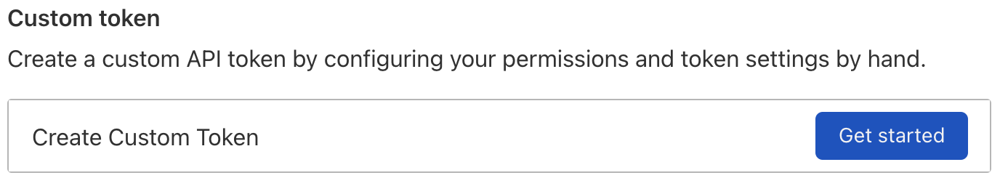
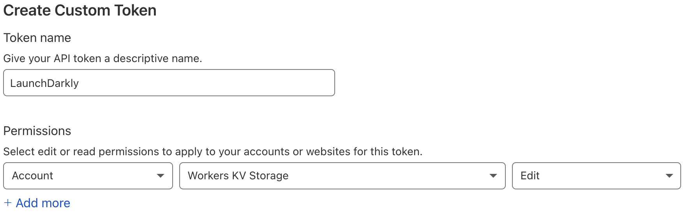
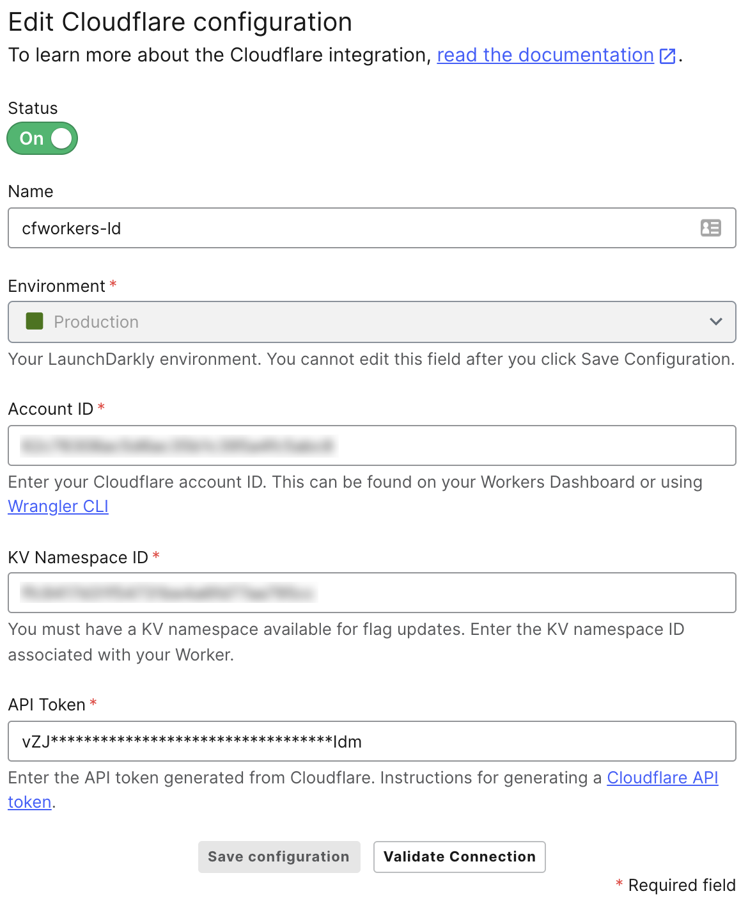

# Using the LaunchDarkly EdgeSDK with CloudFlare

Playground: https://cloudflareworkers.com/

Examples: https://developers.cloudflare.com/workers/examples

https://www.smashingmagazine.com/2019/04/cloudflare-workers-serverless/

## Getting set up

For this guide, we've created a sample CloudFlare Workers project that demonstrates several uses of flags within a Worker. You can find the finished code [on GitHub](https://github.com/remotesynth/cfworkers-ld). You can use this code as reference as you work through steps in the guide. You can view the finished page running on Cloudflare Workers [here](https://cfworkers-ld.remotesynth.workers.dev/).

If you would like to follow along creating the project in this guide, begin by cloning the site assets [in this repository](https://github.com/remotesynth/cfworkers-ld-assets). In order to compile the site, you'll need to [install Hugo](https://gohugo.io/getting-started/installing/), a static site generator built in Go. The easiest way to install Hugo is using Homebrew on Mac:

```bash
brew install hugo
```

Or via Chocolatey on Windows:

```bash
choco install hugo -confirm
```

### Setting up Cloudflare CLI

The quickest way to get set up is to use [Cloudflare's Worker CLI](https://developers.cloudflare.com/workers/cli-wrangler/install-update) called Wrangler via npm:

```bash
npm install -g @cloudflare/wrangler
```

Or via Yarn:

```bash
yarn global add @cloudflare/wrangler
```

Once it is installed, you'll need to use the `wrangler login` command, which will open a browser window allowing you to log into your Cloudflare account to authenticate the CLI. For additional CLI authentication methods, you can reference the [Wrangler docs](https://developers.cloudflare.com/workers/cli-wrangler/authentication).

### Setting up local development for Cloudflare Workers

This guide uses [Workers Sites](https://developers.cloudflare.com/workers/platform/sites) that allow you to deploy an application buit with a static site generator (SSG) or front end framework to a worker. You can follow the [instructions for starting from an existing project](https://developers.cloudflare.com/workers/platform/sites/start-from-existing) to publish a simple static site built with the [Hugo SSG](https://gohugo.io).

> The Wrangler 2 beta supports a new, streamlined Workers integration with Pages, Cloudflare's solution for deploying sites. However, it does not currently allow for providing a custom Webpack configuration, which is required for LaunchDarkly's Cloudflare Edge SDK.

Open the terminal in the folder containing the site assets from GitHub and enter the following command:

```bash
wrangler init --site my-static-site
```

This should have created a `wrangler.toml` and a `workers-site` directory within the project. Open the `wrangler.toml` and add the following line that tells the worker to find the site files in the `/public` folder, which is where Hugo outputs them by default:

```toml
site = { bucket = "./public" }
```

While we haven't actually created a Worker yet, we can run the site locally using Wrangler. The first step is to build the site using hugo and then run a local server with Wrangler.

```bash
hugo
wrangler dev
```

You should be able to view the site at the URL and port indicated in the console, typically `localhost:8787`.

### Setting up the LaunchDarkly Cloudflare integration

LaunchDarkly's Cloudflare integration synchronizes flag data from a LaunchDarkly project and environment with a KV (key value store) connected to your worker in Cloudflare. This means that the latest flag data is immediately available to the LaunchDarkly client within your worker without the need for additional external calls. This makes it extremely fast.

In order to set up the integration, you'll need a minimum of one KV created to sync values with. To set this up, first make sure that your account ID is in the `wrangler.toml` that was created by the Wrangler CLI. Your account ID is listed on the overview page of the Cloudflare Workers dashboard or you can get it by using `wrangler whoami` from the command line.

```toml
account_id = "<YOUR_CLOUDFLARE_ACCOUNT_ID>"
```

Make note of your account ID as we'll need it to enable LaunchDarkly's Cloudflare integration.

Next, create a new KV names space by entering the following command, ensure you are working in your project folder:

```bash
wrangler kv:namespace create "MY_KV"
```

The namespace name will be a combination of the namespace name you provided (`MY_KV`) and the project name. For example, if my project was named `cfworkers-ld`, the name of the created namespace will be `cfworkers-ld-MY_KV`. When the namespace has been created, Wrangler will return the namespace ID of the new KV namespace.

Open `wrangler.toml` and add the namespace ID to the `kv_namespaces` configuration. If this configuration key does not exist yet, create it. If it does exist with the KV namespaces created for your site assets, add the namespace to the array of namespaces.

```toml
kv_namespaces = [
  { binding = "MY_KV", id = "<NAMESPACE_ID>" },
  { binding = "SITE_ASSETS", preview_id = "43ecd3c7d05f45caa947fb48fd7b7c83", id = "a0a8f76d2fe14947826adc1453c2e90c" },
]
```

Make note of the namespace ID as we'll need it to enable LaunchDarkly's Cloudflare integration.

> If you plan to use the [Cloudflare Workers preview service](https://cloudflareworkers.com/), you will need to create a preview namespace as well. Follow the steps in the [Cloudflare integration docs](https://docs.launchdarkly.com/integrations/cloudflare#creating-a-cloudflare-worker-with-the-launchdarkly-cloudflare-edge-sdk) to set this up.

The last piece of information we'll need to enable Cloudflare integration is a Cloudflare API token. From the Workers overview page in the Cloudflare dashboard, under "Get started" on the right hand navigation links, click the [API tokens](https://dash.cloudflare.com/profile/api-tokens) link. Then press the "Create Token" button.

Next, click the "Get started" button next to the "Create custom token" option.



Give the token a name (for example, "LaunchDarkly") and then under "Permissions" choose the following options from the dropdowns:

1. Account
2. Workers KV Storage
3. Edit



Click the "Continue to Summary" button and then "Create Token". Copy the token from the subsequent page and make note of it will not be shown again.

> Detailed instructions on creating a token can be found in the [Cloudflare docs](https://developers.cloudflare.com/api/tokens/create).

Next you need to set up the integration within the LaunchDarkly dashboard. Go to the [Integrations page](https://app.launchdarkly.com/default/integrations/) and search for Cloudflare. Click the "Add integration" button, which will bring up a form requesting the following details:

* **Name** – This is optional but is useful for determining which Worker namespace this is connected to when you have multiple connections.
* **Environment** – Which LaunchDarkly environment will be used when syncing flags and values with the KV on Cloudflare.
* **Account ID** – Your Cloudflare account ID.
* **KV Namespace ID** – The namespace ID for the KV connected to your worker. Note that if you also created a preview KV, you'll need a separate integration set up using the preview KV namespace ID as well.
* **API token** – The Cloudflare API token you just created.



Click the "Save configuration" button. If you want to verify that the information is correct, click the "Validate Connection" button. If everything connected properly, you're ready to begin adding LaunchDarkly into your Worker.

### Initializing LaunchDarkly within a Worker

Before you can get flag values from within a Worker, you'll need to import and intialize the Cloudflare Edge SDK. Begin by installing the SDK.

```bash
npm install launchdarkly-cloudflare-edge-sdk
```

Open or create an `index.js` file within the `workers-site` folder of your project. This folder shoud have been created by the `wrangler init` command you ran earlier. At the top of the file, add the `require` statement to import the SDK into the Worker file. In addition, you'll need to initialize the variable that will contain the instance of the LaunchDarkly client when it is initialized.

```javascript
const { init } = require("launchdarkly-cloudflare-edge-sdk");
let ldClient;
```

Within your Worker, there is typically a `handleEvent()` function. This function listens for the `fetch` event that is triggered by any incoming HTTP request. You can initialize the LaunchDarkly client within this function. You'll pass it the KV namespace defined within your `wrangler.toml` and your LaunchDarkly client ID, which can be found in your [account settings](https://app.launchdarkly.com/settings/projects).

```javascript
if (!ldClient) {
  ldClient = init(MY_KV, "<LAUNCHDARKLY_CLIENT_ID>");
  await ldClient.waitForInitialization();
}
```

Now you are ready to use get flag variations within your application.

### Cloudflare's HTMLRewriter class

The examples below make use of a powerful feature that Cloudflare Workers provides called [HTMLRewriter](https://developers.cloudflare.com/workers/runtime-apis/html-rewriter). HTMLRewriter is a JavaScript class that you can leverage within Cloudflare worker code to modify the content of the response being sent back to the user. This allows you to do things like modify the page's HTML or change text in the response. To better understand the code in the examples that follow, let's cover some of the basics of the HTMLRewriter. 

A new instance of the HTMLRewriter class can be constructed as follows:

```javascript
const rewriter = new HTMLRewriter();
```

An instance of HTMLRewriter provides two functions:

1. `on()` listens for any selected elements on the page. Elements are selected via [selectors](https://developers.cloudflare.com/workers/runtime-apis/html-rewriter#selectors) that offer a subset of standard [CSS selectors](https://developer.mozilla.org/en-US/docs/Web/CSS/CSS_Selectors) commonly used for selecting elements with the document object model (DOM). Each matching element is passed to the element handler that you define.
2. `onDocument()` responds to the entire HTML document, passing the contents of that document to a document handler that you specify.

Corresponding to the above, there are two types of handlers:

1. [Element Handlers](https://developers.cloudflare.com/workers/runtime-apis/html-rewriter#element-handlers) specify the code that will run on each matching element returned by the selector specified in `on()`. This can be used to add, update or remove matching elements and content from within the HTML response.
2. [Document Handlers](https://developers.cloudflare.com/workers/runtime-apis/html-rewriter#document-handlers) specify the code that runs when the entire HTML document is received. This can be used to modify the doctype, modify the text or add code that runs at the end of the document.

Two of the below examples will make use of element handlers to modify the HTML response with a Cloudflare Worker before it is ever received by the end user. If you'd like to know more about HTMLRewriter, check the [Cloudflare docs](https://developers.cloudflare.com/workers/runtime-apis/html-rewriter).

## Bootstrapping client-side flag values

A persistent problem with modifying the client UI on the web using JavaScript is the delay between when a UI element is initially rendered and when the update runs in the script. This causes when can be called a "flash of initial content", where the initial rendering flashes on screen before it gets updated. A common example of this is login/sign up links briefly rendering before getting updated with the logged in user's information.

Imagine a scenario using a LaunchDarkly flag to enable or disable a feature within the browser UI. You definitely do not want the feature to display, however briefly, before disappearing. This could cause confusion and possibly frustration on the part of the user. While LaunchDarkly's client SDKs provide tools caching in LocalStorage to minimize these types of issues, the nature of how JavaScript runs in the browser means that any fully client-side solution cannot completely eliminate the delay. Cloudflare Workers will allow us to eliminate that delay by directly injecting our client-side flag values into the HTML before the request is ever received by the browser.

Within your Cloudflare Worker file, you'll need to first instantiate an instance of the HTMLRewriter class.

```
const rewriter = new HTMLRewriter();
```

You'll want to inject these values in the HTML `<head>` so that they are available immediately before any of the DOM or JavaScript gets processed by the browser engine. You can do this by having the HTMLRewriter listen for the head element.

```javascript
rewriter.on("head", new FlagsStateInjector());
```

this will eliminate the flash or small rendering delay that you can see when using normal client side rendering

https://github.com/launchdarkly/launchdarkly-cloudflare-worker-template/blob/main/index.js

https://docs.launchdarkly.com/guides/platform-specific/static-sites#bootstrapping-the-client


## Modifying content at the edge

https://developers.cloudflare.com/workers/examples/ab-testing

https://developers.cloudflare.com/workers/examples/fetch-html

Attach the worker to a route: https://developers.cloudflare.com/workers/platform/routes

## Modifying the Response Headers for a Request

## Conditional Response

https://developers.cloudflare.com/workers/examples/conditional-response


## Conditional Routing


## Rewrite Links

https://developers.cloudflare.com/workers/examples/rewrite-links


## Header values based on flags