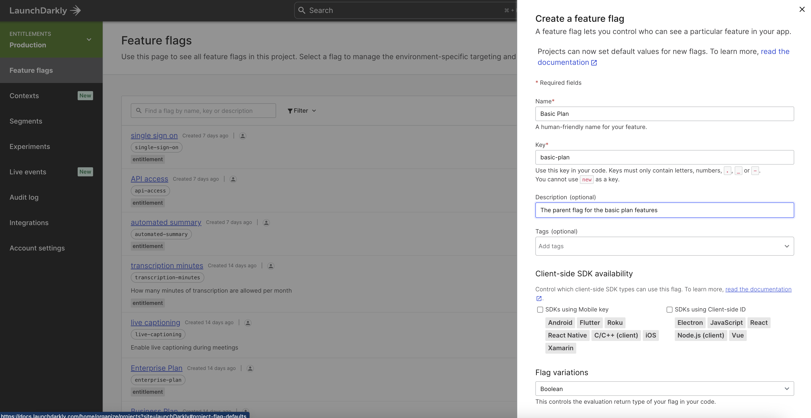
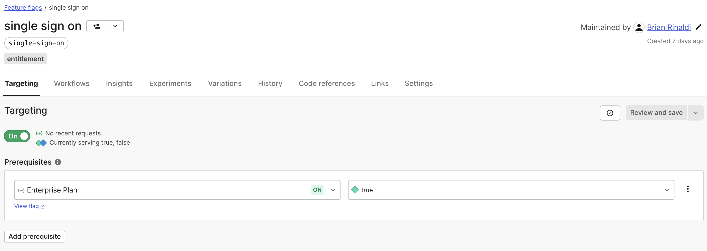
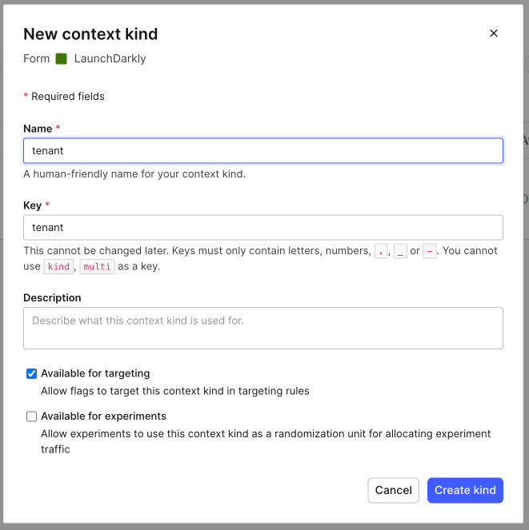
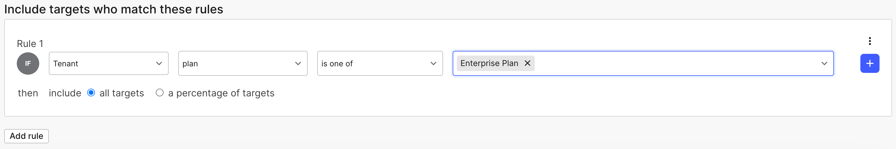

# Managing Entitlements in LaunchDarkly

Feature flags might seem like an odd fit for managing entitlements, but ultimately, from an application standpoint, entitlements are about enabling/disabling and/or rate limiting specific features. This is a capability feature flags excel at when combined with advanced targeting capabilities like those available in LaunchDarkly.

There are some important benefits to managing entitlements via LaunchDarkly feature flags:

1. You do not need to alter or move your existing account management solution. While LaunchDarkly can potentially be used as a source of truth for your accounts, the most flexible solution is to handle account management through an internal or third-party tool specifically designed for that purpose.  As we'll see, just passing the proper targeting information for a tenant will enable LaunchDarkly to determine which features to enable/disable or rate limit.
2. It allows you to manage feature access regardless of where it is implemented. LaunchDarkly provides over 25 SDKs for various languages and platforms. This means that the same flags that are deployed to code running on your Amazon EKS cluster or your AWS Lambda functions can also be deployed to your frontend web or mobile app. 
3. The setup is incredibly flexible. While we will demonstrate one way of setting up your entitlements in LaunchDarkly, this is just one of many ways that this can be set up depending on your specific needs.

## The Basic Account Structure

We're going to use a fairly common set up whereby each tenant is assigned to a plan. These plans increase in terms of their access to features, while inheriting the features of all the plans beneath them. In our example, the plans look like this:

- **No Plan** - These are accounts that may be inactive or have very limited access. For example, an account that is no longer active but still retains access to viewing prior account billing information. These will remain unassigned to any segment within LaunchDarkly.
- **Basic plan** - A basic plan may have access to a baseline set of functionality that any user with an active account can access. The point of this grouping would be to distinguish between active accounts and accounts that have no access to application functionality (i.e. the no plan accounts).
- **Pro Plan, Business Plan, Enterprise Plan** - Each of the remaining account plans has an incrementing amount of access to features, meaning that they get the features of all the plans beneath them as well as additional features or increased access to rate limited features.

One critical thing to keep in mind is that, while broader access to features will be determined by a tenant's plan, you have a lot of flexibility. As we'll see, you could still assign individuals, or groups of individuals access to a specific feature or even give a tenant access to a feature that is not in their plan. For example, if your contract with a particular Business Plan customer gave them access to an enterprise feature, the system would still be capable of handling those exceptions.

### Creating the Feature Flags

Within each plan there are two types of features:

* **A toggled feature** – this feature is disabled (off) for one plan but enabled (on) for another. These will use a standard boolean flag that will indicate whether the feature is on or off for a given plan.
* **A multi-variate feature** – this is a rate-limited feature that may be enabled for all account levels, but to varying degrees. For example, you might offer a very limited number of API calls to a basic plan but increase or even remove those limits with each successive plan.

The toggled features will use dependent flags of a parent flag representing the plan that they are associated with. The benefit of this is that it allows targeting of the parent flag to enable access to all the dependent features without needing to target each individual feature flag. We'll explore how targeting works later in this article.

Here's an example of what this might look like:

```
.
├── Basic Plan
│   ├── concurrent meetings: 1
│   └── transcription minutes: 300
├── Pro Plan
│   ├── speech to text
│   ├── automated summary
│   ├── concurrent meetings: 2
│   └── transcription minutes: 1200
├── Business Plan
│   ├── sync files
│   ├── API access
│   ├── concurrent meetings: 3
│   └── transcription minutes: 6000
└── Enterprise Plan
    ├── live captioning
    ├── single sign on
    ├── concurrent meetings: 3
    └── transcription minutes: 6000
```
To start, you'll want to create the parent flags before you can create the child flags for toggled features.

### Creating a parent flag or a toggled feature flag

Creating a flag for a parent flag or a toggled feature is straightforward:

1. Within the LaunchDarkly console, click the "Create flag" button.
2. Give the flag a name. The flag key will be created for you automatically based upon the name. You can also optionally add a description.
3. Optionally, we can add a tag to make this flag. For example, we might want to tag it as "entitlement" to distinguish this from other flags within our system unrelated to entitlements.
4. If this flag will be used on client-side browser applications or on mobile applications, be sure to check the checkboxes to make it available to those SDKs.
5. Leave the boolean flag variation options with their defaults.
6. Check the "This is a permanent flag" option. This simply prevents the LaunchDarkly console UI from prompting you to remove the flag.
7. Click "Save flag".



If this flag is a child of a parent flag representing a plan (for example, the live captioning flag is a child of the Enterprise Plan flag), there are some additional steps.

8. From the flag detail page, be sure you are on the "Targeting" tab. Under the "Prerequisites" heading, click "Add prerequisites".
9. Choose the prerequisite flag from the "Select a flag" drop down. For example, if we're creating the "API access" flag from the example above, we'd choose the the "Business Plan" flag as the parent.
10. The "Select a variation" option should be set to "true".

In both of these cases, once the flag is saved, turn targeting on and save it. Having targeting turned on will allow it to target this flag to our specific segments representing our tenants, which we'll set up later in this tutorial.



### Creating a multi-variate feature flag

Multi-variate flags will work differently. Ultimately, each segment we create will be targeted with a specific variation of the flag. For instance, using the prior example, a tenant on the "Pro Plan" will get a value of 3000 from the "transcription minutes" flag while a "Business Plan" tenant will get 6000. Because of this, these flags do not need to have a prerequisite (i.e. parent) flag set.

To create a multi-variate flag, begin by following steps 1 through 4 for creating a toggled feature flag and then these subsequent steps:

5. Under flag variations, choose whether this is a number, string or JSON flag. For example, the  "transcription minutes" flag would be a number.
6. Enter each of the variations. For example,  the "transcription minutes" flag would have variations of 300, 3000 and 6000.
7. Set the default variation. This should be the value representing the lowest plan. For example, for transcription minutes, it would be 300.

Once the flag is saved, turn targeting on. We'll see later in this tutorial how we'll set up segments to target specific variations.

## Contexts

LaunchDarkly recently introduced contexts for targeting. It provides a lot more flexibility in how you manage targeting users, servers, devices, regions or anything else. Previously, all the targeting data was passed in a single user object, but now there can be multiple kinds of contexts that determine the value of a flag that is returned.

Contexts are especially useful for handling entitlements. The primary context kind we'll use for targeting entitlements will be called `tenant`. A context of this kind will contain data that determine which segment that the user belongs to and the segment will determine which entitlements the user will receive. While contexts are created when context data is passed into LaunchDarkly, we can define the context kinds in advance.

1. On the left hand navigation, choose "Contexts" and then select the "Kinds" tab.
2. Click "Create Kind" to open the modal form.
3. Name the kind "tenant". The key will be created automatically for you. You can also optionally choose to give this kind a description and to make it available to experiments.
4. Click the "Create kind" button to close the modal and save the context kind.



Since we haven't actually called LaunchDarkly yet with any context data of this kind, there won't be any tenant contexts yet. Before we call LaunchDarkly though, we'll need to create the segments for each of our plans and the rules that will assign tenant contexts to the appropriate segment.

## Segments

Before we can begin targeting segments, we'll need to create them. Creating standard segments in LaunchDarkly is very straightforward.

1. Choose the segments menu item on the left-hand side of the LaunchDarkly console.
2. Click the "Create segment" button.
3. Give the segment a name - for example, "Enterprise Plan". The key will be generated for you based upon the name. You can also optionally add a description.
4. Choose the "Standard" segment option and then click "Save segment".

We'll need to repeat this process until we've created a segment representing each plan within the entitlements structure. In our example, the targeting for these segments will be based upon a `plan` attribute of our `tenant` context, but the attribute can be whatever you choose based upon the structure of your tenant data.

Once the segments are created, we can create rules to assign our contexts to each segment.

1. Choose a segment from the Segments page, scroll down to the section "Include targets who match these rules" and click "Add rules".
2. In the first dropdown after the "If" choose the "Tenant" kind we just created.
3. In the "Select an attribute" dropdown, choose "plan" if it exists. If it doesn't exist yet, you can type it into the  dropdown box and then click "Add "plan"".
4. Leave the "is one of" option selected.
5. Type in the value of the plan that will be passed in the context's plan attribute for this segment and hit enter. For example, for the "Pro Plan" segment, the value of `plan` might be `Pro Plan`.  Note that you can enter multiple values in this box.
6. Click the "Save changes" button.



We'll repeat these steps until there are rules for each segment representing each entitlements plan.

## Flag Targeting

Now that our context kind, segments and segments rules are set up, we're ready to assign targeting to our flags. The process is slightly different for the toggled flags that have a parent versus a multi-variate flag.

### Targeting a Toggled Feature Flag

As noted earlier, the toggled feature flags are all created under a parent flag representing the entitlements plan that they are associated with. The benefit of this strategy is that we only need to set up a targeting rule for the parent flag because the dependent flags will only return true if the parent is also true.

1. Choose "Feature flags" from the left hand navigation and then select the parent flag representing the entitlements plan (ex. Enterprise Plan).
2. Under "Rules", click on "Add rules".
3. In the drop down after the "IF" select "Is in segment".
4. In the "Select segments" drop down, choose the appropriate segment from the ones we created. For example, for the "Enterprise plan" parent flag, you'd select the "Enterprise plan" segment.
5. From the variation drop down, select "true".
6. Click the button to "Review and save" the changes to the flag.

### Targeting a Multi-variate Flag

The key difference between targeting a toggled flag and a multi-variate flag is that, for the multi-variate flag, you are targeting a specific variation to a segment, which means we'll need to add the targeting to each flag directly rather than rely on a parent flag.

1. Choose "Feature flags" from the left hand navigation and then select a multi-variate flag (ex. Transcription Minutes).
2. Under "Rules", click on "Add rules".
3. In the drop down after the "IF" select "Is in segment".
4. In the "Select segments" drop down, choose the appropriate segment from the ones we created.
5. From the variation drop down, select the value that applies to that segment(s). For instance, in our example, Transcription Minutes would server `300` for the "Basic Plan" segment but would serve `6000` for both the "Business Plan" and "Enterprise Plan" segments.
6. Once you've added the appropriate targeting for each value, click the button to "Review and save" the changes to the flag.

## Overriding an Entitlement

When managing entitlements, there will always likely be cases that do not fit the existing plans. For example, we might sign a contract with a customer for a Business Plan account but grant them access to an Enterprise Plan feature as part of the negotiation process in order to close the deal. Thankfully this setup allows us just that kind of flexibility. For example:

* We can add an additional rule to manually target a feature to a particular tenant based upon their key (this could be their account ID or some other identifying value).
* We can use multiple contexts to add targeting rules that override the tenant assigned entitlements. For example, we might add a "Company" context and add an additional targeting rule for a feature to grant access to anyone with that company context.
* We can use a user context to target specific users individually. For example, perhaps we've granted only the CMO of a particular client access to a specific feature. We can target that feature to the individual's user key.

The key thing to understand here is that the tenant targeting we've set up establishes a baseline level of entitlements for a user, but these can be overridden however you require to meet the needs of your system.

## Using Flags in Application Code

At this point, we have everything set up:

1. We've created the `tenant` context kind that will contain a `plan` attribute which can be used to place the user into the proper entitlements segment.
2. We've created the entitlements segments and established rules for each whereby a tenant will be assigned to the proper segment representing their entitlements plan.
3. We've created both parent and child toggled feature flags and added the appropriate rules to the parent to ensure that users will find a feature enabled/disabled based upon their segment.
4. We've created multi-variate flags with the values representing the rate limit for each entitlement plan level and we've established rules to assign the correct values to the appropriate segments.

All that's left now is to use the flags in our code to manage our entitlements. As discussed earlier, a major benefit of this approach is that the same flags work across any part of our application, whether frontend or backend, using LaunchDarkly's SDKs.

The following examples demonstrate how this might work in a Node.js application backend, for instance in a AWS Lambda. First, we'd need to install the Node SDK.

```bash
npm install launchdarkly-node-server-sdk
```

Then we need to initialize the SDK client:

```javascript
const ld = require("launchdarkly-node-server-sdk");
const client = ld.init("sdk-my-sdk-key");
```

Before we can get values from LaunchDarkly, we need to create the tenant context. Note that in this case we are only sending a single context but LaunchDarkly allows you to send multiple contexts which we can use to override some of the entitlements access. The required attributes for our use case are the `key`, which is a critical identifier most likely representing an account number or tenant ID within your system, the `kind`, which aligns with the context kind that this object is associated with (i.e. `tenant`), and the `plan`, which our current targeting examples require to determine the proper segment to place the tenant in. Any other attributes are optional and we can add as many as we need to.

```javascript
context = {
  kind: "tenant",
  key: "umbrella-corporation-hbwihisef8kfxhgf7exne",
  name: "Umbrella Corporation",
  plan: "Enterprise Plan",
};
```

Once we have created the context object, we can pass the flag key, context object and a default value (should the call fail for some reason) to the `variation()` to get the correct entitlement value for this plan.

```javascript
let test;

// enterprise clients get 3 concurrent meetings
test = await client.variation("concurrent-meetings", context, 0);
console.log(test); // 3

// this should be true becuase enterprise gets pro features
test = await client.variation("speech-to-text", context, false);
console.log(test); // true

// this should be true because enterprise gets business feature
test = await client.variation("sync-files", context, false);
console.log(test); // true

// this should be true because it's an enterprise feature
test = await client.variation("live-captioning", context, false);
console.log(test); // true
```

Obviously, the goal isn't to `console.log()` the values but instead to wrap feature specific code to modify or prevent the specific tenant's access.

> For more details on how to use LaunchDarkly's SDKs in AWS serverless environments, refer to [this blog post](https://launchdarkly.com/blog/using-launchdarkly-in-aws-serverless/).

## Security

As a final item, I want to touch briefly on how this system is secure. You might be concerned that a user could just intercept and modify the data being sent to LaunchDarkly and suddenly have access to Enterprise Plan features that they never paid for. Thankfully, there are multiple layers that can prevent this kind of abuse.

1. The flags are available to all the different layers of your application. This means that the same flag that prevents a feature from displaying on the frontend will also prevent the feature from running on your backend or API. Therefore, even if a value were to change, the user might see the UI for a feature but still be unable to use it.
2. LaunchDarkly also provides a [secure mode](https://docs.launchdarkly.com/sdk/features/secure-mode) that can be used when a client-side SDK communicates with LaunchDarkly. This hash is generated on the server and is passed when initializing the SDK client. Secure mode prevents a user from doing an evaluation for a context or user key that hasn't been signed on the backend.

## Conclusion

It's important to keep in mind that this is just one possible way to use LaunchDarkly for entitlements, so if the example setup presented here doesn't work for your entitlements structure, feel free to adjust it to meet your needs.  LaunchDarkly is incredibly flexible and you can use a combination of contexts, segments (or even [big segments](https://docs.launchdarkly.com/home/code)) and targeting rules to fit almost any entitlements structure.

Plus, just because you use LaunchDarkly for entitlements, doesn't mean you can't also use for feature flagging for your deploys/releases, doing progressive rollouts or running experimentation. You absolutely can do that – in fact, you should!