# Using LaunchDarkly with AWS Lambda

Serverless functions play a critical role in modern application architectures. For many applications, particularly applications built with a microservices architecture, serverless functions are the backbone of any server-side logic and data retrieval.

In this guide, we'll explore how to build a serverless function using [AWS Lambda](https://aws.amazon.com/lambda/) and how you can use LaunchDarkly within a Lambda function to conditionally enable or modify server-side logic within depending on a LaunchDarkly flag. In addition, we'll explore how this can even be deployed to [CloudFront](https://aws.amazon.com/cloudfront/), Amazon's content delivery network (CDN), as [Lambda@Edge](https://aws.amazon.com/lambda/edge/) so that the function can even be used to conditionally redirect a user at the "edge".

## The Example

Let's imagine our company is launching a rebrand that includes a new site relaunch. This is a clearly major undertaking and the marketing department wants to be sure that everything is perfect. Rather than simply flip the switch from one day to the next, they want to roll out the new site to an increasing percentage of users to ensure everything looks good before eventually transitioning everyone to the new page. How can we do this without it becoming a major DevOps headache?

In our example, we'll use LaunchDarkly to eliminate the DevOps headaches involved in this while also allowing the marketing team full control of the rollout. LaunchDarkly will assign each user to a variation that determines whether they see the new site or the old site. Our AWS Lambda@Edge function will use this information to route them to the appropriate version of the site at the edge rather than relying on a client-side or server-side redirect.

### What You'll Need

Besides an AWS account and a LaunchDarkly account, you'll just need a way to build and deploy a Lambda function. The instructions here will be leveraging the [AWS Toolkit for Visual Studio Code](https://docs.aws.amazon.com/toolkit-for-visual-studio/latest/user-guide/setup.html) that makes it easy to download, upload and test our Lambda Function within Visual Studio Code.

The source code for this example can be found at [on GitHub](https://github.com/remotesynth/launchDarklyLamda).

## Setting Up AWS

Before we begin coding, there are a couple of resources that we should set up within AWS:

1. **An S3 Bucket** – S3 is Amazon's storage solution where we can house and retrieve arbitrary files. It can also be used to host a static web site, which is what we'll be using it for in this guide. Our site is intentionally simple. It has an index page in the root as well as a `/beta` folder that contains the same page with the new branding. Once we've completed our Lambda function, users will either be directed to the old site or the new site depending on which variation they are assigned to within LaunchDarkly. LaunchDarkly determines this by assigning each unique user (identified by their key in this scenario) according to the percentage rollout we'll define.
2. **A CloudFront Distribution** – This is required to run a Lambda function via AWS's edge servers (Lambda@Edge) on their CloudFront CDN. Since our function will redirect users to the proper site, this is better done "at the edge" so as to limit any latency the user might see during the request. Rather than intercept the request on the server and do a server-side redirect or even sending back a response that performs a client-side redirect, we can intercept this request at the CDN level closest to the user and direct it to the proper version of the site.

### CloudFormation

In the AWS console, search for CloudFormation.
Click create stack
Choose Template is Ready and Upload a Template and then choose the template file from the repo
Click Next
Name the stack "LaunchDarkly-Example" and click next
On the configure stack options step, accept the defaults and click next
Review the details and click "Create stack"
wait for the stack to be created (this can take a few minutes)

### Setting Up an S3 Bucket

Let's start by setting up the S3 Bucket and putting our web site resources into it.

1. Search for S3 in the AWS console. Click the "Create bucket" button.
2. Give the bucket a name (for example, "launchdarkly-example"), choose US East as the AWS Region and turn off the "block public access" option.
3. Click the "Upload" button and then "Add folder". From the [source repository](https://github.com/remotesynth/launchDarklyLamda), upload the `/site` folder containing the both the existing site's `index.html` and `logo.png` and a `/beta` folder containing the new site (Note that to simplify these steps, we're uploading everything into a folder rather than into the root of the bucket, but this means that the URLs will all have to have the `/site` folder appended). Click "Upload" and when it's done click "Close"
4. Select the `site` directory in your bucket. From the Actions pull down select "Make public", click to confirm and then click "Close" 
5. Click on the "Properties" tab for the S3 bucket. Scroll all the way down to "Static website hosting". Click "Edit" and then choose "Enable". Specify `index.html` as your index document and "Save changes".

	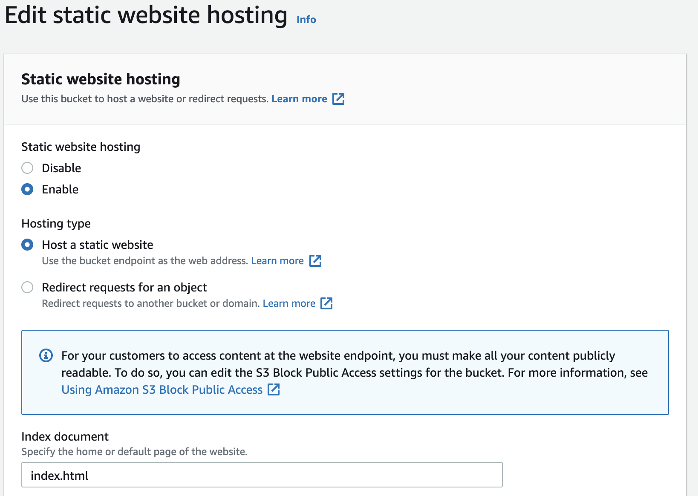

Once you've completed these steps, you should be able to click the bucket URL to view the page (be sure to append `/site` at the end of the URL). Take note of this URL as we'll need it later.

### Setting Up the CloudFront distribution

Next let's set up a CloudFront distribution. This will be needed to deploy our function to Lamda@Edge.

1. In the AWS Console, search for "CloudFront" and then click the button that reads "Create a CloudFront Distribution"
2. For the "Origin domain" choose the S3 bucket we just created. Leave everything else with the default, scroll down and click "Create distribution"

   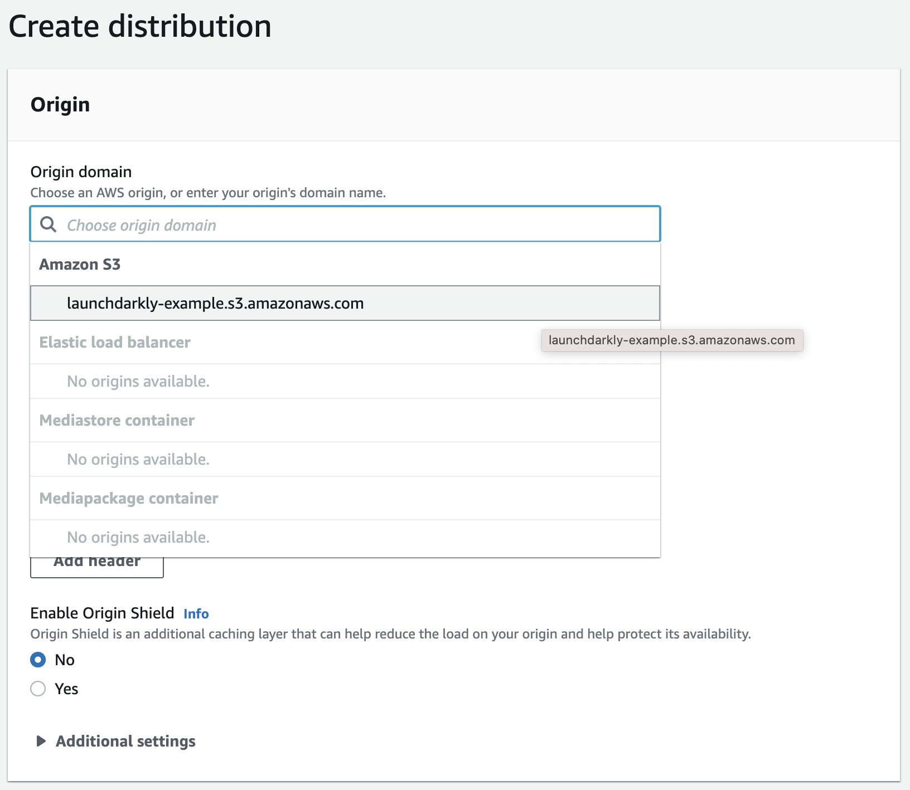

## Creating a Lambda Function Connected to LaunchDarkly

Now we're ready to create our Lambda function. Let's use to the AWS Console to give us a hand getting started.

1. Within the AWS console, search for "Lambda"
2. Click "Create function".
3. Choose "Author from Scratch". Name the function "launchDarklyExample" and choose the Node.js runtime (which is the default). All the other options can also be left at the default. Click "Create Function".
	
	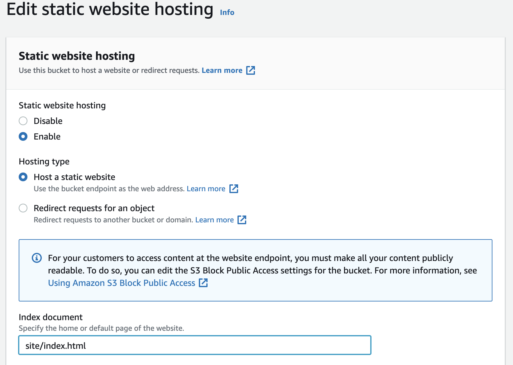

The function we created doesn't do anything just yet. In order to modify the code, let's move to Visual Studio Code. This will allow us to install our npm dependencies and upload the files back to Lambda.

1. Create or open an empty project in Visual Studio Code.
2. Click the AWS icon on the left (this is part of the  [AWS Toolkit for Visual Studio Code](https://docs.aws.amazon.com/toolkit-for-visual-studio/latest/user-guide/setup.html))
3. Choose Lambda and then find the "launchDarklyExample" we just created. Right-click on the function and select "Download". When prompted choose the current project folder.
	
	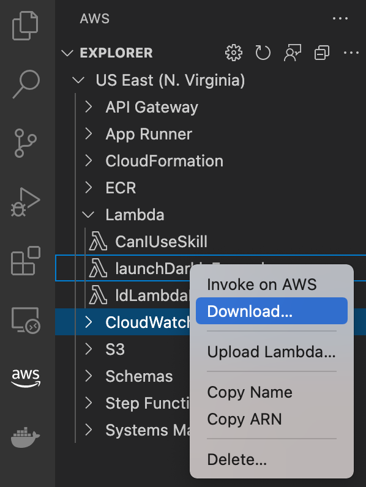

### Install and Configure LaunchDarkly

Now that we have our function dowloaded locally, we can install the [LaunchDarkly Node SDK](https://docs.launchdarkly.com/sdk/server-side/node-js).

1. Open the command line in the current project folder (be sure you `cd` into the `launchDarklyExample` folder containing our Lambda function)
2. Run `npm install launchdarkly-node-server-sdk`
	
	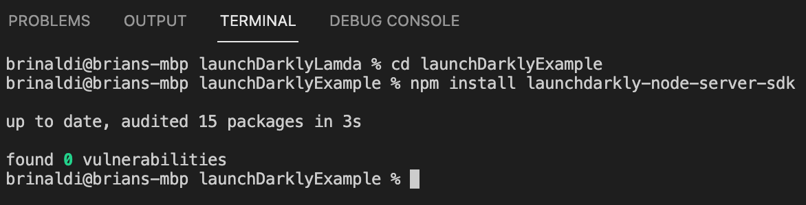
3. Place the following code above the handler in `index.js`. Be sure to replace the `sdk-my-sdk-key` with your SDK key from your LaunchDarkly environment. You can get this via the "Account settings" within the LaunchDarkly dashboard:

   ```javascript
   const LaunchDarkly = require("launchdarkly-node-server-sdk");
   const client = LaunchDarkly.init("sdk-my-sdk-key");
   ```

   Note that we are not placing the SDK key in an environment variable because environment variables cannot be used in Lambda@Edge. However, if you are integrating LaunchDarkly within a standard Lambda function, you should use an environment variable instead to keep your SDK key secrure and out of your source code repository. You can do this within the AWS Console by going to your Lambda function and navigating to Configuration > Environment Variables.

4. Let's test our setup by initializing LaunchDarkly and returning a response indicating whether it has succeeded or failed.

   ```javascript
   exports.handler = async (event) => {
    let response = {
      statusCode: 200,
    };
    try {
      await client.waitForInitialization();
      response.body = JSON.stringify("Initialization successful");
    } catch (err) {
      response.body = JSON.stringify("Initialization failed");
    }
    return response;
   };
   ```
5. To update our Lambda function, including uploading the npm dependencies, open the AWS panel in Visual Studio Code. Right-click the function and select "Upload". When prompted, choose "Directory" and then select the directory that the Lambda function resides in. When it asks you whether to build with SAM, choose "No" to just upload the contents of the directory.
6. To test the function, right-click on the function again and choose "Invoke on AWS". We do not need to provide any payload, just click the "invoke" button. The output panel should show a response `{"statusCode":200,"body":"\"Initialization successful\""}` showing that the SDK client properly initialized.
	
	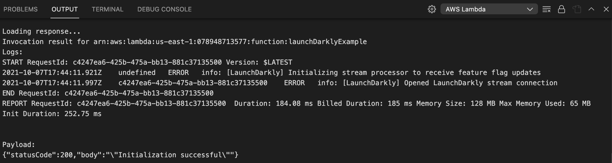

### Creating a Flag in LaunchDarkly

LaunchDarkly is now initialized, but we haven't yet set up any flags to use within our function code. Let's do that.

1. Open the LaunchDarkly dashboard and select our project (the default project works fine) and environment (either the default "Test" or "Production" are fine, just be sure to change the flag in the same environment later) then click "Create flag".
2. Name the flag "rebrand". We do not need a mobile or client side ID, so we can uncheck that. Choose a "String" variation, which will allow us to return any one of a number of string value variations from our flag.
3. Variation 1 will be "/site" and variation 2 will be "/site/beta"
4. Click "Save flag".
	
	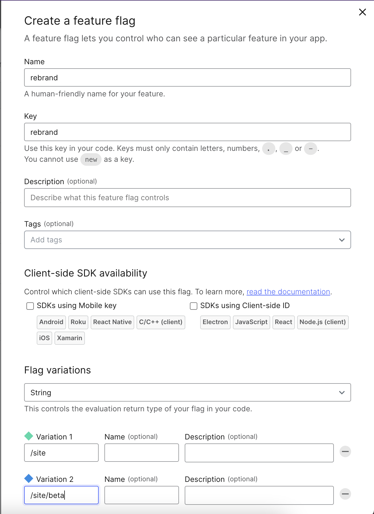
5. Once the flag is saved, scroll down to the "Default rule" and choose the "A percentage rollout" option. For the purposes of example, we'll just assign 50/50 but in a real world scenario you'd likely start smaller and increase over time.
	
	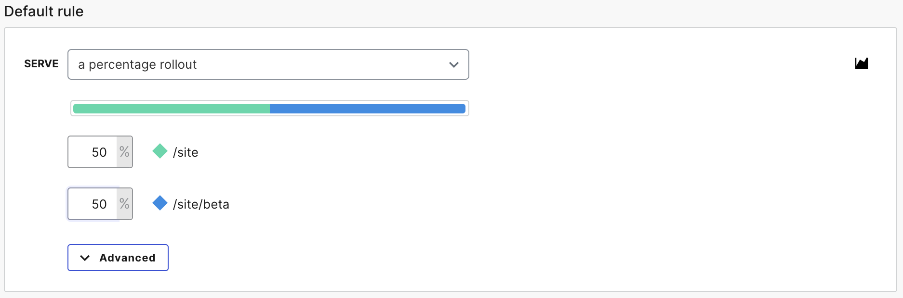
6. Scroll back up and click save.
7. Finally, turn targeting On and save again. If we don't turn targeting on, the percentage rollout is not running and we'll only ever get the default variation.

### Getting a Flag Value in Lambda

Now that we have a flag, let's use it within our function.

1. Replace the existing handler code with the below code that uses the LaunchDarkly SDK to call for the value of our `rebrand` flag. We'll use our email as a static key to identify the user for the moment. The key is what determines whoch variation we'll receive based upon our rollout percentages. Since we're hardcoding the key for the moment, we'll always get the same result regardless of how many times we run it.
	```javascript
    exports.handler = async (event) => {
    let response = {
      statusCode: 200,
    };
    await client.waitForInitialization();
    let viewBetaSite = await client.variation(
      "rebrand",
      { key: "brinaldi@launchdarkly.com" },
      false
    );
    response.body = JSON.stringify(viewBetaSite);
    return response;
    };
	```
2. Open the AWS panel within Visual Studio Code. Right-click to upload and then, when the upload finishes, right-click the function and invoke it again. You do not need a payload. You should receive a response like `{"statusCode":200,"body":"\"/site/beta\""}`.
	
	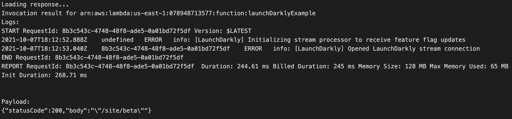

We've successfully integrated and used a LaunchDarkly flag within a Lambda function. If we weren't deploying to Lambda@Edge, there would be no additional steps necessary.

## Deploying Our Function to Lambda@Edge

We're using Lambda but we're not yet using Lambda@Edge. Let's walk through how to deploy our function there.

A function running on Lambda@Edge receives a specific [event structure](https://docs.aws.amazon.com/AmazonCloudFront/latest/DeveloperGuide/lambda-event-structure.html). We'll utilize this to specify a key for LaunchDarkly that will ensure that different users get different variations but the same user always end up in the same group (as in, they don't see one site on one click and one site on another, which would be bad).

Let's start by updating our function to use this event. The following code gets the value of the flag and appends that to the URL of our site, so that you'll either be directed to the existing site or to a `/beta` version of the site (it's worth noting that a more complete solution wouldn't just append the beta but redirect users to the page they requested on the new site using the URI passed via the event, but our site only has one page). It uses the IP address of the user as the key since it is the only indentifying information we have available for the user. Subsequent visits from that IP will not get different results from the flag so that they'll continue to see the same version of the site.

```javascript
exports.handler = async (event) => {
  let URL =
    "https://launchdarklydemostack1-s3bucketforwebsitecontent-jffmp2434grq.s3.amazonaws.com/site/";

  await client.waitForInitialization();
  let viewBetaSite = await client.variation(
    "rebrand",
    { key: event.Records[0].cf.request.clientIp },
    false
  );
  console.log(`LaunchDarkly returned ${viewBetaSite}`);

  if (viewBetaSite) URL += "beta/index.html";
  else URL += "index.html";
  return {
    status: "302",
    statusDescription: "Found",
    headers: {
      location: [
        {
          key: "Location",
          value: URL,
        },
      ],
    },
  };
};
```

NOTE ABOUT CACHE CONTROL

After updating the code, use the AWS panel in Visual Studio Code to upload it again by right clicking on the function and choosing "Upload Lambda".

### Testing Our Lambda@Edge Function

In order to test the function within the AWS panel, we'll need to provide a payload that represents the Lambda@Edge event structure. Open the AWS panel in Visual Studio Code. Right-click on the function and select "Invoke on AWS". From the sample request payload dropdown, choose the "Cloudfront HTTP Redirect" and then click "Invoke". You should get a response like:

```json
{"status":"302","statusDescription":"Found","headers":{"location":[{"key":"Location","value":"d123.cf.net/site/beta/experiment-pixel.jpg"}]}}
```

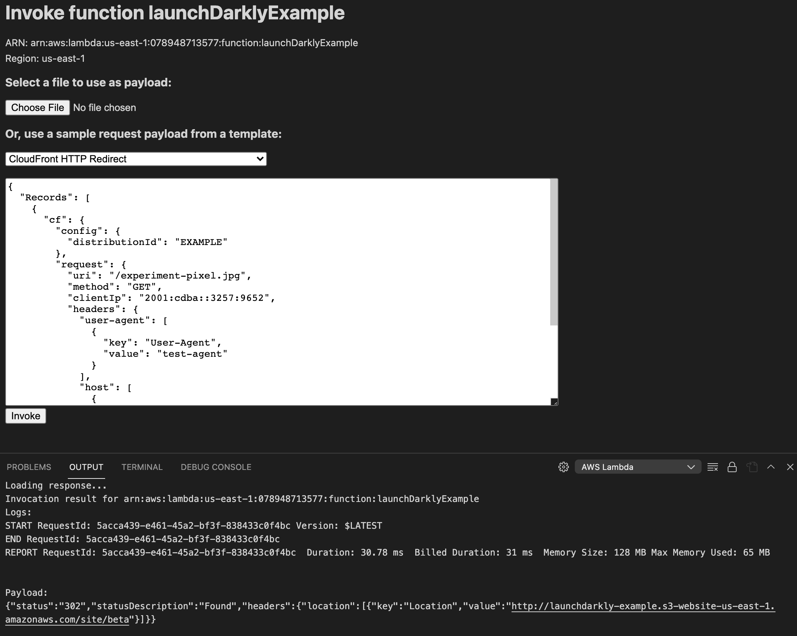

Try changing the IP address in the payload and clicking invoke again. You should get a different response in most cases as it's split 50/50 (though you may need to change the IP more than once and try again as the ultimate percentage breakdown will be 50/50 but that doesn't mean the value returned by request is alternated).

### Connecting a CloudFront Trigger

Our function now uses the Lambda@Edge event data and returns the correct redirect response, but it needs to be triggered from the CloudFront distribution that we created earlier. We'll do this by adding a CloudFront trigger.

Before we can do that though, we need to update the execution role of our function. In the AWS console, search for Lambda and then select our function. Go to the Configuration tab for the Lambda function, click Permissions, then under Execution role click Edit.

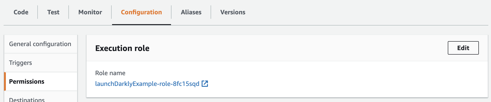

In the "Existing Role" dropdown, select "service-role/lambdaEdge". We don't need to change any other settings. Click save.

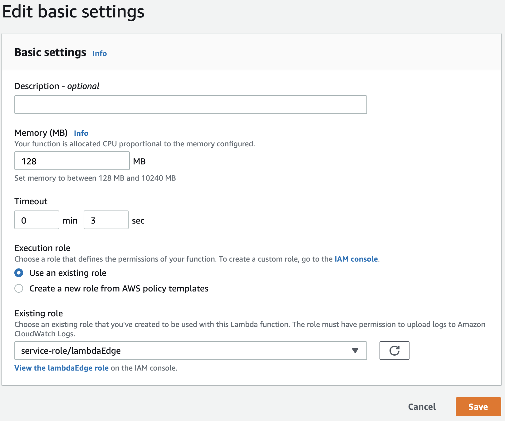

Now we're ready to enable the trigger.

1. Open your Lambda Function and click the "Add trigger" button.
2. In "Select a trigger" dropdown search for "CloudFront" and then click the button to "Deploy to Lambda@Edge". CHANGE FROM ORIGIN REQUEST - EXPLAIN! Accept the defaults and click "Deploy".
	
	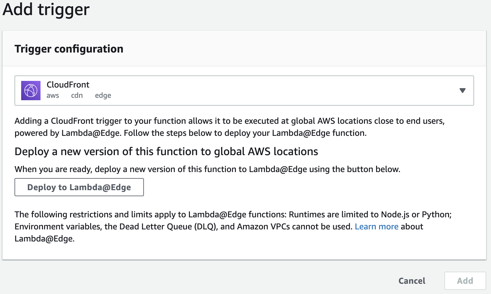
3. When configuring the CloudFront trigger, all of the defaults are ok. Click deploy (note that you may be asked to do this twice, just accept the defaults both times).

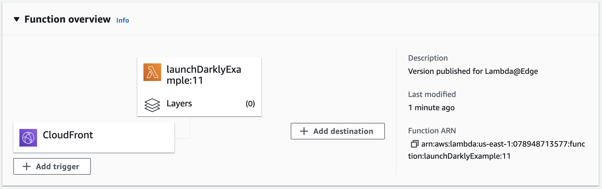

Finally, let's test that this actually works. Click the "CloudFront" box within the "Function Overview". This should open the Configuration > Triggers settings. Click the link next to the CloudFront trigger that has our CloudFront distribution ID. This will open up the CloudFront distribution in a new tab. Open the CloudFront distribution and under the "Details" section, copy the URL for this distribution. If we paste this URL in the browser, it should direct us to either the old version of the page or the new one (be sure the CloudFront distribution has finished deploying first).

Congrats! We've successfully integrated LaunchDarkly into a Lambda function and then deployed that function to Lambda@Edge!

#### Cleanup

If you'd like to clean up your AWS evironment when you complete this guide, here's the steps.

1. We'll need to remove the CloudFront association following [instructions here](https://docs.aws.amazon.com/AmazonCloudFront/latest/DeveloperGuide/lambda-edge-delete-replicas.html).
2. Go to the Behaviors tab of your CloudFront distribution, edit the behavior and remove the Function association for LambdaEdge. Once the distrubution deploys, we can delete the Lambda function.
3. We'll need to empty the S3 bucket before we can delete it.
4. We'll need to disable the CloudFront distribution before we can delete it. After disabling, wait for it to finish deploying and we'll be able to delete the distribution.
