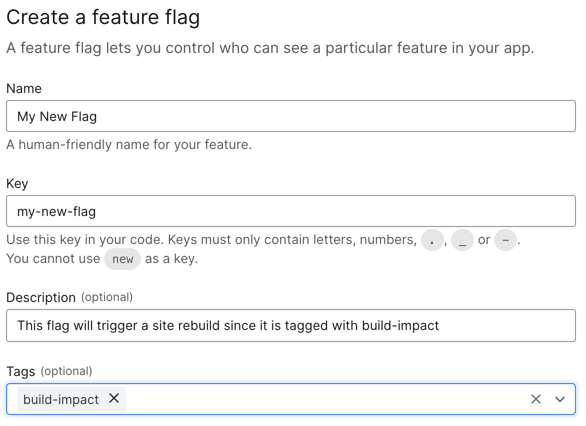
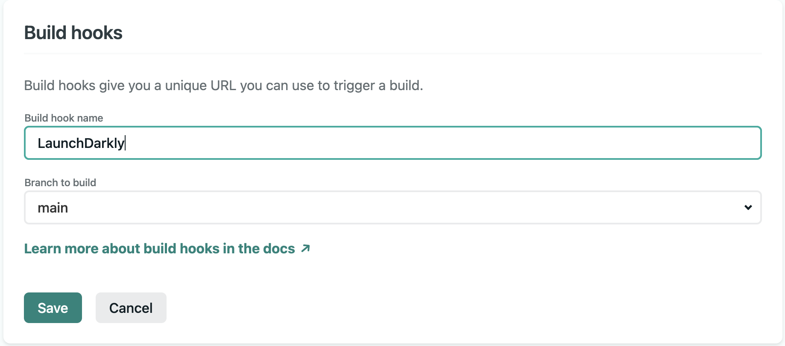
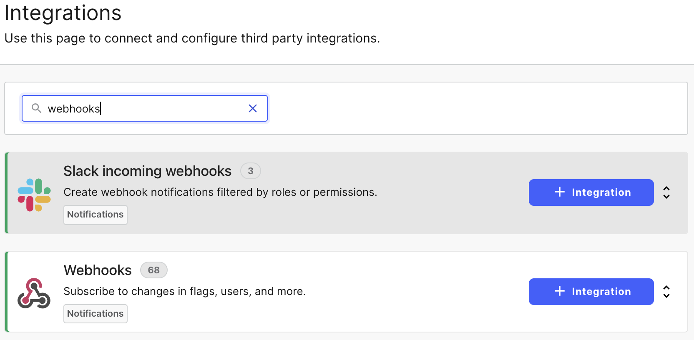
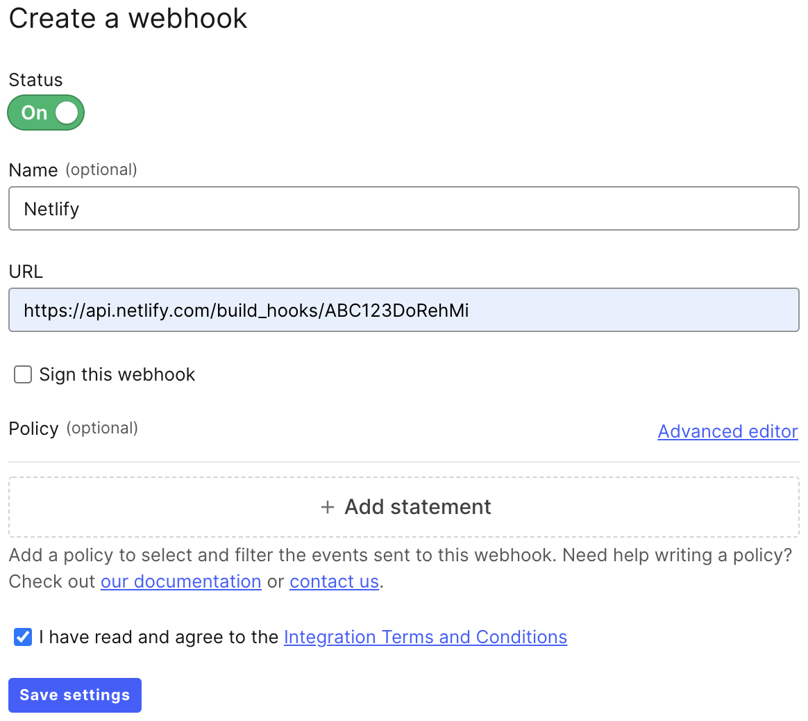

# Using LaunchDarkly with Next.js

Next.js is a React-based framework for full-stack JavaScript development. One of the most powerful aspects of Next.js is that it offers tools for rendering content at multiple junctures: at build time; on the server; or on the client. It even offers an option for deferred rendering that builds pages only when they are first requested.

While these options add a lot of power, they can also create some confusion when trying to integrate LaunchDarkly. Which library do I need? Where do I import and configure it? How do I use it once it is set up? In this tutorial, we'll answer these questions for all the various types of integrations Next.js offers.

## Rendering Options in Next.js

Once upon a time, rendering occurred in just one place: the server. I'd request a page, the server would do its work and then send me back HTML that my browser could render. Those were definitely simpler times.

Things become especially complicated when you are dealing with a "full stack" framework like Next.js (sometimes referred to as an [isomorphic javascript framework](https://en.wikipedia.org/wiki/Isomorphic_JavaScript)) that isn't just about rendering content using JavaScript on the client (also known as the browser). It also handles rendering on the backend using JavaScript within Node.js.

There are four different strategies for rendering content in a Next.js application. Keep in mind that an application could have any mix of any or all of these and, in some cases, even a single page may include multiple rendering strategies for different parts of the page.

* **Pre-rendering** – This content is rendered at build time before the application is deployed. Typically this will happen as part of a CI/CD build process. For example, new code checked into your git repository will automatically trigger a build in Netlify or Vercel, two popular deployment options for Next.js sites. A new build may also be triggered via a [build hook](https://docs.netlify.com/configure-builds/build-hooks/) (also known as deploy hooks). This is common, for example, when you're using an external headless content management system so that changes to content will get automatically re-rendered in the build. You'll frequently see pre-rendering also referred to as static rendering or static site generation (SSG).
* **Server-side rendering** – This is the traditional style of rendering a page where it the content is generated on the server (Node.js in this case) for every single request and then sent to the browser. You'll frequently hear server-side rendering referred to as just SSR.
* **Client-side rendering** – Some content cannot be fully pre-rendered – for instance, user-specific data on a page that is pre-rendered. In these cases, you'd need to modify the rendered output in the browser using JavaScript. Similarly, you may not want to rerender the page server side for every interaction and in these cases you'd also update the page using client-side JavaScript.
* **Deferred rendering** – This is functionally equivalent to pre-rendering except that the requested page isn't rendered during the initial build but only when the first user requests it. Imagine an ecommerce site with thousands of product pages. Pre-rendering all of these could cause excessively long builds – plus, many of those pages may get minimal traffic. Instead, the page rendering for these can be deferred until they are first requested. While the initial visitor may see a slight delay in loading the page, subsequent visitors will receive the page from the build cache.

As you might imagine, each of these different types of rendering has different considerations when working with LaunchDarkly via the SDKs.

> There are two forms of deferred rendering: Incremental Static Regeneration (ISR) and Distributed Persistent Rendering (DPR). While the terminology can be confusing, the key difference is that ISR can include a timeout, meaning that the generated page will go stale and rerender after a specified period. Whereas with DPR, the rendered page becomes part of the build and the only way to rerender it is with a new build.

## Which SDK Do I Use?

LaunchDarkly offers multiple JavaScript SDKs that may seem relevant to a Next.js project:

* [JavaScript](https://docs.launchdarkly.com/sdk/client-side/javascript)
* [Node.js (client)](https://docs.launchdarkly.com/sdk/client-side/node-js)
* [Node.js (server)](https://docs.launchdarkly.com/sdk/server-side/node-js)
* [React](https://docs.launchdarkly.com/sdk/client-side/react)

So, which one should you use? That depends in part on the nature of the particular flag you are integrating and which types of rendering it will be integrated into:

* For pre-rendering, server-side rendering and deferred rendering, you'll want to use the Node.js (server) SDK. While each of the rendering types are very different, they all happen on the server in one manner or another, even if that server is a build server generating static pages.
* For client-side rendering you'll want to use the React SDK. Next.js is a React meta-framework, meaning that it is a framework built on top of React. One of the benefits is that the React SDK will offer us React hooks integration that is available in Next.js.

In many cases, your application will need both the Node.js (server) SDK and the React SDK to use flags on both the frontend and backend of your Next.js application.

## Build Impact or No Build Impact?

In some cases, flipping a flag will have immediate impact but in others it may require a site rebuild before a change can be reflected. Let's explore the different rendering options, when you'll need to trigger a rebuild and how to do that.

First, when do you need a rebuild? You'll need to tigger a rebuild for:

* Pre-rendered (also known as statically generated) pages – This may seem obvious but if your flag impacts the content or functionality on any pre-rendered page, this won't be visible until a rebuild is triggered and deployed.
* Deferred rendered pages – It's perhaps less obvious but even if a page's rendering is deferred using DPR or ISR, you'll need to trigger a full rebuild. You do not have an easy way to determine if the impacted pages have been built and already exist in the cache. Thus, the only way to ensure that the page updates appropriately is to do a full site rebuild. Pages using ISR can have a cache timeout and thus be rebuilt reflecting any changes once the timeout expires, but this would still require waiting for that page's cache to be invalidated and then rebuilt for the next user's request. It's better and safer to ensure your changes will be reflected with a full rebuild.

Server-side rendered pages will reflect any changes on the next request. If a user is already on the page, they would need to refresh to see the impact of a flag change. Client-side rendered pages will automatically reflect any changes right away in the browser without any refresh.

### Triggering a Rebuild When Flags Have a Build Impact

The good news is that you do not need to manually trigger a rebuild each time you make a flag change. Instead the process can be automated using build hooks on your deployment platform (for example, here's Netlify's [build hook documentation](https://docs.netlify.com/configure-builds/build-hooks/)) and a combination of [tags](https://docs.launchdarkly.com/home/members/role-tags) and [webhooks](https://docs.launchdarkly.com/home/connecting/webhooks) on LaunchDarkly. Let's see how this works.

Let's start by adding a tag. You can add this when you create a new feature flag that will need to trigger a rebuild. For instance, we can name the tag `build-impact`. You can name yours whatever you like but it's best to keep it consistent (for example, use the same tag for all flags that need to trigger a rebuild) and descriptive.



As you'll see in a moment, the reason for the tag is so that we can use it to filter only those flags that require full site rebuild to trigger the web hook. This means that if a tag is only used in SSR or client-side rendering, it won't cause a rebuild. This doesn't just prevent needless and meaningless deploys. As most deployment platforms ultimately charge for build minutes, this can also save you money.

Now that we added a flag and tagged it as having build impact, let's see how to hook that up to trigger a rebuild. This example shows how to connect LaunchDarkly to Netlify's build hooks, but most deployment platforms offer a similar type of feature.

Within the [Netlify admin dashboard](https://app.netlify.com), click on the site you would like to connect the webhook to. Then go to Site Settings > Build & Deploy > Build Hooks. Click the button to add a new build hook and give it a name (for example, "LaunchDarkly"). Finally, choose the git branch that will be used as the source when this build hook is called. Netlify allows branch deploys. This could be used, for instance, to have flags from your test environment within LaunchDarkly tigger a deploy on a test branch in Netlify, but for this example we can just choose the `main` branch which typically deploys the public site.



Once the hook is added, we'll get a URL for our new build hook. Copy that as we'll need it to connect the LaunchDarkly web hook.

Next, within our LaunchDarkly admin dashboard, go to Integrations and use the "Find an integration" search bar to search for "webhooks". Click the "+ Integration" button to add a new web hook.



Let's give our web hook a name (for example, "Netlify" though you may want to be more specific) and then paste the URL of the build hook we just got from Netlify.



Now, here's where we are going to get a little bit fancy. We're going to add a policy to this web hook. The policy will determine the "permissions" that the web hook has. This will ultimately limit the access it has to events triggered by changes to our LaunchDarkly flags and settings which means that it will only call the build hook on those events it has access to. In this case, we only want it to respond to flags that are tagged as having build impact via the `build-impact` tag we created earlier.

To do this, click on the "Advanced editor" button on the top right of the Policy section, this will allow us to create a more advanced policy with very specific restrictions. The restriction code below says that this web hook has access to all environments (`env/*`) and all flags (`flag/*`) but then specifies only those tagged with `build-impact`.

```json
[
  {
    "resources": [
      "proj/brian-test:env/*:flag/*;build-impact"
    ],
    "actions": [
      "*"
    ],
    "effect": "allow"
  }
]
```

Note that if you don't want your other environments to trigger a rebuild, you will need to be more specific in the environment permissions but, for our purposes right now, this will suffice.

To test this out, create a flag and tag it as `build-impact`. Now change its value and then go to your Netlify dashboard and you should see a new build starting. Next, create a flag and do not tag it. Change its value and you should notice nothing happen on Netlify, just as we'd expected.

## Integrating LaunchDarkly's SDKs

Let's explore some examples of how to integrate the LaunchDarkly SDKs into our Next.js applications. We'll explore examples of adding flags into each of the different types of rendering scenarios: SSG, SSR, client-side rendering and ISR/DPR (also known as deferred rendering).

The code shown here is available in [on GitHub](https://github.com/remotesynth/ld-nextjs-basics) and you can see the project running on Netlify [here](https://agitated-goldstine-6a8d97.netlify.app/). The application makes use of the [DEV API](https://developers.forem.com/api) to populate some content. Don't mind my (extremely!) limited design skills. The key focus is the SDK integration and how to configure and work with LaunchDarkly flags.

### Creating a Server-Side Component

Let's start by creating a helper component for any of the server-side rendering methods. Keep in mind that the server-side rendering methods include more than just SSR. Static rendering and deferred rendering both occur on the "server" in that their code runs on the backend. The key difference is that they render their pages as static files only once whereas SSR renders the page on each request. Thus, this component can be used for:

* Static Rendering
* Server-side Rendering
* Deferred rendering

This component handles the initialization and configuration for the Node.js (server) SDK so that we don't need to do this on every single page that utilizes a LaunchDarkly flag. Within the project, I've saved this component as `/lib/ld-server.js` but you can feel free to place it or name it whatever you like.

The component has two methods: `initialize()` and `getClient()`. The `initialize()` method passes our API key to the SDK and then waits for the initialization process to be completed. The `getClient()` method checks to see if the `launchDarklyClient` has been initialized and returns it if it has or calls the `initialize()` method if it hasn't. Any page that uses this component only needs to be concerned with the `getClient()` method which will always return an initialized LaunchDarkly SDK client.

```javascript
import LaunchDarkly from "launchdarkly-node-server-sdk";

let launchDarklyClient;

async function initialize() {
  const client = LaunchDarkly.init(process.env.LAUNCHDARKLY_SDK_SERVER);
  await client.waitForInitialization();
  return client;
}

export async function getClient() {
  if (launchDarklyClient) return launchDarklyClient;
  return (launchDarklyClient = await initialize());
}
```

In order for this to work, we'll need a `LAUNCHDARKLY_SDK_SERVER` environment variable set in a `.env.local` file. In addition, we'll need to ensure that wherever we deploy this application, that environment variable is set as well. For example, if we are deploying to Netlify, within the site's settings on the dashboard we'd go to Build & Deploy > Environment, then click on the Edit Variables button, then Add Variable and finally add the `LAUNCHDARKLY_SDK_SERVER` variable.

To get your LaunchDarkly SDK key, go to [Account Settings > Projects](https://app.launchdarkly.com/settings/projects) within the dashboard. Choose your project and then grab the SDK key for the environment you wish to work with within that project.

### Static Rendering (SSG)

Let's explore a couple of use cases involving pre-rendered content. Within Next.js, data being passed to a pre-rendered (also known as static) page will be passed via the `getStaticProps()` function. If your page uses [dynamic routes](https://nextjs.org/docs/routing/dynamic-routes), you'll also need to define a `getStaticPaths()` method that outputs the paths that will be rendered. The integration of LaunchDarkly in both methods is the same.

In the following example, we're using the `ld-server.js` component's `getClient()` method to get the initialized LaunchDarkly client and then we request the value of the `featured-username` key. This is a string key that is used to determine the DEV username to use to load posts from the DEV API. We could also have gotten a true/false flag and then passed that value and used in when rendering the UI to determine if a feature should be shown.

```javascript
export async function getStaticProps() {
  const client = await getClient();
  let featuredUsername = await client.variation(
    "featured-username",
    { key: "brian@launchdarkly.com" },
    false
  );
  const response = await fetch(
    `https://dev.to/api/articles?username=${featuredUsername}&page=1&per_page=10`
  );
  const data = await response.json();
  return {
    props: {
      featuredUsername: featuredUsername,
      posts: data,
    },
  };
}
```

This sort of flag could give marketing the ability to flip the behavior of a page without needing to ask for code changes from the dev team.

The thing to keep in mind about statically pre-rendered pages is that you will not be able to use different variations for different users or roll out a variation. Every user will see the same statically rendered content. This is why we'd use a single constant value for the user (in this case, we can just use an email as the constant).

In this next example, we're loading two flags: `show-about-us` and `new-about-us`). Let's skip over discussing the `show-about-us`flag at the moment as it relates to an interesting side-note in the client-side rendering example that comes later. The `new-about-us` flag determines which file-based content (in this case a Markdown file) should be loaded and rendered. Imagine a scenario where we wanted to give marketing the ability to launch an updated About Us page when new branding and messaging are ready to align with their campaigns. This would allow us to do this even when the content is loaded from files in the git repository (for example, if they were managed by a [git-based headless CMS](https://www.ample.co/blog/api-driven-or-git-based-figuring-out-the-right-cms-for-you)).

```javascript
export async function getStaticProps() {
  const client = await getClient();
  let showPage = await client.variation(
    "show-about-us",
    { key: "brian@launchdarkly.com" },
    false
  );
  let loadPage = "";
  let frontMatter = "";
  let markdownBody = "";
  if (showPage) {
    let loadPage = await client.variation(
      "new-about-us",
      { key: "brian@launchdarkly.com" },
      false
    );
    const content = await import(`../content/${loadPage}.md`);
    const data = matter(content.default);
    frontMatter = data.data;
    markdownBody = data.content;
  }
  return {
    props: {
      frontmatter: frontMatter,
      markdownBody: markdownBody,
      showPage: showPage,
    },
  };
}
```

Keep in mind that, in both these cases, we'd need to trigger a rebuild before the content will update on the deployed site. So any of the flags references in either `getStaticProps()` or `getStaticPaths()` will need to be tagged with the `build-impact` tag we discussed earlier in order to automatically trigger a rebuild when the flag is changed.

### Server-side Rendering (SSR)

The basics of using a flag in a server-rendered page are almost the same as in a statically rendered page. For instance, we'll still get the client from our `ld-server.js` component and load the key from the SDK using the same syntax. The key differences:

* We'll load the client and pull the value of the flag within the `getServerSideProps()` method, which is the functional equivalent of `getStaticProps()` but for SSR pages.
* We don't need to trigger a rebuild when a flag has been changed. We will need to refresh the page in order to see the content change though.

In this example, we are also calling a string flag that determines which post category will be featured. The value of this flag determines the parameter we pass to the DEV API.

```javascript
export async function getServerSideProps() {
  const client = await getClient();
  let featuredCategory = await client.variation(
    "featured-category",
    { key: "brian@launchdarkly.com" },
    false
  );

  const response = await fetch(
    `https://dev.to/api/articles?tag=${featuredCategory}&page=1&per_page=5`
  );
  const data = await response.json();
  return {
    props: {
      featuredCategory: featuredCategory,
      posts: data,
    },
  };
}
```

### Client-side Rendering

Client-side rendering is the only scenario covered here that we need the LaunchDarkly React SDK. This means that it will work quite differently than the prior examples.

The first thing is that the client SDK uses a different, more restricted, key than the server SDKs (for details on why, check [our documentation](https://docs.launchdarkly.com/sdk/concepts/client-side-server-side#keys)). We can get this key the same way you got the server SDK key. Go to [Account Settings > Projects](https://app.launchdarkly.com/settings/projects) within the dashboard. Grab the key and add a `LAUNCHDARKLY_SDK_CLIENT` value to `.env.local` (note that we'll also need to ensure this key exists on our deployment provider as well).

Environment variables are not automatically made available client-side within Next.js. In order to do that, we need to alter the `next.config.js` file in our project, adding the following code within the `module.exports` block. This basically says to make the `LAUNCHDARKLY_SDK_CLIENT` variable available on the client using the same variable name.

```javascript
env: {
  LAUNCHDARKLY_SDK_CLIENT: process.env.LAUNCHDARKLY_SDK_CLIENT,
},
```

There are two ways to initialize the React SDK so that it is available throughout your application (you an read about this in [the documentation](https://docs.launchdarkly.com/sdk/client-side/react/react-web#getting-started)). We're going to use the [`withLDProvider` method](https://docs.launchdarkly.com/sdk/client-side/react/react-web#withldprovider). To do this, we'll need an  `_app.js` in the root of our `/pages` directory, if we don't already have one (you may already have one as this is often the place where global CSS styles are imported).

Rather than `export default` the `MyApp` function, we're going to instead wrap the application in an LaunchDarkly provider and return that. Our `_app.js` should look something like the following:

```javascript
import "../styles/globals.css";
import { withLDProvider } from "launchdarkly-react-client-sdk";

function MyApp({ Component, pageProps }) {
  return <Component {...pageProps} />;
}

export default withLDProvider({
  clientSideID: process.env.LAUNCHDARKLY_SDK_CLIENT,
})(MyApp);
```

Now we're ready to use our flags on the client. To do so, all we have to do is use the `useFlags()` React hook. In the following example, we're pulling a flag, `show-about-us`, and using that to determine if the "About Us" link should be displayed within the site navigation. Keep in mind that, because `show-about-us` is not a valid JavaScript variable name, LaunchDarkly automatically converts it to camel case, though this is configurable when you initialize the SDK.

```javascript
import { useFlags } from "launchdarkly-react-client-sdk";
import Link from "next/link";

export default function Nav() {
  let { showAboutUs } = useFlags();
  return (
    <div className="nav">
      <ul>
        <li>
          <Link href="/">Home</Link>
        </li>
        <li>
          <Link href="/ssr">SSR</Link>
        </li>
        {showAboutUs && (
          <li className="about">
            <Link href="/about">About Us</Link>
          </li>
        )}
      </ul>
    </div>
  );
}
```

Because this is running on the client, any flag changes we make in LaunchDarkly will be reflected in the UI almost immediately, without requiring a page refresh. Also, we do not need to tag the flag as having build impact, thus triggering a rebuild...except...

For this particular example, there's a bit of a catch. We've technically removed the link to the About Us page from the UI, but the route for `/about` is still generated. This means that, if someone knew or figured out the path, they could still access the page. In some cases, perhaps we don't care, but what if it was critical that this page not be accessible when `show-about-us` returns false? We don't want to have to ask our developers to physically remove the `/pages/about.js` file and redeploy it when we change the flag. That defeats the purpose.

Instead, we're going to need to make a few small changes to our `/pages/about.js` file. The first, which we saw earlier, is to load the value within the page's `getStaticProps()` method:

```javascript
let showPage = await client.variation(
  "show-about-us",
  { key: "brian@launchdarkly.com" },
  false
);
```

And then pass that value as part of the page's props:

```javascript
return {
  props: {
    frontmatter: frontMatter,
    markdownBody: markdownBody,
    showPage: showPage,
  },
};
```

When the user hits this route but `show-about-us` is false, we want to return a 404, as if the page doesn't even exist. To do that we need to first import Next's error page:

```javascript
import ErrorPage from "next/error";
```

And now we can access the `showPage` prop that we passed and use it to return a 404 in the case it is false. (Note that the code sample does not include the contents of the second return from the below code just for brevity. It does not need to change from the previous code sample.)

```javascript
export default function About({ frontmatter, markdownBody, showPage }) {
  if (!showPage) return <ErrorPage statusCode="404" />;
  return (
    ...
  );
}
```

It's important to point out two things here though. The first is that we've now introduced a build impact to the `show-about-us` flag and will need to tag it so that the site is rebuilt when that flag is changed. The second is that, because we introduced a build impact, we cannot show different variations to different users. So either everyone will see the About Us page or no one will.

### Incremental Static Regeneration (ISR) and Distributed Persistent Rendering (DPR)

Because ISR and DPR are essentially just a deferred static rendering, the integration is identical to the SSG integration. You create an both an ISR or a DPR page the same way. Remember, the main difference is that ISR can have a timeout whereby the page gets rerendered without a complete rebuild but with DPR it only ever renders once per build. On Netlify, if you do not provide a timeout, it will run as DPR, but if you do, it will run as if it is SSR (for example, rendering via a serverless function) as they do not support ISR. Vercel, the creators of Next.js, has full support for ISR.

In the below example, we've created a dynamic "catch all" route as `/dpr/[[slug]].js` (note that the folder name `/dpr` is just for example purposes and not required to use DPR). This page will pull the top 5 posts from the featured user as determined by our `featured-username` flag, and prerender those. This is determined by only adding these 5 paths to the `paths` variable returned by `getStaticPaths()`.

What makes this page use DPR/ISR is the `fallback: "blocking"` line on the return instead of `fallback: false`. In a typical prerendered static path, `fallback: false` will cause any path not returned in the `paths` variable to return a 404. However, with `fallback: "blocking"`, any path not in the `paths` variable will wait for the page to be generated and return that to the browser. (For more details on this, refer to the [Next.js documentation](https://nextjs.org/docs/basic-features/data-fetching#getstaticpaths-static-generation).)

```javascript
export async function getStaticPaths() {
  const client = await getClient();
  let username = await client.variation(
    "featured-username",
    { key: "brian@launchdarkly.com" },
    false
  );

  // only grab the first 5 to prerender
  const top = 5;
  const response = await fetch(
    `https://dev.to/api/articles?username=${username}&page=1&per_page=${top}`
  );
  const data = await response.json();

  const paths = data.map((post) => {
    let username = post.organization
      ? post.organization.username
      : post.user.username;
    let slug = `/dpr/${username}/${post.slug}`;
    return slug;
  });

  return {
    paths: paths,
    fallback: "blocking",
  };
}
```

This route will function for any valid path even if it is not one of the top five that were returned in `getStaticPaths()`. You can see this in action by going to my [deployed example site](https://agitated-goldstine-6a8d97.netlify.app/) and clicking one of the blog post links past the first five. The page will still render, though you may notice a slight delay compared to the first five.

The key thing to remember here from a LaunchDarkly integration perspective is that, regardless of whether the page uses DPR or ISR, the only way to ensure that the flag will change the page is to trigger a rebuild. Otherwise, your users will see the incorrect version of the page until a new build is triggered with DPR or until the timeout has triggered a rebuild of the page with ISR.

## Conclusion

Combining Next.js with LaunchDarkly's feature management can be incredibly powerful. We only discussed a handful of possibilities here but hopefully this already got you thinking about more. To summarize, the key items to consider are:

* What type of rendering am I integrating my flag into? SSG, SSR, client-side or DPR/ISR?
* Which SDK do I need? Node.js (server) for all cases except client-side rendering which uses the React SDK.
* Does my flag have build impact? This applies to flags connected to SSG or DPR/ISR. If so, tag it properly to automatically trigger a rebuild.