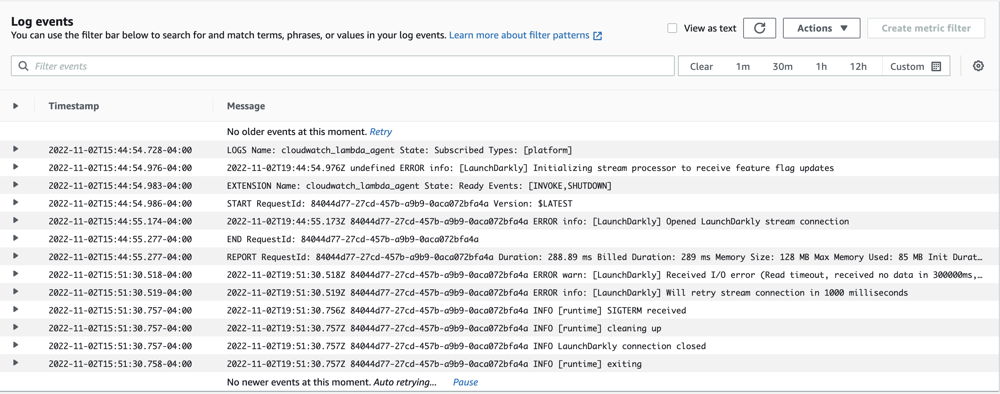

# Using LaunchDarkly in AWS Serverless Lambdas

If you're running on AWS, chances are that Lambdas, AWS's function-as-a-service offering, play an important role in your application, whether they form the basis of a microservices architecture or they just run arbitrary compute tasks required for your application to function properly. The good news is that you can bring the benefits of feature flags and feature management to your release processes in Lambda using LaunchDarkly.

Feature management isn't just about visible features that user's can interact with. It is also about the backend code that makes your application function. Being able to add kill switches, feature toggles and more to Lambda functions becomes critical as your team adopts feature flags. While LaunchDarkly works out-of-the-box in Lambdas, there are some special considerations you need to know about when working in a serverless environment. This article will cover how to get LaunchDarkly set up in Lambda and show you how to handle those aspects that are unique to serverless.

## LaunchDarkly in Lambda

The good news is that integrating LaunchDarkly into Lambda functions is pretty straightforward. You'll need to install and configure the [relevant SDK for your language](https://docs.launchdarkly.com/sdk). Here's one way to do this using the [LaunchDarkly Server-Side SDK for Node.js](https://docs.launchdarkly.com/sdk/server-side/node-js): 

1. Create a new Lambda from scratch using the Node.js 16x runtime in AWS.
2. Pull the function code down locally, for example by clicking the "Actions" drop down and choosing "Export").
3. Within the project files locally, install the Node SDK via `npm install launchdarkly-node-server-sdk`.
4. Require and configure the SDK. This can occur outside of the handler so that the SDK is not reinitialized every time the function is run:
```javascript
const LaunchDarkly = require('launchdarkly-node-server-sdk')
const client = LaunchDarkly.init(process.env.LAUNCHDARKLY_SDK_KEY)
```
5. Wait for the client to initialize and then start getting flag values. This must occur within the handler. Note that the below example just passes a "anonymous" as a key, but you can, of course, pass more detailed targeting information.
```javascript
await client.waitForInitialization();
const flagValue = await client.variation("my-flag", { key: "anonymous" }, false);
```
6. Re-upload the updated function, for example by zipping it up and choosing the "Upload from" and then ".zip file" option in the AWS Lambda console.
7. Set the `LAUNCHDARKLY_SDK_KEY` environment variable by going to the "Configuration" tab and choosing "Environment variables". You can obtain your key within the LaunchDarkly flag dashboard by clicking `Command/Ctrl + K` and then choosing "Copy SDK key for the current environment" and finally "Server-side key".
8. Test your function.

You should now be able to retrieve flag data within your function and alter the logic of the function accordingly.

### Using a Lambda Layer

You can repeat the above process for every Lambda you've deployed that needs to use LaunchDarkly, but there's an easier way to ensure that all your Lambda functions have quick and easy access to LaunchDarkly, and that's by creating a [Lambda Layer](https://docs.aws.amazon.com/lambda/latest/dg/configuration-layers.html). The process of doing so is very similar to the above.

Here's how to do it for the Node.js runtime:

1. Create a local folder and, within that folder, create a `nodejs` subdirectory. If you are using a different language runtime,  you can find the relevant [location for dependencies here](https://docs.aws.amazon.com/lambda/latest/dg/configuration-layers.html#configuration-layers-path).
2. Within the `nodejs` directory, run `npm install launchdarkly-node-server-sdk`.
3. Compress the contents of your layer directory (i.e. the `nodejs` directory) but not the containing directory. For example, if the path to the project and `nodejs` folder is `/layer/nodejs`, ensure your zip does not contain the outer `/layer` directory.
3. Go to the [Layers page](https://console.aws.amazon.com/lambda/home#/layers) within the AWS Lambda console and click "Create layer".
4. Give the layer a name. For example, `launchdarkly-node-sdk` and choose Node 16.x as the supported runtime. Finally, upload the zip file containing your layer.


Now that you have the layer set up, it's relatively easy to use in any Lambda function that requires the LaunchDarkly SDK.

1. In the AWS Lambda console, open the function that you want to add the layer to and scoll down to the Layers section at the bottom of the page. Choose "Add a layer".
2. Select the "Custom layers" option and then, from the dropdown, choose your "launchdarkly-node-sdk" layer. Click "Add".

That's it! Now your Lambda can use the SDK without needing to manually install it or upload the `npm_modules` directory (if this is the only npm dependency you have, even the `package.json` and `package-lock.json` are no longer needed). However, the code within your Lambda to initialize the SDK and get flag values will remain the same and you'll still need to set the SDK key as an environment variable.

## Caching Data in a Data Store

Behind the scenes LaunchDarkly does a lot of things to make retrieving flag values incredibly fast, including [delivering flags from the edge](https://launchdarkly.com/blog/flag-delivery-at-edge/), caching flag data locally and streaming updates. This means that getting the SDK client initialized and retrieving flag data takes under 25 milliseconds.

However, using a data store can help speed up the process by allowing you to get the latest flag data without ever needing to make an external call outside AWS. For example, LaunchDarkly's SDKs make it simple to configure [DynamoDB](https://docs.launchdarkly.com/sdk/features/storing-data/dynamodb?q=dynamo) as a data store.

First, you'll need to add the DynamoDB extension for the language you are building your Lambda in. For Node.js, that would mean installing the add-on via npm (`npm install launchdarkly-node-server-sdk-dynamodb`) or adding it to your Lambda Layer and then requiring it as shown below.

```javascript
const LaunchDarkly = require("launchdarkly-node-server-sdk");
// The SDK add-on for DynamoDB support
const {
  DynamoDBFeatureStore,
} = require("launchdarkly-node-server-sdk-dynamodb");
```

Next, you'll need to create an instance of a store object that can be passed as a configuration option to LaunchDarkly. You'll need the DynamoDB table name, which can be passed as a string or set as an environment variable. You can also specify the [caching behavior](https://github.com/launchdarkly/node-server-sdk-dynamodb#caching-behavior) for the data store if needed.

Within our configuration options, we'll want to specify `useLdd` as true. This will launch the client in [daemon mode](https://docs.launchdarkly.com/sdk/features/relay-proxy-configuration/daemon-mode). What this means is that the client will use DynamoDB as the source of truth for flag data without calling LaunchDarkly.

```javascript
const store = DynamoDBFeatureStore(process.env.DYNAMODB_TABLE);
// useLdd launches the client in daemon mode where flag values come
// from the data store (i.e. dynamodb)
const options = {
	featureStore: store,
	useLdd: true,
};
const client = LaunchDarkly.init(process.env.LAUNCHDARKLY_SDK_KEY, options);
```

From this point on, you can get flag values as normal, but the LaunchDarkly client will only go to DynamoDB. You may be wondering, how do I get the latest flag data into DynamoDB? By default, the SDK client will cache all of the values as soon as it is initialized with a configured data store, but if you're in daemon mode that won't happen.

One solution is to create a separate function that will only initialize the data store and the SDK client (not in daemon mode), allowing it to automatically synchronize flag data. This function can then be called whenever a flag is changed via LaunchDarkly's webhook integration. You can see that solution discussed in detail on our guide on [using LaunchDarkly in serverless environments](https://docs.launchdarkly.com/guides/infrastructure/serverless).

This works, but there's a potentially better solution depending on your needs in our Relay Proxy. So let's explore that next.

## Using the Relay Proxy in AWS

https://github.com/solve-hq/LaunchDarkly-relay-fargate

## Handling LaunchDarkly Analytics Events

LaunchDarkly's dashboard provides a lot of detail on flag usage, users and even experimentation results. Much of this data is passed to LaunchDarkly via [analytics events](https://docs.launchdarkly.com/sdk/concepts/events/). In order to save on performance and network requests, the LaunchDarkly SDKs will buffer these events, sending them on an interval (note that this interval is configurable).

One of the potential complications of running LaunchDarkly within Lambda, or really in any serverless context, is that the Lambda may shut down before all pending analytics events have been sent. There are a couple of solutions for this.

### Flushing events

One solution is to [manually flush analytics events](https://docs.launchdarkly.com/sdk/features/flush) on every invocation of the Lambda. You can see that is just a one line addition to my handler code below.

```javascript
exports.handler = async (event) => {
  await client.waitForInitialization();

  const apiVersion = await client.variation("my-flag", {key: "anonymous"}, "");
  
  // flush the analytics events 
  await client.flush();
  
  const response = {
    statusCode: 200,
    body: JSON.stringify("Hello world"),
  };
  return response;
};
```

While this will work, it has also effectively eliminated the buffer entirely since all events will be flushed on every invocation, making a call to LaunchDarkly's servers in the process. This may not be the ideal solution for you, but thankfully there's another option.

### Closing the client

When the client closes, it automatically sends any pending analytics events to LaunchDarkly. You can handle this using a graceful shutown in Lambda [as described here](https://github.com/aws-samples/graceful-shutdown-with-aws-lambda). This requires that you add an extension to your Lambda. You can use the CloudWatch Lambda Insight extension as it is built in. Here are the steps:

1. Open your Lambda function and go to the Layers section at the bottom of the page and choose "Add a layer".
2. Leave the "AWS layers" option selected and in the dropdown select "LambdaInsightsExtension" under the "AWS provided" heading and then click "Add".

Now that the extension is added, we can listen for the `SIGTERM` event that indicates that the Lambda is being shut down and run code at this time as shown below.

```javascript
const LaunchDarkly = require("launchdarkly-node-server-sdk");
const client = LaunchDarkly.init(process.env.LAUNCHDARKLY_SDK_KEY);

exports.handler = async (event) => {
  let response = {
    statusCode: 200,
  };
  await client.waitForInitialization();
  const flagValue = await client.variation("my-flag", { key: "anonymous" });
  response.body = JSON.stringify(flagValue);
  return response;
};

process.on('SIGTERM', async () => {
    console.info('[runtime] SIGTERM received');

    console.info('[runtime] cleaning up');
    await client.close();
    console.info('LaunchDarkly connection closed');
    
    console.info('[runtime] exiting');
    process.exit(0)
});
```

If you'd like to see this process run, go to the "Monitor" tab in the AWS Lambda console and choose "View logs in CloudWatch". You can view the logs for a recent run of your function and see that the cleanup script was triggered (in my tests, this happened approximately 6 minutes after the last call of the function) as you can see with the "LaunchDarkly connection closed" log message below.



## Conclusion

Hopefully this article has provided you with all of the tools you'll need to begin adding LaunchDarkly feature flags into your Lambdas. However, we do have a number of additional resources that may be useful to you in your further development:

* [Using LaunchDarkly in serverless environments](https://docs.launchdarkly.com/guides/infrastructure/serverless) – This guide covers high-level considerations for serverless environments and walks through creating a function to synchronize flag data into DynamoDB.
* [Using LaunchDarkly in AWS Lambda](https://docs.launchdarkly.com/guides/infrastructure/aws-lambda) – This guide covers similar ground to the above but in a more step-by-step tutorial format if you'd like to follow along.
* [DynamoDB](https://docs.launchdarkly.com/sdk/features/storing-data/dynamodb/?q=lambda) – This is the documentaiton page for integrating DynamoDB into LaunchDarkly's SDKs that includes code samples for all supported language SDKs.