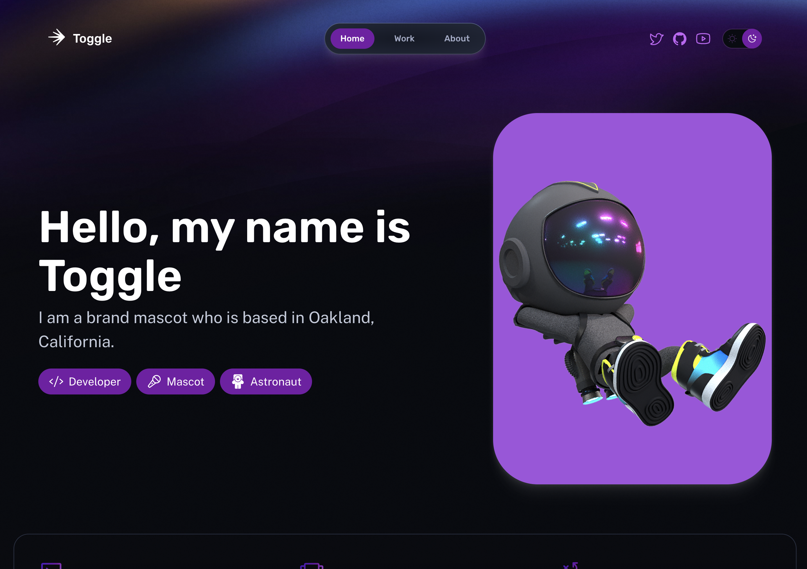

# Connect (Almost) Anything to LaunchDarkly with Zapier

One of the most powerful aspects of LaunchDarkly is our lengthy list of [integrations](https://docs.launchdarkly.com/integrations). We've got integrations with AWS services like Cloudwatch and Cloudtrail, Atlassian products like Confluence and Compass, Terraform, Azure DevOps, Honeycomb and many more. But what if the service(s) you want to integrate aren't on that list? That's where our [Zapier integration]() comes in.

If you haven't heard of [Zapier](https://zapier.com/), it is an automation platform that allows you to connect disparate services and perform automated tasks whenever an event occurs. For example, when someone registers for an event in Eventbrite, you might add them to your email list on MailChimp and also as a potential lead in Salesforce. Plus, all of this is done with a visual editor and _no code_.

But what makes Zapier powerful is the sheer number of integrations it has - currently over 5,000 apps. This means that almost any software your company uses is likely to have a Zapier integration, which means that it can integrate with LaunchDarkly! Let's see how this works.

## Exploring the Demo

To demonstrate how this would work, I built a [simple portfolio for Toggle](https://toggle-portfolio.netlify.app/), LaunchDarkly's astronaut mascot. The app is built with Astro, a full-stack web framework, using a combination of LaunchDarkly's [client-side JavaScript SDK](https://docs.launchdarkly.com/sdk/client-side/javascript) and [server-side Node.js SDK](https://docs.launchdarkly.com/sdk/server-side/node-js/migration-6-to-7).

_If you'd like to learn more about Astro and see how you can integrate feature flags within an Astro app, check out [this blog post](https://launchdarkly.com/blog/5-things-that-make-astro-unique-for-building-web-apps/)._

You can also find the code [on GitHub](https://github.com/remotesynth/toggle-portfolio),  but, to be clear, you won't find anything specific to Zapier in here. That's the point in many ways. Zapier can connect the various services that run aspects of this site without requiring any modification to the code.

The Toggle Portfolio site will use Zapier to perform the following actions:

* When we launch the portfolio section of the site (i.e. Toggle's work) via a feature flag, it will automatially send an email campaign to Toggle's email list subscribers that are in [Mailjet](https://mailjet.com).
* When Toggle posts a new item to his work portfolio, it will trigger a flag that enables a toast message that will pop up notifying visitors of the site that a new item has been posted. This flag will automatically be turned off by Zapier after a predetermined period of time.
* When someone submits the contact form it will automatically add them to targeting for a flag that will display a different message on the home page rather than the "contact Toggle" CTA (call to action).

Obviously the exact services and nature of your own Zaps could be quite different, but this is designed to explore ideas for how Zapier lets you link flag changes to other services in unique ways.