# Connect (Almost) Anything to LaunchDarkly with Zapier

One of the most powerful aspects of LaunchDarkly is our extensive list of [integrations](https://docs.launchdarkly.com/integrations). We've got integrations with AWS services like Cloudwatch and Cloudtrail, Atlassian products like Confluence and Compass, Terraform, Azure DevOps, Honeycomb and many more. But what if the service(s) you want to integrate aren't on that list yet? That's where our [Zapier integration](https://docs.launchdarkly.com/integrations/zapier) can save the day.

If you haven't heard of [Zapier](https://zapier.com/), it is an automation platform that allows you to connect disparate services and perform automated tasks whenever an event occurs. For example, when someone registers for an event in Eventbrite, you might add them to your email list on MailChimp and also as a potential lead in Salesforce. Plus, all of this is done with a visual editor and _no code_.

But what really makes Zapier powerful is the sheer number of integrations it has - currently over 5,000 apps. This means that almost any software your company uses is likely to have a Zapier integration, which means that it can integrate with LaunchDarkly! Let's see how this works.

## Exploring the Demo

To demonstrate how this would work, I built a [simple portfolio for Toggle](https://toggle-portfolio.netlify.app/), LaunchDarkly's astronaut mascot. The app is built with Astro, a full-stack web framework, using a combination of LaunchDarkly's [client-side JavaScript SDK](https://docs.launchdarkly.com/sdk/client-side/javascript) and [server-side Node.js SDK](https://docs.launchdarkly.com/sdk/server-side/node-js/migration-6-to-7).

_If you'd like to learn more about Astro and see how you can integrate feature flags within an Astro app, check out [this blog post](https://launchdarkly.com/blog/5-things-that-make-astro-unique-for-building-web-apps/)._


You can also find the code [on GitHub](https://github.com/remotesynth/toggle-portfolio),  but, to be clear, you won't find anything specific to Zapier in here. That's the point in many ways. Zapier can connect the various services that run aspects of this site without requiring any modification to the code.

The Toggle Portfolio site will use Zapier to perform the following actions:

* When we launch the portfolio section of the site (i.e. Toggle's work) via a feature flag, it will automatially send an email campaign to Toggle's email list subscribers that are in [Mailjet](https://mailjet.com).
* When Toggle posts a new item to his work portfolio, it will trigger a flag that enables a toast message that will pop up notifying visitors of the site that a new item has been posted. This flag will automatically be turned off by Zapier after a predetermined period of time.
* When someone submits the contact form it will automatically add them to targeting for a flag that will display a different message on the home page rather than the "contact Toggle" CTA (call to action).

Obviously the exact services and nature of your own Zaps could be quite different, but this is designed to explore ideas for how Zapier lets you link flag changes to other services in unique ways. In each case, we'll talk through the scenario so that you can better understand how you might apply the broader concepts of each to your specific needs and service integrations.

## Example 1: Launching a Campaign Using a Feature Flag

### Scenario

We're ready to launch a big new feature and, as such, have aligned marketing campaigns to the launch. Rather than manually triggering the related campaigns, we'll use Zapier to automatically trigger them as soon as the feature is officially released in production.

While our specific integration will focus on only an email campaign using Mailjet, this could apply to any sort of campaign integration or multiple integrations. Perhaps an email campaign goes out, a post on your LinkedIn, Facebook and Instagram pages is published, and a Google Ads campaign begins – all occurring automatically, without the need for manual intervention.

### Example Implementation

There are three steps to this implementation:

#### 1. Start the automation on the change of a flag.

Let's start by creating a new Zap in Zapier and choosing LaunchDarkly as the trigger. Once we've connected your LaunchDarkly account to Zapier, we'll want to choose the option for "Toggle a feature flag" for the trigger.

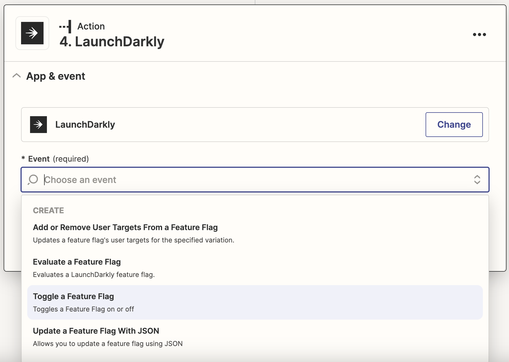

We'll choose the connected LaunchDarkly account and this will open a form where you will select the details such as the project, environment, flag key and the type of event to update on (you can learn more about the types of actions listed in this menu option [in the documentation](https://docs.launchdarkly.com/home/members/role-actions)). We'll select the `updateOn` action and update on `*`, which means any type of update. We're choosing this option because there is not a specific update event specific to the flag being turned on, however we will address that in a moment.

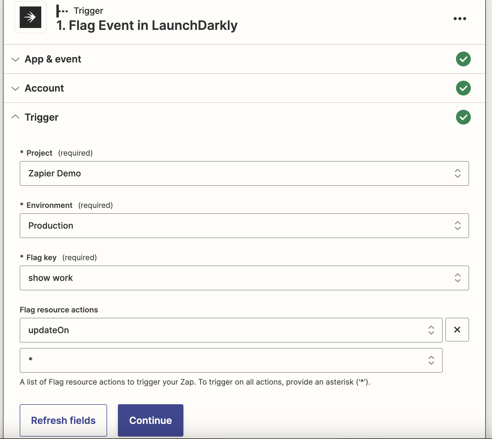

The final step is to test the trigger. Zapier will pull in flag data and show us the response it receives from LaunchDarkly. In this case, this is particularly important as we'll use the response data in our next step.

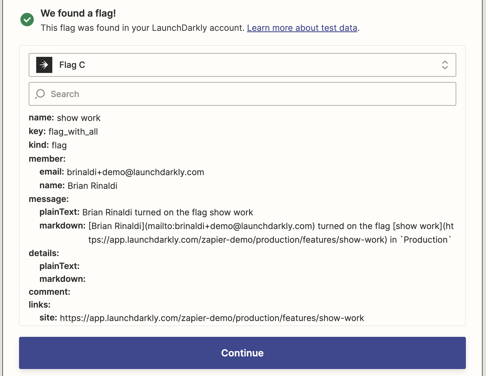

#### 2. Filter the flag event data.

Our prior step triggered the automation based upon any flag update, but we only want to trigger this automation if the flag is turned on, not when some other form of update is made. To accomplish this, we'll use a built in action provided by [Zapier called a filter](https://help.zapier.com/hc/en-us/articles/8496276332557-Add-conditions-to-Zaps-with-filter) (aka "Only continue if..."). The filter will allow us to look for specifics in the data response from LaunchDarkly and only run the rest of the automation when the response meets our criteria.

In our case, we want to parse the message portion of the response from LaunchDarkly and look to ensure it contains text indicating that the flag was turned on.

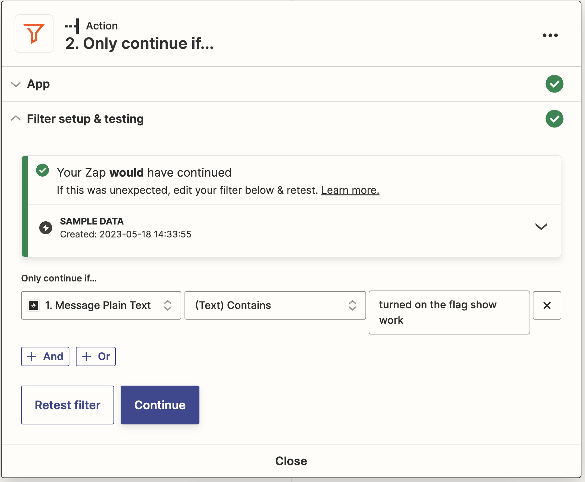

#### 3. Connect the service.

Now we're ready to connect the service(s) that will launch when the flag is turned on. For this example, we've connected Mailjet, but, again, this could be anything. In Zapier, Mailjet gives you the option to send an HTML email that you define within the Zapier automation, which we'll use to send an email to our contact list indicating that the new section of our site has launched.

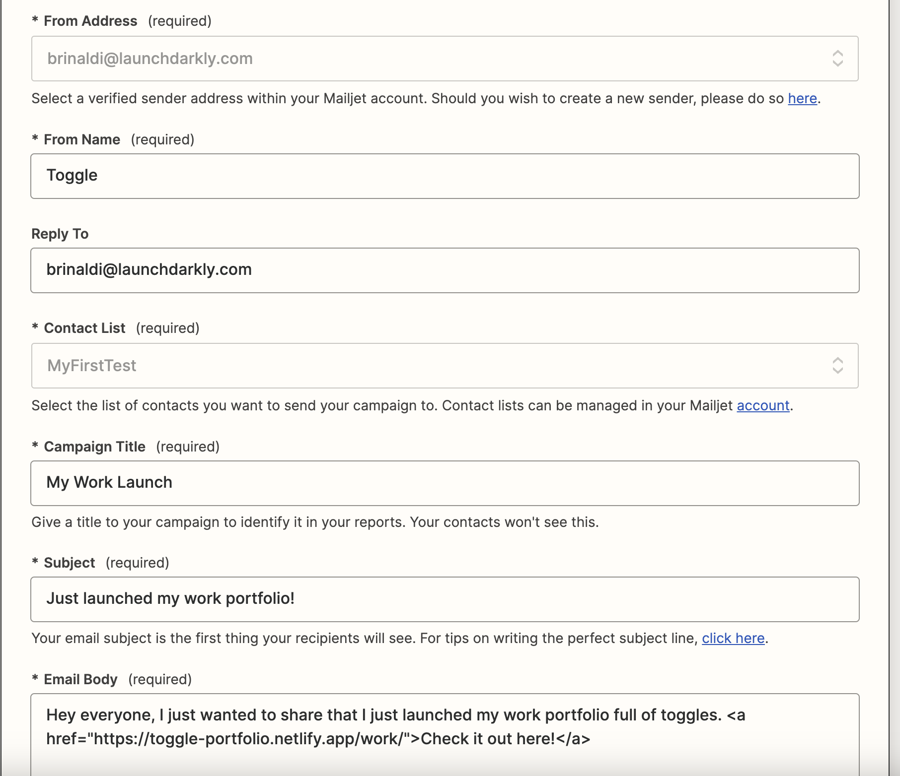

You can see from the zap runs that this automation ran in one case but was filtered out in another based upon our filter's criteria.

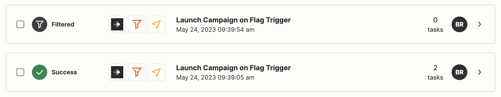

## Example 2: Temporarily Triggering a Flag Based Upon an External Event

### Scenario

Some feature flags become part of the a site's permanent infrastructure or configuration allowing you to toggle them on and off as necessary. In this scenario, we want to enable one of these flags when a particular external event happens. For our example, it will be when a new post is posted to our RSS feed, which will temporarily cause the site to display a toast message notifying users that a new post was just released (essentially acting similarly to a push notification), but this could be new product was released on our external Shopify or WooCommerce store, a Video was posted to our YouTube channel or a livestream goes live on Twitch.

### Example Implementation

There are four steps to this implementation:

#### 1. Start the automation based upon an event.

The first step is to start the automation whenever an external event happens. In our case, this is a new item being added to the RSS feed for our blog. Zapier offers an [RSS trigger](https://help.zapier.com/hc/en-us/articles/8496279482125-Trigger-Zaps-from-new-RSS-feed-items) that can watch a feed for new or updated items.

We'll need to provide RSS feed URL, a username/password (if required) and then what type of change we want to look for. For this last item, we would usually look for an updated GUID (the unique identifier for a new post in the RSS feed), but for our testing purposes we're choosing any change to make it easier to test the trigger.

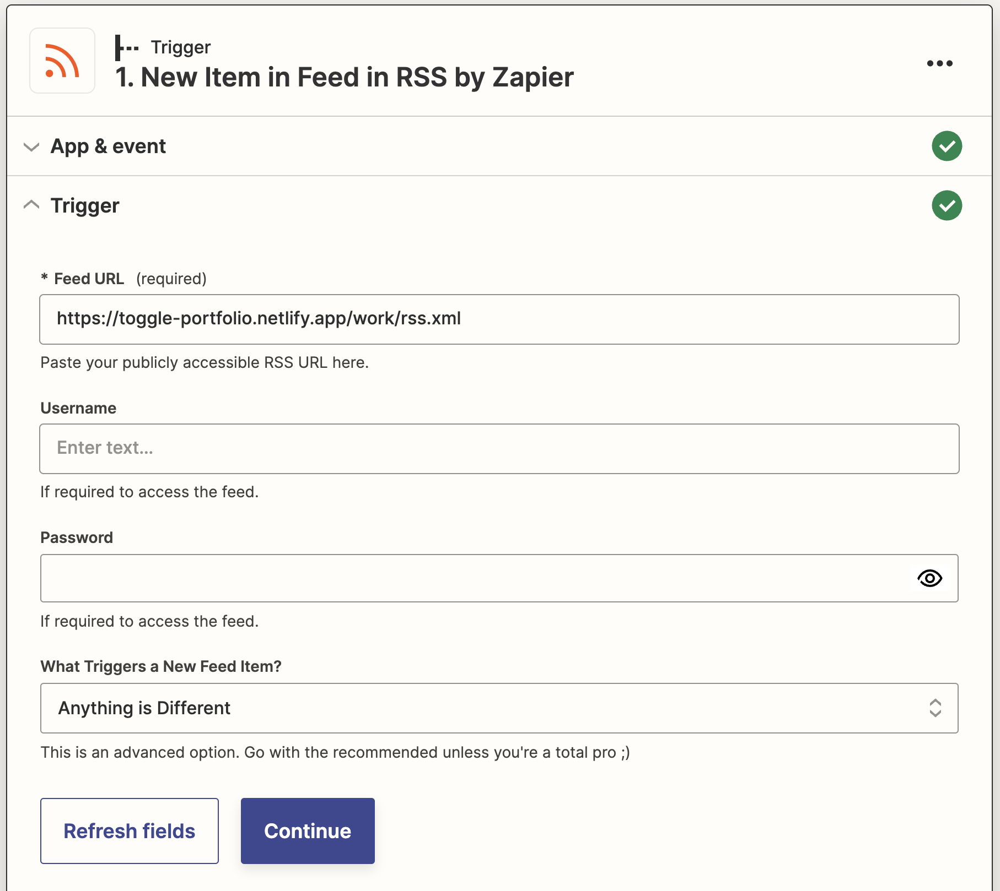

#### 2. Toggle the feature flag on.

For our connected LaunchDarkly account, we'll choose the "Toggle a feature flag" action.


The next step is to toggle the appropriate flag for the relevant project and environment and tell Zapier to turn the flag on (we can also optionally provide a comment that will be in LaunchDarkly's audit trail).

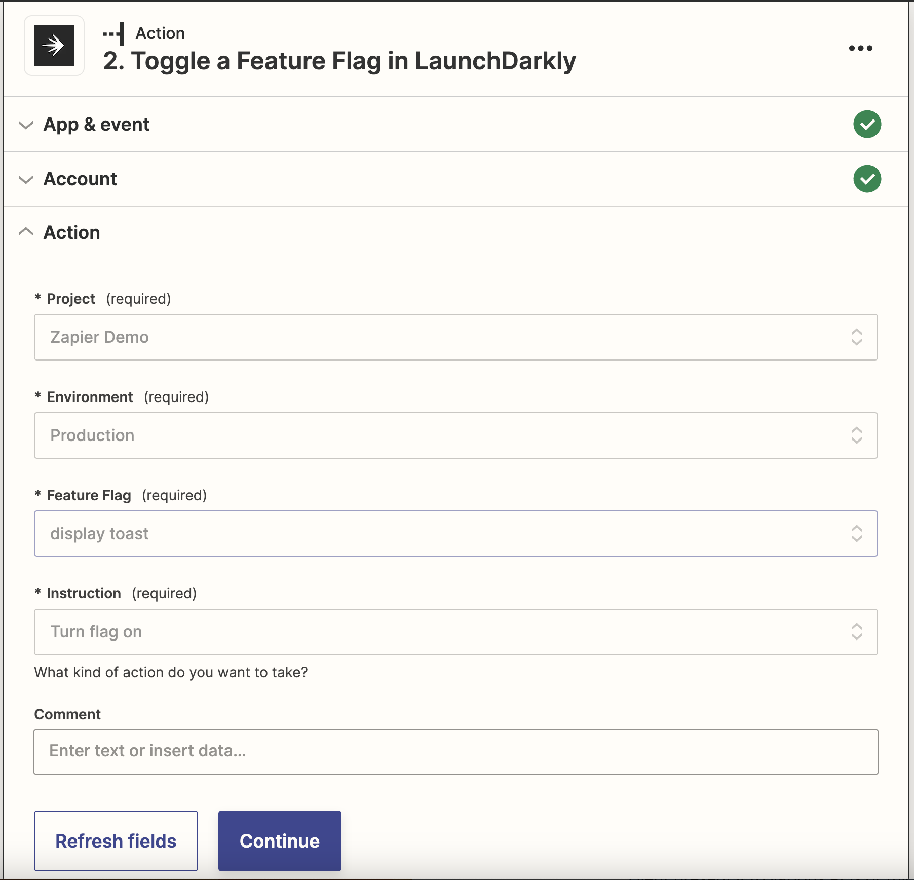

#### 3. Wait a specified time period.

In this scenario, we want to turn the flag back off after a particular time period since the post is only new for a short time. Zapier offers a [delay](https://help.zapier.com/hc/en-us/articles/8496288754829-Add-delays-to-Zaps) action for this purpose that allows us to delay for a specified amount of time, delay until a specified date and time or delay after queue, which waits for a specified queue of actions has completed. We want the "Delay for" action.

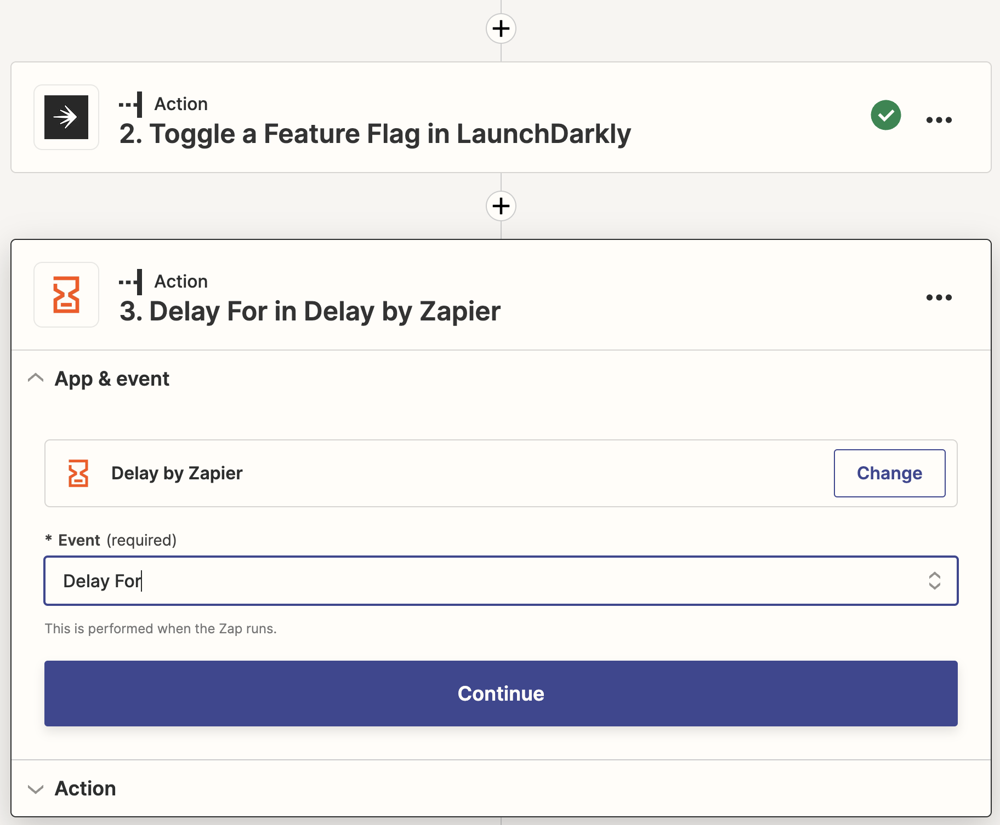

To configure this action, we specify a number and the units for this delay. We've set it to 3 minutes, which is extremely short but designed to make this easier to test.

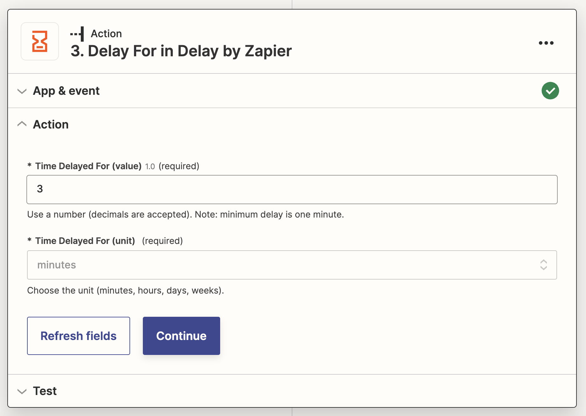

#### 4. Toggle the feature flag off.

Once the time delay has passed, we can configure the flag to turn off using the same workflow as in step two above but choosing the "Turn flag off" instruction.

## Example 3: Updating Flag Targeting Based Upon a Form Submission

### Scenario

LaunchDarkly feature flags aren't just a tool for testing and releasing features. Their advanced targeting capabilities make them perfect as a way to manage access to particular features, often referred to as entitlements. For example, users in the EU might see a different feature than those in the US. It's also often used to manage access for things like beta programs or targeted rollouts.

In this scenario, we want to allow users to automatically get added to targeting once a form hosted Netlify is submitted. This could be useful for allowing self-signup of beta programs or even managing access to beta programs via external lists in Google Sheets or Airtable.

### Example Implementation

There are three steps to this implementation (two in Zapier and then one in code):

#### 1. Trigger the automation via a form submission.

Since the example site is hosted on Netlify and uses [Netlify Forms](https://www.netlify.com/products/forms/), we can trigger an automation when a new submission is added, which will pass us the details of the form submission that we can then use for targeting. We just need to choose the site and then the associated form.

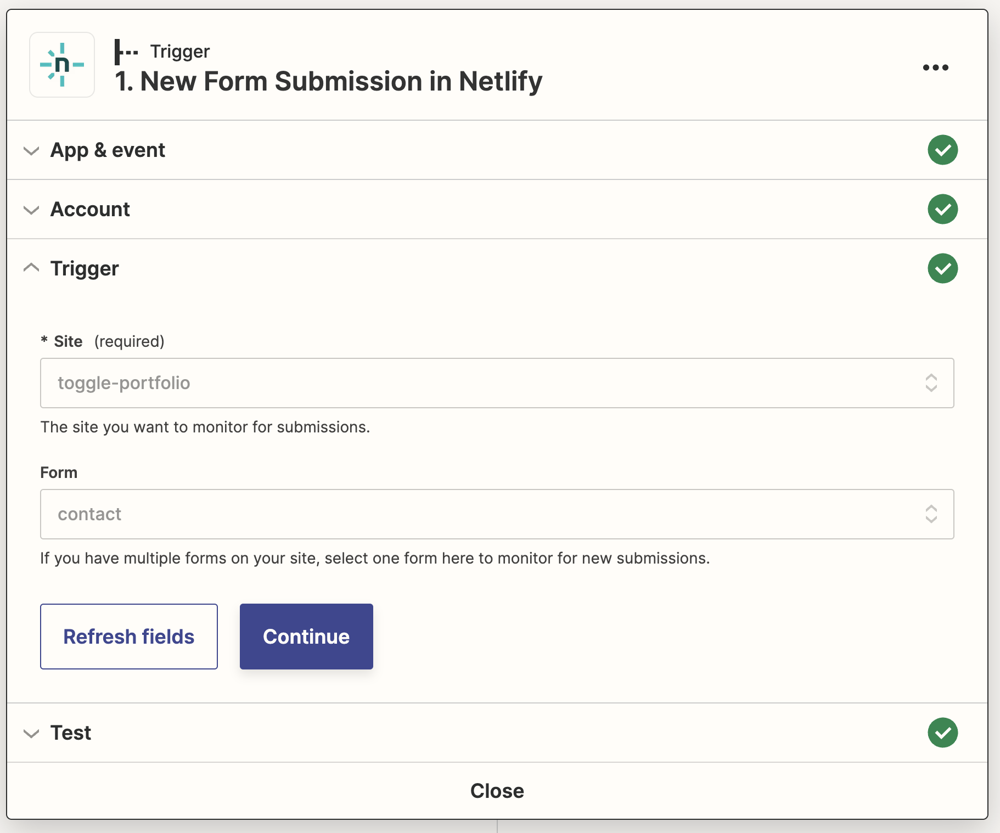

#### 2. Add the user as a flag target.

LaunchDarkly's Zapier integration allows us to add an individual user target to any flag within the chosen project and environment as part of an automation.

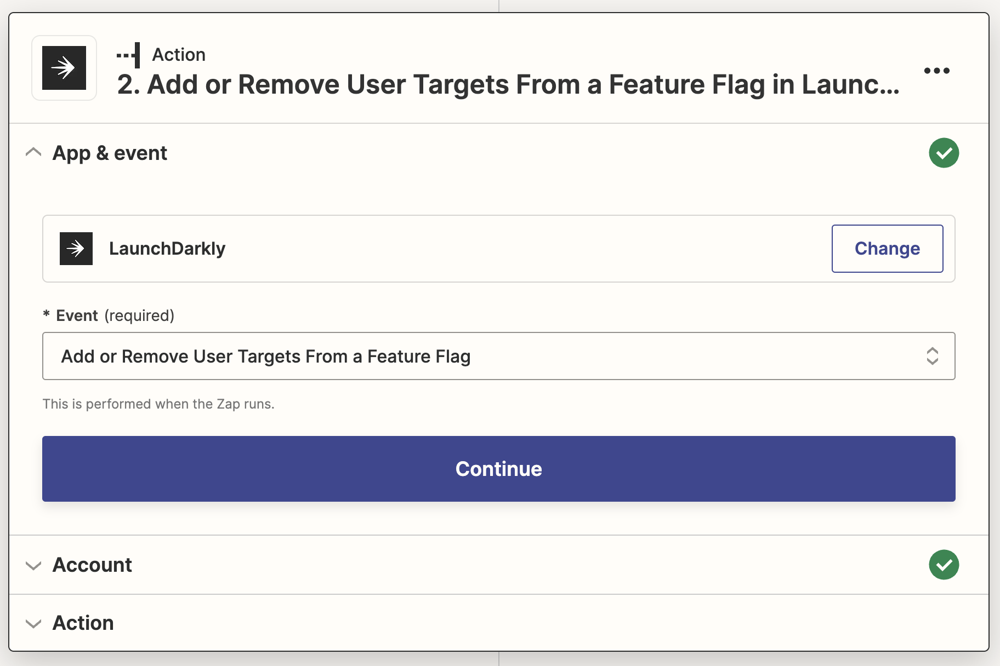

To do this, we need to provide a number of details including the project, environment, feature flag and the variation the targeting should be added to. We can then use the data passed from the Netlify Form trigger to supply the user key (the user's email in this case).

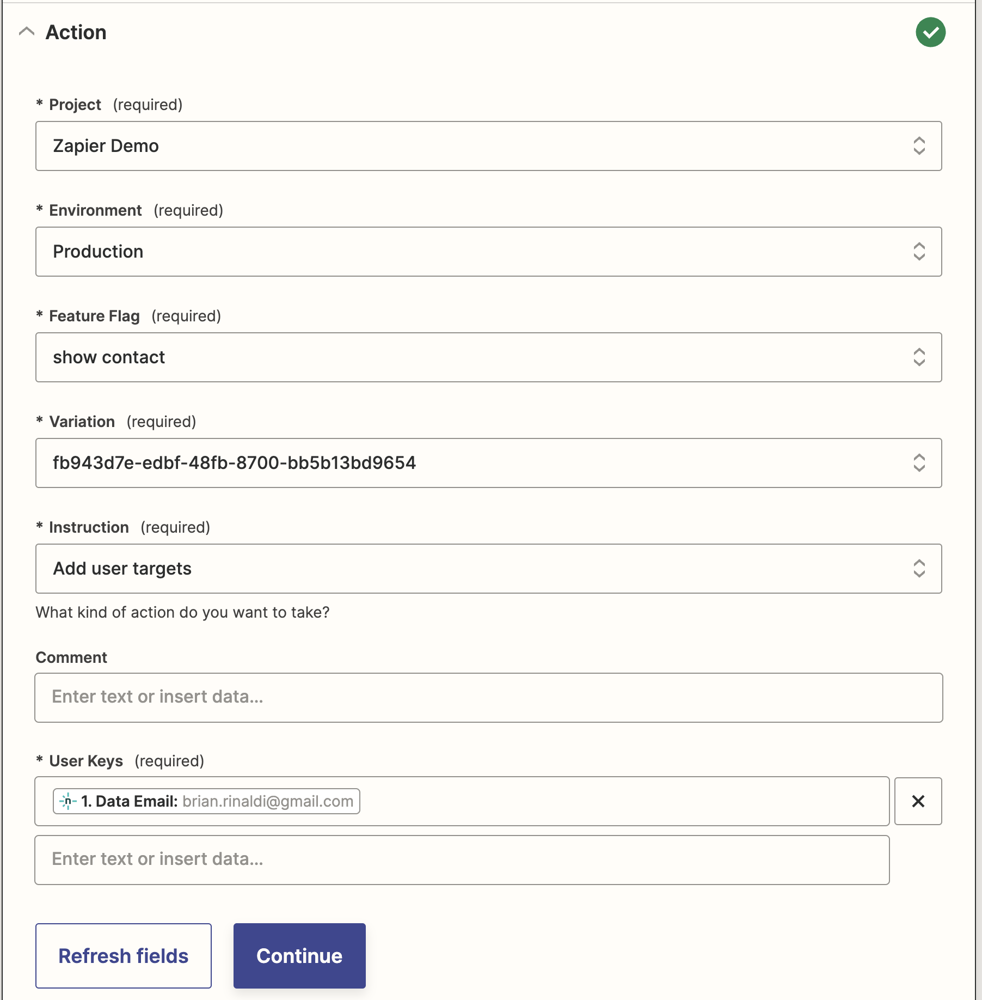

#### 3. Add context targeting in the code.

In the example app, the user submits a contact form and, if they've already contacted us, they are no longer shown the "Contact Us" CTA. This is done by adding them to the `false` variation targeting via Zapier using the steps described above.

In order to get this to work in the code, we first need pass the user data to a `user` context in LaunchDarkly. The below code does this by initializing the [client-side JavaScript SDK](https://docs.launchdarkly.com/sdk/client-side/javascript) client with the context details. Note that if the client had already been initialized, we would use the `identify()` method to update the user context.

Finally, it saves the context data as a cookie. This isn't necessary for LaunchDarkly, but, given the nature of this simple example app, it is the easiest way to persist the user's context across the application.

```javascript
const context = {
  kind: "user",
  key: formData.get("email"),
  email: formData.get("email"),
  firstName: formData.get("first_name"),
  lastName: formData.get("last_name"),
};
const client = LDClient.initialize(import.meta.env.PUBLIC_LD_CLIENT_ID, context);
await client.waitForInitialization();
document.cookie = `context=${JSON.stringify(context)};  Secure; path=/`;
location.href = "/thankyou";
})
.catch((error) => alert(error));
```

On the home page, we get the context from the cookie value using the `Astro.cookies` API and then pass that context to LaunchDarkly's [server-side Node.js SDK](https://docs.launchdarkly.com/sdk/server-side/node-js) when getting the variation for our `show-contact` flag. Once the user has been added to targeting, this flag will return false rather than the default of true. If the cookie doesn't exist, we pass an anonymous user context.

```javascript
const ldClient = ld.init(import.meta.env.LD_SDK_KEY);
await ldClient.waitForInitialization();
const contextCookie = Astro.cookies.get('context').value;

let context;
if (contextCookie) {
	context = JSON.parse(contextCookie);
} else {
	context = {
	kind: 'user',
	key: 'anonymous'
	};
}
const showContact = await ldClient.variation('show-contact', context, true);
```

Finally, we can use the cookie to determine what to display to the user.

```html
<aside id="contact">
	{showContact ? (
	<>
	<h2 class="width-15ch">Interested in working together?</h2>
	<CallToAction href="/contact">
		Send Me a Message
		<Icon icon="paper-plane-tilt" size="1.2em" />
	</CallToAction>
	</>
	): (
		<h2>Thanks for reaching out! I'll be in contact soon.</h2>
	)}
</aside>
```

## So Many Other Possibilities...

My hope is that these examples triggered some ideas in your mind about ways that you can integrate flags into other workflow automations using Zapier. Here are some other ideas you might consider:

* **Add tasks when a flag is created.** Perhaps you want to ensure that flags are cleaned up once they are no longer in use. You could automatically add tasks to a todo list (for example, on Todoist , Trello or even Asana) when they are created.
* **Post flag changes to a Discord server.** Our [Slack integration](https://docs.launchdarkly.com/integrations/slack) can help you monitor and even change flags via Slack, but what if your team uses Discord? Zapier can help. You can even enable a message in Discord to flip a flag.
* **Manage beta group targeting in a Google Sheet or Airtable.** LaunchDarkly makes it easy for anyone from any team – not just developers – to manage segments and targeting, but perhaps your team already has an external tool for keeping track of a beta group? Rather than manage things in two places, you could tie the two together using Zapier.
* **Many, many more...** Again, Zapier integrates with _thousands_ of applications so the combination of services is practically limitless.

One thing that I did not discuss in detail is that LaunchDarkly's Zapier integration allows you to evaluate a feature flag as an action and, for instance, only running them if the flag is true for example. This means that, beyond all the automations we already discussed, you can even use LaunchDarkly feature flags to control any automation you build within Zapier. 🤯