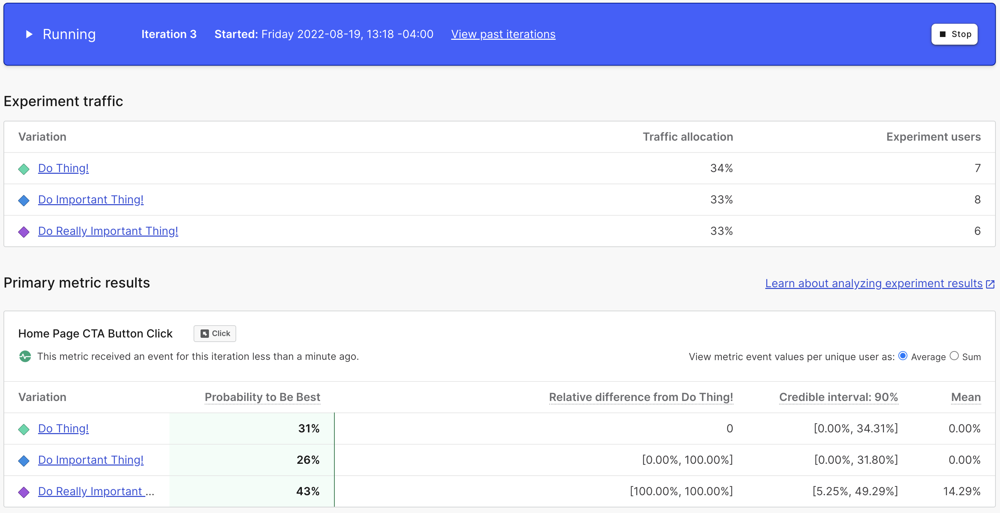

# Feature Flags: Beyond the Boolean

Like many problems in computer science, feature flagging seems deceptively easy to solve at first. After all, you might say, "it's just a simple boolean or conditional". I could start using them by simply setting a flag variable directly in my code that I can flip on and off as needed for testing.

```javascript
const myFlag = true;

if (myFlag) {
	// show my new feature or run my new code
}
else {
	// show the old feature or run the old code
}
```

I can change the variable to a false, recompile my code, and ship it again with the new value. 

Of course, this very quickly becomes problematic as I need to ensure that I don't accidentally deploy my code with the flag set to a state I don't want. This can be somewhat mitigated by tests, but it also doesn't scale well and makes it extremely difficult to tell what flags I have throughout my code. Plus, I need to redeploy the code each time to flip the flag. 

### A better solution

What I really need is some external but centralized place to set flags that I can even make different for each environment. I got it! I need a config or `.env` file.

```yaml
flags:
	- myFlag: true
	- myOtherFlag: false
```

Not only can I manage different flags for different environments in a central location, but now I can even have flags structured to make them easier to understand and (extra bonus!) flags don't have to be booleans. I can have strings, numbers and even full objects as the value of a flag. This lets me do more than just flip a portion of code on or off. Now, for instance, I can pass full configurations as objects or even content changes as strings or numbers.

### Whoa! How did things get so complicated?

Except, now I have some new problems. It turns out that since I can handle more complex flag types, I have scenarios where I'd like to have more then just two values. I need to build something to manage which variation needs to be served at any given time or for any given user.

Also, I'd like to do more even with the simple boolean flags. I'd like to have more than just 100% on or 100% off. Progressive rollouts seem like a great time, and I'd like to take advantagte of those to ensure that our changes hold up under load or testing. On top of this, the product team reached out and they would like to manage access to beta features for some of our key customers. In fact, they'd like to control when a feature goes live to align it with other teams like marketing. They'd prefer if they didn't have to call and developer and redeploy the configs to get a feature turned on. Even our software engineering team is concerned that the kill switch effectively requires deploying a new config or rolling back a release anyway.

Ok. So I can move the flag values out of the config and into a database or data store and then implement a management tool to allow the product team to manage changes and then I need to build a way for the production application to know when a flag is flipped so that the change is near immediate when we need to kill a feature... oh and both product and engineering management would like me to track metrics so that we can better utilize our flag system to make decisions and they are hoping to have the same performance across all users connecting globally... 


## From feature flags to feature management

There's good news and there's "less good" news. The good news is that the solution I've built can do a lot more than just simple true/false or on/off feature flags. Our deployments are easier and less risky because it has decoupled deploy from release. The engineering team no longer has long running feature branches that are painful and sometimes problematic to merge. Our product team can manage feature access, allowing us to test the impact of features using access controls or progressive rollouts while also aligning releases to company goals. But...

The "less good" news is now managing my "simple" feature flag system has become a full time job. I've essentially built a _simple_ version of a feature management platform like LaunchDarkly and am charged with improving and maintaining it. For some teams, this is a valid path, but for most it can be a major burden.

Regardless of which path _you_ choose, to [buy or to build](https://launchdarkly.com/blog/feature-management-platform-build-or-buy/), let's explore some of the cool things you can do beyond simple feature toggles with a feature management platform like LaunchDarkly.

## A flag for every occassion

Traditional boolean flags are incredibly powerful and by themselves can help you separate deploy from release thereby improving your development team's productivity. But different types of flags enable you to manage different aspects of your application beyond specific code paths. Let's look at the additional [flag types](https://docs.launchdarkly.com/sdk/concepts/flag-types#understanding-flag-types) supported within LaunchDarkly and how you might typically use them:

* **String flags** – these are frequently used to pass simple configuration values or even content.
* **Number flags** – these are frequently used to pass simple numeric configuration values.
* **JSON flags** – these can be used to pass complex configuration objects or even structured content.

A key thing to understand is that, once you leave the world of boolean flags, these are all [multivariate flags](https://docs.launchdarkly.com/home/flags/variations/?q=flag+types#understanding-multivariate-flags). They can have more than two variations! This can allow you to test different configurations or multiple content options via a single flag, or even target specific variations to specific users based upon specific criteria.

Let's look at a simple example of using a JSON flag for structured content. The below example modifies the content of our executive profile on the Wayne Industries about us page. This passes a very simple JSON object, but the data in a JSON flag can be as complex as you need it to be.

```javascript
{
  "account": "Member",
  "image": "AdamWest.webp",
  "location": "Gotham",
  "name": "Brue Wayne",
  "occupation": "Billionaire"
}
```

In the below CodePen, you can see what happens when you click the button to flip the flag on LaunchDarkly. When the flag is updated, the new flag data is passed via a streaming connection to the instance of the LaunchDarkly SDK client within my application, which triggers an event and updates the UI with the new data.

<iframe height="575" style="width: 100%;" scrolling="no" title="LaunchDarkly JSON Flag Example" src="https://codepen.io/remotesynth-the-bold/embed/qBoLZvz?default-tab=result" frameborder="no" loading="lazy" allowtransparency="true" allowfullscreen="true">
  See the Pen <a href="https://codepen.io/remotesynth-the-bold/pen/qBoLZvz">
  LaunchDarkly JSON Flag Example</a> by Brian Rinaldi (<a href="https://codepen.io/remotesynth-the-bold">@remotesynth-the-bold</a>)
  on <a href="https://codepen.io">CodePen</a>.
</iframe>

This change happens client-side, but a more typical scenario would change this content server-side. You can use one of LaunchDarkly's [20+ SDKs](https://docs.launchdarkly.com/sdk) for this.

> **How the demo works**
>
> The demo above is built using LaunchDarkly's [JavaScript SDK](https://docs.launchdarkly.com/sdk/client-side/javascript) for client-side JavaScript. In order to enable you to toggle the flag, it uses the [LaunchDarkly API](https://docs.launchdarkly.com/home/connecting/api) within a Cloudflare Worker to first read and then modify the flag's status. It denotes the flag's status at the time the demo loaded or upon any change. Note that every user is served based upon the same targeting, so if one user reading this article changes the flag, the content will change for every user.

In the above example, manually changing the flag triggers the change, but things get much more interesting when we combine this with the ability to target users. For example, what if only Dick Grayson and Alfred Pennyworth were able to see Bruce Wayne's true executive profile? Let's see how this might work.

## Right on target

Feature flags get even more interesting (and much more powerful) when you do not need to serve the same variation to every user. Here are just a few capabilities that rely on flag targeting:

* **Progressive/Incremental rollouts** – Imagine you want to ensure that a recent change doesn't have any negative impact either on your performance, infrastructure or even, perhaps, conversion rate. In this case, you'll want to either slowly roll out the changes to a randomized set of user (say 10% then 20% and so on until 100%) or roll out changes to a specific subset of users (for example, a beta or early access program like our Product Management team wanted in the example above).
* **Attribute targeting** – In many cases, you may want to roll out a feature to a specific subset of users based upon specific critera, either temporarily for testing or permanently. For example, you may want to target certain compliance related features only at customers in EMEA. Or you may want to roll out changes only to a specific subset of devices.
* **A/B testing/experimentation** – This is a very specific kind of randomized rollout intended to research the impact of changes based upon a specific hypothesis. Using an A/B test we can measure the impact of changes to see which option performs best.

Without the ability to target users, either randomly or specifically based upon criteria, none of these solutions are possible. Let's look at a couple of quick interactive examples of how this works using LaunchDarkly.

The below Codepen demonstrates rolling out a new feature to test it's impact before pushing it to all users. In this simple example, I'm just changing a simple text tagline. If I wanted to expand this it could be any sort of feature or even an infrastructure change. For the purposes of example, both variations of the tagline are targeted randomly at 50% of users, but in a real world situation you'd probably start smaller or even use [a workflow](https://docs.launchdarkly.com/home/feature-workflows/workflows) to automate increasing the rollout.


It's worth noting that even though each variation targets 50% of users, it does not mean that each subsequent user will get the variations in sequence. It's more like a coin flip whereby you might hit heads or tails multiple times in a row.

<iframe height="400" style="width: 100%;" scrolling="no" title="LaunchDarkly Percentage Rollout Example" src="https://codepen.io/remotesynth-the-bold/embed/QWmzPqX?default-tab=result" frameborder="no" loading="lazy" allowtransparency="true" allowfullscreen="true">
  See the Pen <a href="https://codepen.io/remotesynth-the-bold/pen/QWmzPqX">
  LaunchDarkly Percentage Rollout Example</a> by Brian Rinaldi (<a href="https://codepen.io/remotesynth-the-bold">@remotesynth-the-bold</a>)
  on <a href="https://codepen.io">CodePen</a>.
</iframe>

> **How the demo works**
> 
> The demo uses the LaunchDarkly JavaScript SDK to load a string flag with the tagline. The two variations of the flag are each targeted at 50% of users. The initial load uses a random user ID to identify the user. Each click of the button generates a new random ID and calls the `identify()` method within the SDK to change the user. If the new user is randomly assigned the other variation, you will see the text change.

This sort of user targeting also enables flags to effectively manage your experimentation or A/B testing. Since we can create a flag with multiple variations and since those variations can be tracked based upon a metric, we can use this data to determine whether a change has the desired impact. Let's look at another simple example.

In the below Codepen, I am testing the effectiveness of changing the text on a call to action button on my home page. This experiment uses a flag with three different variations that I have split evenly amongst a third of site visitors. Each visitor will be randomly assigned a variation and I am testing whether or not they click the appropriate button.

<iframe height="350" style="width: 100%;" scrolling="no" title="LaunchDarkly Experiments Example" src="https://codepen.io/remotesynth-the-bold/embed/oNqmWvq?default-tab=result" frameborder="no" loading="lazy" allowtransparency="true" allowfullscreen="true">
  See the Pen <a href="https://codepen.io/remotesynth-the-bold/pen/oNqmWvq">
  LaunchDarkly Experiments Example</a> by Brian Rinaldi (<a href="https://codepen.io/remotesynth-the-bold">@remotesynth-the-bold</a>)
  on <a href="https://codepen.io">CodePen</a>.
</iframe>

As the experiment runs, I can track how many users were assigned each variation, how many clicked each one and, finally, what the prediction is as to which is the most effective CTA (Obviously, in the below screenshot this example has not yet received enough results to be an effective predictor).



> **How the demo works**
> 
> The demo uses the LaunchDarkly JavaScript SDK to load a string flag with the button's "call to action" text. The three variations of the flag are each targeted at 1/3 of users. The initial load uses a random user ID to identify the user. Each click of the new user button generates a new ID and calls the `identify()` method within the SDK to change the user, which will randomly assign the new user a new variation for testing. LaunchDarkly automatically tracks clicks on the button to help determine the effectiveness of each variation within the experiment.

## Feature flags – The tool you deserve _and_ the one you need right now!

Once you start thinking beyond the simple boolean, feature flagging quickly goes from being a way to manage simple conditionals to a way to enable a whole range of new capabilities.

This begins by speeding up your development workflow through constant releases and testing in production. It moves on to improving your DevOps practices by allowing teams to manage how their features are released through progressive or targeted rollouts. It broadens to enabling cross-team collaboration by allowing product owners to manage releases or enable access for targeted customers. Finally, it adds a new layer of insights through metrics around flags or even experimentation.

Happy flagging!