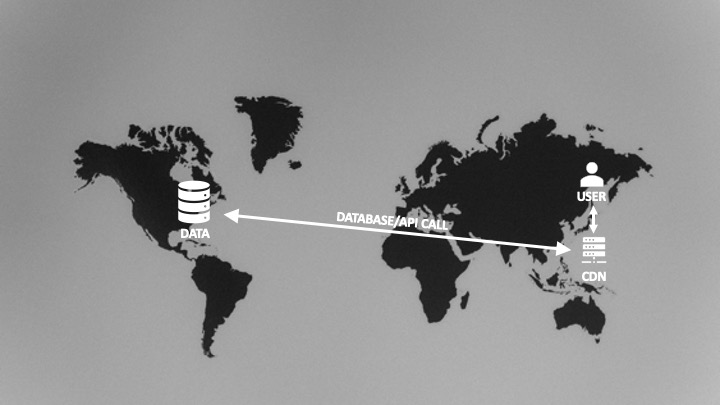
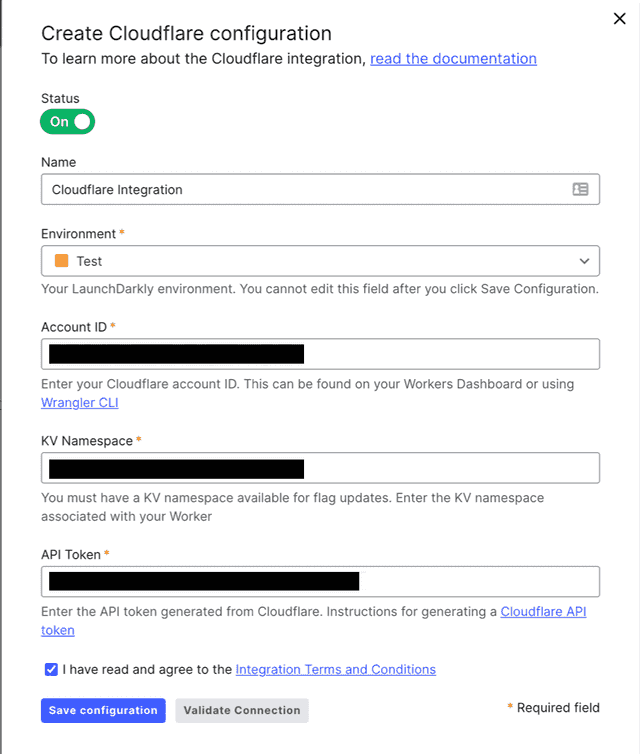

# Handling Data at the Edge with Cloudflare Workers

There's a lot of buzz around edge functions right now. If you haven't heard of them or aren't sure what they are, an edge function is essentially a serverless cloud function that runs on and is replicated across edge nodes. In many cases, though not all, these "edge nodes" are synonymous with CDN (content delivery network) nodes.

## What's the big deal about edge functions?

A typical serverless backend is deployed to a single region. For example, when I use AWS, I typically deploy my code to US-East-1. Any calls to my backend from the client/browser, will need to go to US-East-1, regardless of where in the world the client is.


Edge functions can help remove the latency involved in crossing these huge distances by moving serverless backend code to the edge node closest to the client. They can also do some things that would be difficult to achive in a regular serverless function, like intercept and can  modify or replace the request/response. This lets them do some pretty interesting things. For example:

* You can modify the body for A/B tests without any flash of rendering that you may get by modifying this client-side because the body is updated as the response is returned before it ever hits the browser.
* You can redirect the user immediately without relying on server-side or client-side redirection because you can intercept the request as it is sent. For example, if the user isn't logged in, you can send them to the login page.
* You can modify HTTP headers by adding custom headers or updating existing headers. For example, you can add custom headers based upon the user's credentials.

These are just a few examples to give you an idea of how edge functions can improve the performance and experience of your site.

## Sounds awesome! What's the catch?

There's two potential tradeoffs when it comes to using edge functions. The first is that, on some providers, edge functions have some limitations. For example, on AWS a Lambda@Edge function cannot modify the response body, though it can replace it while a Cloudfront Function can only modify HTTP headers.

The second is not so much a tradeoff as something to be aware of. An edge function may exist on an edge node close to the client, but your data may still be deployed in a single location, say US-East-1. This means that, while there is reduced latency calling the function itself, depending on which edge node the user hits, there may be additional latency involved in retrieving any data your edge function needs.



In many cases, this latency may not be a major issue, and may be no different than the latency you incurred by serving a function from a single server region, but it is worth considering because it may mitigate some of the benefits of moving code to the edge. There are ways to mitigate the latency of getting data, some of which I'll cover in a moment.

## Edge functions on Cloudflare

Many providers distinguish between edge functions and regular serverless functions. For example, AWS has Lambda, which is deployed to a server region, Lambda@Edge, which is replicated across 13 regional edge caches, and CloudFront functions, which are replicated across over 200 CDN locations (for a great explanation of the differences, see [this blog post](https://www.honeybadger.io/blog/aws-cloudfront-functions/)).

However, Cloudflare makes no distinction. Every Cloudflare Worker is effectively an edge function. That also means there are almost no limitations on what you can do with your edge function on Cloudflare. But it also means that you may need to think about where your data is coming from and whether there are opportunities to store or cache that data at the edge as well.

Thankfully Cloudflare offers multiple options for moving data to the edge:

* [Cache API](https://developers.cloudflare.com/workers/runtime-apis/cache/) – Cloudflare does a lot of caching of fetch requests within workers automatically, but they provide an API for directly writing to and reading from the local cache.
* [KV](https://developers.cloudflare.com/workers/runtime-apis/kv/) – A key-value store that can contain any arbitrary data. It does store data centrally and replicate values globally that are frequently accessed, meaning there can be latency when a value is not in the cache and must be centrally accessed. It is also "eventually consistent" in that changes are kept in the edge location where they are made and replcated globally in a process that can take up to a minute.
* [Durable Objects and Transactional Storage API](https://developers.cloudflare.com/workers/runtime-apis/durable-objects/) (requires a paid subscription) – Durable objects provide the strong consistency for data that the KV cannot and persist data to disk based upon an instance of a class.
* [D1](https://blog.cloudflare.com/introducing-d1/) (still in beta) – D1 was just announced on May 11 and is still in beta but it is a SQL database based upon SQLite that will replicate read-only data across CDN nodes.

Let's explore how to use the first two to help bring your data to the edge.  The full code of the examples can be found [on GitHub](https://github.com/remotesynth/cloudflare-functions-astro).

## Using the cache

The example application uses the [Rick and Morty API](https://rickandmortyapi.com/) as a sample data source to illustrate getting data from a remote data location within a Cloudflare Worker. The basic Worker code is simple. It uses the character ID passed in the parameters to get the data for a specific Rick and Morty character and return the JSON response. This is captured using the [functions routing](https://developers.cloudflare.com/pages/platform/functions/#functions-routing) for a dynamic route, `[id].js` in this case.

```javascript
export async function onRequestGet({ params }) {
  const res = await fetch(
    `https://rickandmortyapi.com/api/character/${params.id}`
  );
  const data = await res.json();
  const info = JSON.stringify(data, null, 2);
  return new Response(info);
}
```

Rather than put the cache API code within the API route directly, I used a [middleware function](https://developers.cloudflare.com/pages/platform/functions/#adding-middleware) to intercept the response and cache it via the cache API if it does not already exist in the cache. The following example is based upon the code provided in the [Cloudflare Workers examples](https://developers.cloudflare.com/workers/examples/cache-api/) for the cache API.

A key difference is that it sets the content type on the response headers for a JSON response type. Without this, I found the response type was unreliable. The response cannot be directly modified. It can, however, be cloned and the clone can be modified.

```javascript
const handleGet = async (event) => {
  const request = event.request;
  const cacheUrl = new URL(request.url);

  // Construct the cache key from the cache URL
  const cacheKey = new Request(cacheUrl.toString(), request);
  const cache = caches.default;

  let response = await cache.match(cacheKey);
  let nextResponse;

  if (!response) {
		// cache doesn't exist yet, so add to the cache
    response = await event.next();

    response.headers.append("Cache-Control", "s-maxage=10");
    event.waitUntil(cache.put(cacheKey, response.clone()));
    nextResponse = response;
  } else {
    // cache exists, so return the cached response
    nextResponse = await event.next();
  }

  // clone and create a new response because
  // otherwise you get errors modifying the content type
  const clonedResponse = nextResponse.clone();
  const finalResponse = new Response(response.body, clonedResponse);

  finalResponse.headers.append("Content-Type", "application/json");
  return new Response(finalResponse.body, finalResponse);
};

export const onRequestGet = [handleGet];
```

Note that this example only caches the response for 10 seconds. In reality, because the Rick and Morty API data changes infrequently, I could cache it for far longer. How long you cache your response should, of course, depend on the nature of the data you are returning and how frequently that data is likely to change. Learn more about Cloudflare's cache [via their docs](https://developers.cloudflare.com/cache/about/cache-control/).

## Using the KV

Using the KV requires a little bit more work than the cache but gives you much more fine-grained control over what gets stored. The following example gets the full list of Rick and Morty character data and writes the ID and name of each character into the KV. Iin the case of this simple example, my application doesn't need the full JSON response for each character, but I could potentially have stored the response rather than just the name.

I chose to write the data into the KV and read from the KV within the API route itself, because the API response is actually based upon the data in the KV. The first thing the function does is check to see if the KV contains the character results. If it doesn't, it calls the API and adds each character into the KV.

The results pulled from the KV are used to assemble a simple JSON response with just the character ID and name that is used on the home page's list. These results need to be sorted as results from the KV do not come back in a particular sort order.

```javascript
export async function onRequestGet({ env }) {
  let result = {
    characters: [],
  };

  let chrs = await env.RICK_MORTY_CHRS.list();

  if (chrs.keys.length === 0) {
    const res = await fetch(`https://rickandmortyapi.com/api/character/`);
    const data = await res.json();
    data.results.forEach(async (chr) => {
      console.log("adding character: " + chr.name);
      // I am not putting an expiration on this but I could
      await env.RICK_MORTY_CHRS.put(chr.id.toString(), chr.name);
    });
    chrs = await env.RICK_MORTY_CHRS.list();
  }

  result.characters = await Promise.all(
    chrs.keys.map(async (key) => {
      let kvChar = await env.RICK_MORTY_CHRS.get(key.name.toString(), {
        type: "text",
      });
      let res = {
        id: key.name,
        name: kvChar,
      };
      return res;
    })
  );
  result.characters.sort((a, b) => {
    if (Number(a.id) > Number(b.id)) {
      return 1;
    }
    if (Number(a.id) < Number(b.id)) {
      return -1;
    }
    return 0;
  });

  return new Response(JSON.stringify(result, null, 2));
}
```

It's worth noting that I did not add an expiration to the data in the KV but I could do so within the `put()` request if the data changed frequently. In addition, as mentioned earlier, the KV is "eventually consistent" so a real, production-ready solution would need to take into account that the values written into the KV may not be immediately available.

I should also point out that this isn't a recommended strategy for working with an API like this. I've primarily used the KV here for illustrative purposes to show how to write to and read from the KV within a Worker. A better overall solution here would still be to rely on the cache for an API call of this sort.

## How LaunchDarkly works with data at the edge

LaunchDarkly provides a [Cloudflare integration](https://docs.launchdarkly.com/integrations/cloudflare) and [Cloudflare Edge SDK](https://docs.launchdarkly.com/sdk/server-side/node-js/cloudflare-edge-sdk) that takes advantage of some of the techniques discussed in this article to create something really powerful. Let's take a quick look.

In order to use the integration, you'll need to set up a KV for your Cloudflare Worker and get an API token from Cloudflare. You provide these along with your account ID to LaunchDarkly on the integrations page.



LaunchDarkly uses this information to synchronize flag data from the connected environment with the KV for your Worker in Cloudflare. This enables the Cloudflare Edge SDK to pull flag data from the KV, eliminating even the minimal latency that might be caused when getting the data directly from LaunchDarkly's servers.

The combination of Cloudflare Workers, the KV and LaunchDarkly's integration can ultimately offer a huge performance boost. For example, you can directly inject client-side flag values into the head of your page by intercepting the response.

```javascript
class FlagsStateInjector {
  async element(element) {
    // fetch all flag values for client-side SDKs as evaluated for an anonymous user
    // use a more appropriate user key if needed
    const user = { key: "anonymous" };
    const allFlags = await ldClient.allFlagsState(user, {
      clientSideOnly: true,
    });
    element.append(
      `<script>window.ldFlags = ${JSON.stringify(allFlags)}</script>`,
      { html: true }
    );
  }
}
```

Now that the flag values have been injected, we can use them to bootstrap our initialization of the SDK client. This means that flag values are available immediately, which can eliminate even the slight flash of rendering you might get for any client-side flags that impact UI rendering. And because the flag values are continuously synchronized with the KV, the bootstrapped values should reflect your current flag value.

```javascript
const client = LDClient.initialize(
  "YOUR_CLIENT_SIDE_ID",
  {
    key: "anonymous",
  },
  {
    bootstrap: window.ldFlags,
  }
);
```

## Where to go from here

Phew! I know I threw a lot at you, so let's quickly review the key points:

* Edge functions are essentially serverless functions that are replicated across and run on edge nodes.
* Edge functions can remove important latency caused by distance when getting a response from your serverless backend.
* Edge functions can also enable critical capabilities by intercepting the request and/or response.
* However, if your data does not exist at the edge as well, it may reintroduce some of that latency.
* Every Cloudflare Worker is an edge function.
* Cloudflare offers tools including but not limited to a cache API and KV that let you store data at the edge.
* LaunchDarkly's Cloudflare integration lets you synchronize flag data with your Worker's KV making flag data available at the edge without latency.

If you'd like a much more detailed walkthrough on using the LaunchDarkly Cloudflare SDK, check out our guide on [Using LaunchDarkly with Cloudflare Workers](https://docs.launchdarkly.com/guides/platform-specific/cloudflare-workers). I also explored the topic of working with LaunchDarkly on the edge, including AWS Lambda@Edge, in my post [Flagging at the Edge: Combining LaunchDarkly with edge functions](https://launchdarkly.com/blog/how-the-serverless-edge-functions-work/).