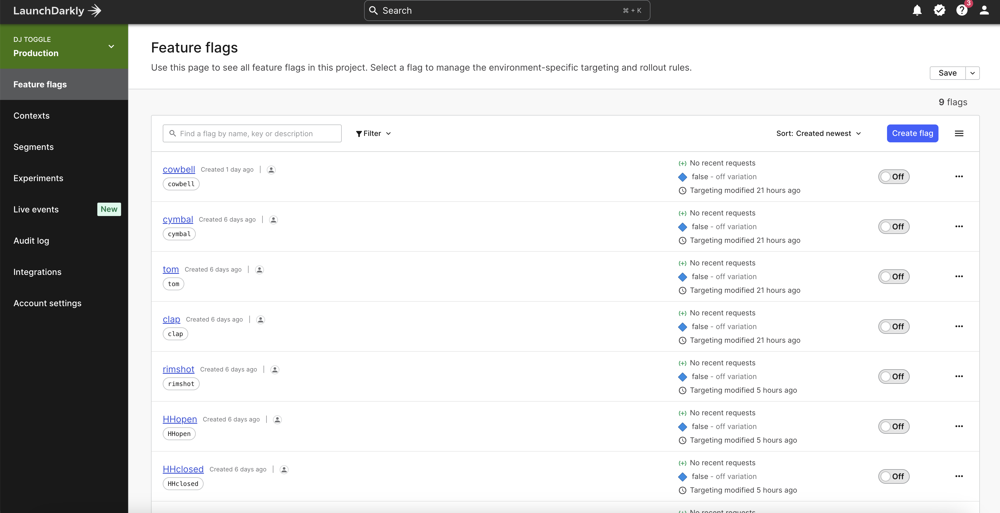

# Near Instant Feature Flag Updates Make Sure Your App Never Misses a Beat

From an operational perspective, a lot of the value of feature flags is tied up in their ability to have an immediate impact. For example, if there is an incident related to a feature release, I need to know that when I flip that kill switch, the feature will be turned off immediately. The longer it takes for that change to occur, the more it could potentially impact my business, even cost the business money.

And if flipping that flag requires a redeploy, we're not just talking the impact of the incident on our customers, but also upon all of the employees who had to drop what they were doing to take part in a fire drill.

This isn't just relevant for incidents and kill switches. For instance, if I am using flags to allow our marketing or product team to easily align a feature release with the timing of a campaign, that immediacy of the change is still critical. Campaigns can be extremely costly, and if the feature is delayed waiting on a deploy or, even worse, if that deploy fails causing extensive delays, that could mean money wasted and potentially lost business.

This is one of the most immediate benefits of using LaunchDarkly for feature management, particularly when compared to home grown feature flag solutions – the effect of changing a flag is nearly instantaneous on both the client and the server. In this post, we'll take a look at how this works and then have a little bit of fun with it.

## A peek behind the curtain

The key ingredient to the immediacy of LaunchDarkly flag changes lies in our [25+ SDKs](https://launchdarkly.com/features/sdk/). Before we jump to the demo, let's take a moment to explore how the SDKs make this possible.

The first thing you'll do when incorporating a SDK into your project is to initialize the SDK client. For example, here's how you'd do that in client-side JavaScript:

```javascript
const context = {
  kind: "user",
  key: "user-123ABC",
};
const client = LDClient.initialize("MY_CLIENT_SIDE_ID", context);
await client.waitForInitialization();
```

Or server-side JavaScript using Node.js:

```javascript
const client = LaunchDarkly.init(process.env.LAUNCHDARKLY_SDK_KEY);
await client.waitForInitialization();
```

It's worth taking note that in the case of the client-side code, a context is provided when the client is initialized while the server-side initialization does not provide a context. They also use different keys to initialize (a client side ID versus an SDK key). This is because they take two different paths to solving the problem in order to address the platform that they are running in.

### Server-side

Server-side SDKs operate within a much more secure environment. Thus, server-side SDKs will immediately create an in-memory cache of all of the information from LaunchDarkly that it needs to evaluate a feature flag. This not only allows flag evaluations to be incredibly fast, but also helps prevent issues in the case of a lost connection to LaunchDarkly. In addition, by default LaunchDarkly will set up a streaming connection that streams updates into this cache. These updates happen within milliseconds and your code can listen for changes to a flag and respond.

> Note that not every language and therefore not every SDK supports streaming. In cases, where it isn't supported or in cases where the SDK is configured by the developer not to use streaming, these updates will occur via polling connections.

For example, here's how you would listen for updates in server-side Node.js:

```javascript
client.on('update', (param) => {
	// server side SDKs don't get the changed value by default
	const context = {
		kind: "user",
		key: "user-123ABC",
	};
	const flagValue = await this.client.variation(param.key, context, false);
	// do something with the updated flag
});
```

### Client side

In the case of client-side SDKs, they have to consider the security (or lack thereof) of the platform that they are running in. Client-side code is inherently insecure, thus the SDK requires the context(s) in advance and then caches the flag variations for the context(s). Variation calls need only check the cache for flag values, making them faster and more stable. However, just as on the server-side, a streaming connection provides near instant updates to these flag values.

> Note that when a streaming connection is unsupported or in cases where the SDK is configured by the developer not to use streaming, these updates will occur via polling connections. In addition, the developer is able to update the context(s) and retrieve new values as needed at any time.

For example, here is how you would listen for flag updates in client-side JavaScript:

```javascript
client.on("change:my-flag", (value, previous) => {
	// the new value is passed
  console.log(`my-flag was ${previous} and is now ${value}`);
  // do something with the updated flag
});
```

## Let's see this in action

To illustrate how fast flag updates are and how quickly your application can adjust to them, I have built a fun demo.

Those of you were able to join us at [last year's Trajectory conference](https://launchdarkly.com/trajectory/2022/)  may recall our mascot, Toggle (i.e. the person in the space suit), DJing music during the breaks. This got me thinking... If Toggle really was a DJ, would he use a mixtable? No, he'd use feature flags of course! Timing is key to any good DJ mix, so fast updates would be a "must have" for any feature flag DJ.

Here's what the demo looks like (and sounds like in action):

VIDEO HERE

As you can see and hear, making flag changes almost immediately change the audio playing. But we can trigger any kind of behavior when flags change and we don't have to be limited. For example, the flag change also triggers the button for that instrument's track to light up. Finally, if any of the flags are on (i.e. any tracks are playing), the video will play, but once they are all off, the video pauses. Let's explore how this works.

I've created a 9 track audio loop for Toggle to DJ. I began by creating a flag for each instrument track within the loop.



In this particular case, they are standard boolean flags, though I could imagine a more advanced version of this using multivariate number flags to represent the volume of a particular track.

Once the flags were created, I initialized the client-side JavaScript SDK and called a custom function that would initialize each flag when the SDK initialization was complete. I passed the key for the flag as well as a variable that reprented the audio track associated with that flag.

```javascript
client.on("ready", async () => {
  await initFlag("cowbell", cowbell);
  await initFlag("cymbal", cymbal);
  await initFlag("tom", tom);
  await initFlag("clap", clap);
  await initFlag("rimshot", rimshot);
  await initFlag("HHopen", HHopen);
  await initFlag("HHclosed", HHclosed);
  await initFlag("snare", snare);
  await initFlag("kick", kick);

  // play the video if any tracks are on
  let sum = trackMutes.reduce((pv, cv) => pv + cv, 0);
  toggleVideo(sum);
});
```

To initialize the flag, I would get its current value and then determine whether the track should be playing or muted based upon the value returned. In addition, I added a listener for a change event for that specific flag key. As soon as a change is received on that flag, the track playing that instrument will be muted or unmuted depending on the value returned. The `toggleMute()` function also contains the logic to turn on and off highlighting for the buttons representing that track that you saw at the bottom of the screen in the demo.

As a last bit of flair, I also added logic to have the video of Toggle playing if any track is currently playing audio or stopped if all of the tracks are currently muted.

```javascript
// get each flag value and intialize the sound based on the value
// add a listener for any flag changes
async function initFlag(key, instrument) {
  const flag = await client.variation(key, false);
  toggleMute(instrument, flag);

  client.on("change:" + key, (value) => {
    toggleMute(instrument, value);
    // toggle the video
    let sum = trackMutes.reduce((pv, cv) => pv + cv, 0);
    toggleVideo(sum);
  });
}
```

Any time I change a flag within the LaunchDarkly dashboard, the application responds almost immediately.

> If you are curious about the audio side of the demo, I created the audio via a simple drum machine called DM1, which is available in the MacOS app store. This allows for exporting each individual track as a separate audio file. I then used a tool called [audiosprite](https://www.npmjs.com/package/audiosprite) to convert the audio files into a single audio sprite that could be used with the [Howler.js](https://github.com/goldfire/howler.js) library to manage and play multiple audio tracks via the [Web Audio API](https://developer.mozilla.org/en-US/docs/Web/API/Web_Audio_API). To keep audio always in sync, audio tracks are all playing as soon the app begins, while the feature flags simply handle muting and unmuting the playing tracks.

If you'd like to grab the source code for the project and play around with it yourself, you can [find my repository on my personal GitHub](https://github.com/remotesynth/djtoggle).

## Conclusion

Now I don't anticipate that LaunchDarkly will suddenly become a go to tool for online DJs, but I do hope that I was able to demonstrate the immediate impact  flag changes can have on your application. How those flag changes are handled is entirely up to you so that you can address the particular needs of your application or the specific feature being targeted.

While this example focused on the front end, the same immediacy applies to the backend. This can give you and your team the confidence to release new features without stress, knowing that, if there is ever a problem, it can be addressed quickly and easily with the flip of a toggle.