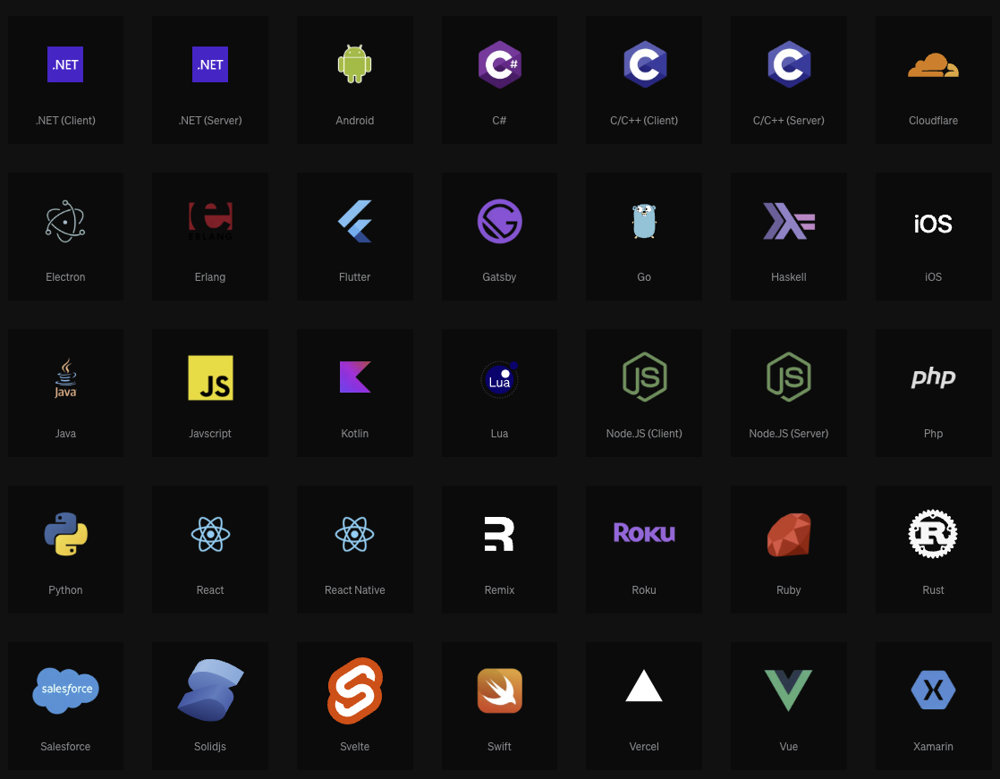
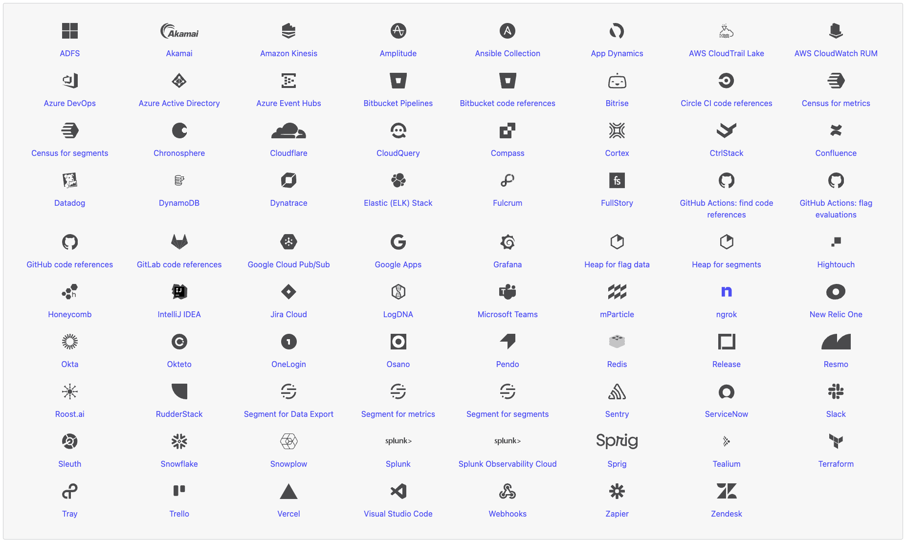
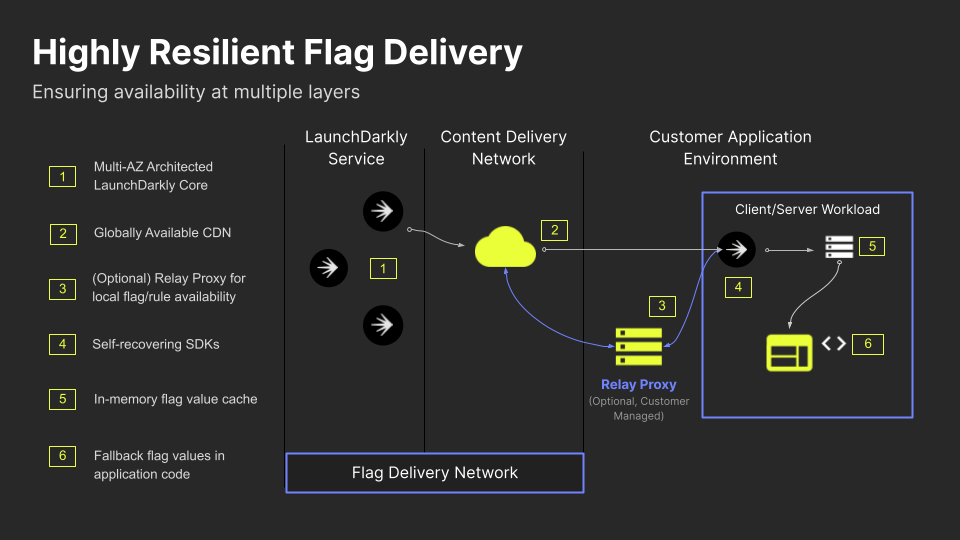

# 5 Reasons Why LaunchDarkly Outshines DIY Feature Flags

Whether it's an enterprise solution or a DIY option, feature flags have become commonplace in software development and feature management. When looking at what works for your organization, it's essential to understand your needs from a feature management platform. Let's dive into the pros and cons of building your feature management solution vs using an enterprise solution like LaunchDarkly.

To know our options, we need to understand what a homegrown or DIY solution looks like in the first place. Working at LaunchDarkly, we've seen many types of DIY solutions, but we can break down the different types into a few core categories. 

Three core categories of homegrown solutions:

* **The config** – This is the single most common DIY solution, and possibly the easiest to create is the config. Features are managed in a configuration file, usually in a structured data file like YAML. However, flag configuration values are sometimes held in a remote config solution.
* **The database** – This slightly more advanced option generally makes for easier collaboration of feature flags across teams and applications. Features are managed by directly changing the database values. 
* **The platform** – In rare cases, companies (usually large enterprises) have invested in building and maintaining a complete, in-house feature management platform. When teams have built a solution like this - team members typically spend a portion of their time updating and maintaining their platform.

While all these solutions can work, and many features across the web are managed with solutions every day, each path forward typically brings limitations. But what exactly are these limitations? Let's explore why a feature management software solution like LaunchDarkly might be worth exploring.

Let's look at five of the most important reasons why.

## Works Anywhere Across Your Application

One of the common issues with homegrown feature flag solutions is that they solve the problem for only one specific application area. For example, the backend team may have created a solution for their domain, but the frontend team doesn't have one (or has a different one). This lack of standardization across the various teams in the company can lead to issues. For example, a feature is turned on in the API but not in the parts of the application consuming that API change.

A system like LaunchDarkly resolves those issues by being available anywhere you need it in your application. We primarily do this via our [more than 25](https://launchdarkly.com/features/sdk/). Whether you are a team working on the backend, frontend, mobile, or DevOps, we likely already have an SDK that works for you.

Using a tool designed for all different parts of your application empowers you (and your team) to collaborate more closely and reduce headaches through increased consistency.

But it goes beyond just SDKs. Sometimes, you need access to flag data or flag values in other services that your company relies upon. For example, you may want to automatically turn off a feature if certain thresholds are met in Datadog or trigger a marketing campaign workflow automatically when a feature goes live via Zapier.

LaunchDarky has [almost 80 integrations](https://docs.launchdarkly.com/integrations) and counting. That's the kind of thing a homegrown system is unlikely to have because each external integration would require significant engineering resources to build.

## Near-instant Response and Updates

The kill switch is one of the most commonly cited use cases for feature flags. The concept behind the kill switch is that if a feature, particularly a newly launched feature, is broken or causes performance degradation, you can turn it off rather than have to roll back and redeploy it. But what happens if your kill switch itself requires a redeploy? You've saved yourself from the painful rollback, but the problematic feature isn't disabled until the redeployment is complete.

This kind of delay can be costly, but it's also unnecessary. All connected clients receive updates from LaunchDarkly in 100ms or less. That means that as soon as you turn a feature off in the LaunchDarkly dashboard, it can be turned off everywhere it needs to be within your application code. This synchronicity is a capability most homegrown systems cannot match.

You may be wondering, "But doesn't this degrade performance?" It would take a lot of work to beat the performance of a configuration evaluated at deployment time. Still, if your needs go beyond the basic capabilities of config, it would be challenging to replicate LaunchDarkly's performance with a DIY system.

That's because LaunchDarkly has multiple layers that make it incredibly fast.

1. **The Flag Delivery Network** – LaunchDarkly's flag data comes from a globally distributed CDN, meaning it is ultra-fast and benefits from reduced latency.
2. **Cached Responses** – LaunchDarkly's SDKs automatically cache the flag data that they need locally, meaning that flag values are retrieved from the local cache, making them extremely fast and resilient in the case of outages.
3. **Streamed updates** – When an SDK client is initialized, it establishes a streaming connection for flag updates so that connected clients will receive any changes you make in LaunchDarkly within 100 ms. With this connection,  if you flip that kill switch, the feature is off almost immediately.

Building and maintaining the necessary infrastructure and architecture for fast, resilient, and immediately responsive flags can be a massive undertaking. It's not one most internal engineering teams would have the resources for. Because of the maintenance requirements and upkeep, many homegrown solutions can suffer from slower flag retrieval, a lack of resiliency, and an inability to respond quickly to updates.

## Advanced Targeting Capabilities

Targeting is the "secret sauce" of feature flags. Being able to turn a feature on or off for everyone in a particular environment is helpful, but being able to turn a feature on or off for individuals or segments is incredibly powerful and opens up all kinds of new capabilities:

* **Phased rollouts and canary releases** – Targeting unlocks the ability to gradually release a feature, which can help limit the blast radius of any issues and help ensure that, when a release is complete, it is solid and stable. For example, you can roll out a release to larger targeted segments, phase a rollout to an increasing percentage of randomly chosen users, or do a canary release to a subset of users.
* **Beta programs** – While a beta program can be part of a phased rollout process or canary release, it is typically used as an ongoing tool to help determine both in testing that a feature works and ensuring it meets user expectations. Users who are chosen for or opt into a beta program will typically get early access to features in development, helping to refine the feature before it is fully released. Maintaining access to a beta program can be difficult without the ability to target features to individuals.
* **Entitlements** – Managing [entitlements](https://launchdarkly.com/blog/managing-entitlements-in-launchdarkly/) is all about who has access to what features. Managing permissions can be a complex problem, especially with any software-as-a-service (SaaS) product. Feature flags combined with comprehensive targeting are perfectly designed for handling these entitlement issues within application code while allowing them to be easily configurable without requiring rewrites.
* **Experimentation** – Experimentation allows testing software changes to ensure they achieve the expected results. Running experiments requires placing users into cohorts and targeting them with the correct randomized variation, capturing the necessary measurements for the test, and performing analysis on the test (this is a very simplified explanation of a complex topic). These capabilities require significant engineering resources and specific data analysis expertise that an internal team is unlikely to replicate easily (or affordably).

Building even basic targeting capabilities into a homegrown solution is a complex problem. There are so many layers. You need a way to easily pass data about the user from the client to the flag solution. You need a rules engine to determine the correct variation to serve. It would help if you had a way to manage those rules easily. Ultimately, you've committed to building and maintaining an in-house feature management platform, taking precious engineering resources away from your core business.

## Manage Access, Approvals and Governance

In most homegrown systems, changing flags is a manual process that requires developer intervention, and there is no managed access control. Because of the lack of access control, any developer with access to the configuration or database can add or update flags and the audit trail to the extent that one exists, which requires examining noisy logs. For a limited set of flags shared across a small development team, this may meet your minimum requirements for a time, but in most cases, you'll quickly outgrow this.

LaunchDarkly has access controls, detailed audit logs of changes, approval workflows, and detailed feature flag metrics. Here are just a handful of the reasons why this can be critically important:

* **Ensure each team only has access to their flags** – It can be difficult for a homegrown system to service multiple teams while maintaining the necessary level of access control, which can lead to potential issues. LaunchDarkly has fine-grained access controls to ensure that only the appropriate person(s) can create, view, or change a flag, segment, targeting rule, etc.
* **Prevent potential mistakes by adding approvals** – Mistakes can happen, even when using feature flags. A developer may accidentally flip a flag or change a setting in the wrong environment, causing issues. LaunchDarkly allows you to set up an approval process so that changes can be verified wherever necessary before they take effect.
* **Keep an audit trail for regulatory or compliance purposes** – It can be essential to keep track of what changes were made when those changes were created, and who made them. Most homegrown systems rely on digging through messy logs to see if they have any records, but LaunchDarkly provides detailed audit trails on any changes made.
* **Eliminate "flag debt"** – One of the things to be aware of when adopting feature flags is that if you aren't careful about cleanup, you can end up with flags littering your code (aka flag debt). LaunchDarkly provides tools and metrics to help you build internal processes to eliminate flag debt. For instance, there is tagging to help organize and find flags, metrics to highlight flags that are no longer in use, and code references to show you where those flags exist within your project's codebase.

These are the sorts of features that can seem like overkill when building a homegrown system because the amount of work required to create them is significant. Still, they show their value once; for example, they prevent a potential incident, you're asked for audit trails for compliance, or you spend multiple cycles cleaning up flag debt.

## Anyone Who Needs to Can Manage

One of the most common issues in homegrown systems is that every change requires developer intervention. Let's take the example of an incident. Support may be the first to become aware of an incident via direct customer reports. They may need to flag an engineering manager, who then tasks an engineer with updating the flag in the configuration and redeploying. Despite the benefits of feature flags, a lot of time has passed since the initial report of the incident and the resolution – time that could have been avoided if support had access to make flag changes where appropriate.

In fact, many decisions about when to turn on a feature or alter segments and targeting are not engineering decisions. Frequently, they belong to other stakeholders like product managers, product marketing managers, or support. A product manager may determine who is in the beta access group. Marketing may want to align the timing of a redesign launch to the start of a campaign. I could go on, but the point is that by requiring a developer to intervene, a homegrown feature flag system puts unnecessary burdens on the engineers while also frustrating the stakeholders.

LaunchDarkly's intuitive user interface, combined with its access controls, makes it easy to give the appropriate people access to make these changes. Combined with the access control, approval, and auditing features in the prior section, you can let the stakeholders who need access have the right kind of access without worry. The unnecessary burden on your engineering teams is relieved while also putting the decision-making in the correct hands.

## Making The Move From HomeGrown

At this point, hopefully, you are fully convinced that making the move from a homegrown system to LaunchDarkly is the right way to go. However, you may be concerned that migrating from your current homegrown solution would be a massive burden. Thankfully, it isn't.

First, any migration doesn't have to be all or nothing and can be done incrementally. Start by making all new flags in LaunchDarkly and remove them as flags get deprecated in the old system. Since many, if not most, flags are temporary, this will go a long way to removing the old system without creating an additional burden on the team to replace existing flags that are ephemeral.

Second, replacing any long-lived or permanent flags is made much easier by LaunchDarkly's SDKs. Once the SDK is initialized across the application, replacing an existing flag may require as little as changing one line of code to get the value. This process is especially true if your existing system is a config or database without targeting.

Third, and finally, begin adopting the more advanced features in LaunchDarkly, like targeting, experimentation, and more, in a step-by-step manner rather than trying to do everything at once. You can look at the [five stages of feature flag adoption](https://launchdarkly.com/blog/the-five-stages-of-feature-flag-adoption/) to help guide you.

A migration from a homegrown system to LaunchDarkly doesn't have to be painful and, as we've seen, comes with enormous benefits.