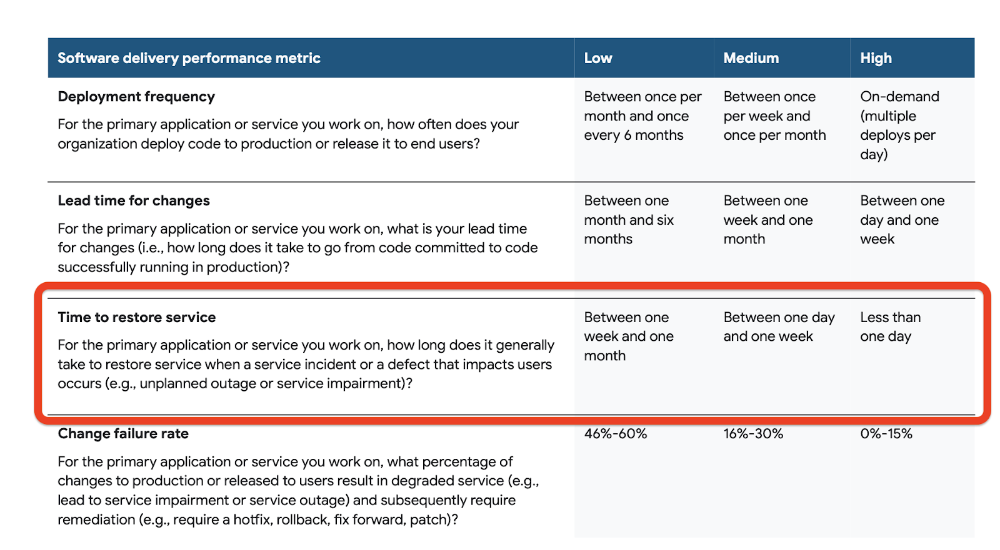

In the days of shipping software on CDs in boxes, software releases were “done” once the CDs hit the users’ hands. Now, with software delivered through the cloud and hosted remotely, there isn’t an equivalent sense of “done”. Complexity abounds and entropy encroaches. The interplay of your code, user behavior, 3rd party integrations, internal tooling, cloud hosting and SaaS vendors mean that your software can perform unexpectedly at any time. 

There are two sides to dealing with the inevitability of incidents. The first involves what you do before an incident occurs, since they will occur. The second is how you handle an incident after it happens.

Before an incident occurs, you want to create processes that limit the impact of that incident on both your application, its users and your organization. In this chapter, we'll discuss some strategies that can help you and your team proactively shorten the length of incidents and reduce or eliminate the damage they may cause.

After an incident has happened, you need strategies for identifying the problem, creating a fix, testing that fix, and eventually releasing the fix. Since incident responses require the involvement of technical and/or other staff that can identify and respond to incidents, we'll discuss topics of people management and culture that can improve your response processes and cover tools that can help.

When reviewing an incident, it is always valuable to reflect on what happened, how well you and your team responded, and determine if there are any areas that need improvement. We'll look at some best practices for post-indident retrospectives and how to establish and measure metrics that can help you determine the effectiveness of your incident response processes.

## What Is An Incident?

Let me start by making it clear that when we talk about operations, we are not just talking about incidents. However, incidents are often the most obvious sign of the health of your overall operations.

An incident is any event that requires immediate, out-of-band remediation. Urgency and customer impact should be the barometers for determining the severity of an incident.

Incidents are not just system outages. Incidents can and should be declared if there is a problem in your system that could lead to an outage, degrade performance or even prevent access to application functionality, regardless of whether customers are currently unaffected or not-- this is an essential shift towards moving to a proactive incident management process that can detect and mitigate incidents before customers are even aware.

### Common incident causes

Incidents typically have one of three causes:
1. Changes to your system
2. Changes to the inputs of your system
3. Non-software issues

#### Changes to your system

Almost any software system is in a fairly constant state of change. Ranging from infastructure changes, that can include both hardware and software updates, to new features being built and deployed by your development team. Any of these changes or updates may cause an incident to occur. In fact, according to The Visible Ops Handbook, "80% of unplanned outages are due to ill-planned changes made by administrators ("operations staff") or developers." (https://itpi.org/the-visible-ops-book-series/visible-ops-handbook-review/)

When it comes to the software we build, continuous deployment makes life easier. Deploying multiple times per day ensures that each change will individually be minor in size and importance. If part of your application starts failing, the most recent deployments are the most obvious culprits. Smaller deploys make roll backs or kills switches, which we'll discus later, easier, which means easier incident management. Each individual deploy has less complexity to untangle, and a more narrow scope.

However, frequent updates and deploys, even in small batch sizes, can lead to a higher likelihood of small incidents. Any deploy can have unintended consequences. Fortunately, these small incidents can be handled more easily, as they tend to not be as complex and are easy to isolate. We'll discuss some strategies to minimize the risk of these deploys in this chapter.

#### Changes to the inputs of your system

Changes to the inputs of your system may also cause incidents. These can include a sudden surge in traffic, new or existing customers using your software in ways you didn’t anticipate, and unexpected changes or outages to third-party integrations or APIs.

Just as incidents are inevitable for you, they are for your vendors as well. Sometimes a vendor will have a major enough incident to impact your system in a way you weren’t prepared for, and their incident will have now caused your incident.

Your customers might also cause incidents by using your software in unpredictable ways. You want lots of customers, and you want all those customers to use your software constantly. If this happens, you found strong product market fit, congratulations! Unfortunately, the down side of thousands or millions of customers using your software all the time is that they will find new ways of using your product which might cause things to break. However robust your QA and testing process might be, your customers can and will do things you don’t expect, and this will result in incidents.

#### Non-software issues

The rest of the incidents are caused by non-software issues. Creating software comes with inherent risks and pitfalls, but at least code is orderly and readable. The rest of the world outside of our computers can be quite messy.

Happy employees can lose laptops or entry badges. Unhappy employees can publish unsavory stories that threaten your company’s reputation. Global health pandemics like Covid-19 can quickly disrupt your standard business operations.

These aren’t code-related, but these “real world” issues can cause major technical damage to your organization’s ability to deliver a stable product, and should be accounted for in your incident management process.

### Declaring an incident

Whith any release, there are the things you know could go wrong, the things you think might go wrong, and then there's the things that go wrong that you never even thought about. That's why it's important to ensure you have the proper processes in place for identifying and declaring an incident.

There are two ways to declare an incident: automatically and manually. Both are necessary for a high functioning incident response.

#### Automatically

For the things you know could go wrong or the things you think might go wrong, the best way to declare an incident is to have a monitoring tool identify it automatically. As we'll discuss later in the observability section, monitoring tools can be set with thresholds that can automatically trigger an incident response if they crossed. The most optimal solution would be to tie these triggers to a feature flag that, potentially, can automatically disable the release before the impact spreads.

#### Manually

Observability and monitoring tools can’t catch everything. In general, they are limited to catching problems you have some ability to predict. After all, you are the one setting the thresholds and triggers that these tools use. However, there are many streams of information that can help your team identify a problem problem that monitoring tools cannot. For instance, customers may tell you that a certain functionality is inoperable, either via traditional support channels or perhaps through non-traditional ones, like social media. The key is to ensure that everyone in the organization feels empowered and encouraged to reach out to relevant chat channels, support or DevOps teams and escalate the issue as necessary.

## Mitigating risk

Now that we've idenfied the risk, let's talk about how we can minimize it ahead of time. The processes and tools you put in place before the inevitable incident can help to reduce the frequency, length, and damage they may cause. These processes can include:
* Managing roll backs when needed
* Implementing kill switches or safety valves
* Planning migration strategies
* Implementing observability solutions

With the right processes in place, you can reduce the time, cost and damage of managing incidents. Let's explore each of these processes, and offer some advice on how to establish each of them effectively within your organization.

### Rollbacks

Rolling back to a previously known, working version of your software can mitigate the disruption and allow teams to troubleshoot and fix the problem. However, rollbacks can sometimes be difficult, particularly if you are releasing in large batches or when database changes are involved. As we discussed earlier, continuous deployment can keep batch sizes small and reduce the complexity of rollback, but there are other solutions too. Implementing release strategies, like blue/greens or canaries, and using feature flags can also help decrease any disruptions caused by a rollback.

Blue/green and canary deploys help minimize the need for rollbacks because they allow you to test code in production before releasing it to all users. If a rollback is needed, they also can ease the pain of reverting back to the prior version by reducing the number of impacted users. In the case of a blue/green deploy, the change is not so much “rolled back” as all the traffic is simply diverted back to the prior, working version. Depending on how your canary deploy is implemented, you may need to roll back deployed changes, but rollback is simplified by the fact that the new version and prior version coexist. Only users who’ve been accessing the new version will need to be redirected back to the original. While both strategies provide easier rollbacks, keep in mind that deploys involving database changes can potentially complicate either one.

### Kill switches 

A physical kill switch is designed to immediately shut off machinery in the case of an emergency. The concept is basically the same when we’re talking about software. If something goes wrong with our application, we want to have a way to quickly shut it down. The easiest way to implement a kill switch in software is using feature flags.

In software, a kill switch completely disables a feature or set of features. If something isn’t working, using a kill switch doesn’t fix the underlying problem, but it does disable the code within the application, minimizing its damage and impact on users. This allows for a near immediate response to an incident once reconized and diagnosed, without the need to perform a rollback.

The flipping of a kill switch can be triggered by a human or automation. Humans can shut off features, customers or integrations that are causing problems whenever the need arises. This process can be automated as well, specifically when connected to application performance monitoring (APM) tools, more on that a bit later.

It's worth noting that a kill switch does not necessarily need to turn off a feature for everyone. Feature management platforms offer user targeting capabilities that can allow you to turn off a feature for a specific subset of users affected by an incident. For example, if your application has a bug that only affects Android users, you may consider turning the problematic feature off only for Android devices.

When explaining software development and operations to less technical people, the idea that you can simply turn off something that isn’t working seems pretty obvious. Feature flags make kill switches easy to implement but also make the act of turning off a broken piece of software relatively quick and painless. You do not need to rollback a large part of the application by reverting to the last known working version, which can often mean rolling back adjacent functionality. This makes the decision less impactful, meaning fewer approvals and fewer trade-offs, which leads to fewer delays in resolving the incident.

#### Turn off features for business reasons

Kill switches don’t necessarily need to be limited to technical issues. They can also be used if business issues arise. Sometimes the software works perfectly, but other factors, such as unexpected demand, unpredictable weather, complexities in the supply chain or any number of other business reasons, necessitate temporarily shutting off access to a particular feature. 

For example, a well known fast food chain rolled out a new item on their menu that proved immensely popular. Predicting regional demand for physical goods can be tricky, and the item sold out in some places but not others. When the item was no longer available, the company used a kill switch implemented with a targeted feature flag that turned off the menu item in the places where it was no longer available. This reduced customer frustration as hungry customers weren’t tempted by what wasn’t available. Modern feature management systems have extensive user targeting capabilities that can enable turning on and off features based upon configurable properties or identifiers, such as geolocation. 

#### Kill switch case study

Kill switches don’t make the problems disappear, but they do minimize the blast radius and allow problems to be quietly fixed behind the scenes. To see how this works in the real world, I'd like to share an actual experience from our team at LaunchDarkly. LaunchDarkly sells feature management software that allows customers to create and use kill switches, but sometimes we also have to use them ourselves.

One time we released a feature that inadvertently caused Safari users to lose critical access for updating LaunchDarkly feature flags... on a Friday. Some organizations consider Friday releases to be a bad idea, because creating weekend incidents can lead to bad outcomes and low morale. Without kill switches, releases can have giant, weekend-destroying consequences. With kill switches, the risk of those consequences is much lower.

After the release, a customer sent us a support ticket indicating they were unable to flip feature flags in LaunchDarkly’s user interface on Safari. The on-call staff confirmed the bug in our development environment and that it affected all Safari users. After confirming the incident, the next step was to determine which feature was causing the issue.

We reviewed the last few things we released and found a likely culprit. Turning the flag for that feature off in our development environment restored the Safari functionality, so the team felt comfortable that turning the flag off in production would address the issue.  Our support team reached back out to our customer and confirmed that the issue was resolved. Finally, we scheduled a bug fix in the next week's iteration plan to allow us to rerelease the feature.

The mood would have been quite different if reverting back to the previous working version meant reverting days, weeks or months’ worth of changes. This would have increased the scope and impact, meaning more people would have to be involved in making the decision to roll back. This also would have taken longer, widening the impact on customers, meaning more support tickets from users who are understandably frustrated that the issue is preventing them from accomplishing their jobs.

Remediating incidents is challenging under the best of circumstances, particularly with customers and stakeholders demanding answers instantaneously. Feature flagging helps address these challenges by offering multiple advantages to the traditional way of doing things:

1. It gives you the confidence to do things that would otherwise be considered risky, such as releasing on a Friday, because it lowers the impact of failure.
2. It offers much faster troubleshooting because you can very rapidly isolate the impact of any specific change within a group of changes without redeploying, both in your development and production environments.
3. Once the culprit has been discovered, you can leave it in a disabled state and solve the problem in the normal course of business, rather than an emergency deployment or emergency patch. This means bug fixing becomes more routine, less urgent, and saves on costly incidents involving numerous stakeholders.

In our case, kill switching a release was pretty low effort, low stakes, and avoided a potentially weekend ruining situation. 

### Safety valves

As the name implies, a safety valve is designed to relieve pressure in order to avoid a potentially significant problem. They bear a lot of similarities to kill switches in that they:

* Can be implemented in software using feature flags
* Can be triggered manually or via automation, for instance when connected to APM tools
* Can disable or throttle access to a feature to address an actual or potential incident

Key differences between safety valves and kill switches are that:

* A safety valve typically doesn't completely remove the feature but, instead, throttles access to it
* Safety valves are usually associated with an external dependency
* Because they are associated with a dependency, safety valves are typically a long-living or even permanent flags, whereas a kill switch is usually removed once a release has been deemed successful.

As an example, perhaps your application relies on a non-critical, third-party service that has been having issues with performance or reliability. A safety valve can be used to help gracefully degrade the application in order to deal with the outage or availability issues. A problematic service or feature can be feature flagged as a safety valve and triggered when certain conditions arise. limiting access or usage to features that rely on a problematic dependency can help avoid a larger outage.

### Handling migrations

Migrations involve moving from one service, software or infrastructure to another and are notoriously risky to release. In many, if not most, cases, a migration is invisible to the users. This makes a progressive rollout one of the most effective ways to handle the release of a migration. A progressive rollout slowly pushes more and more traffic to the new service. While your users (hopefully) won't see the difference, it gives your team time to verify that the migration under increasing load and revert before any potential incident occurs. 

Progressive rollouts are a key use case for feature flags within a migration project. The flag can randomly assign a percentage of users to the new service. After a pre-determined amount of time, if no issues arise, a larger percentage of traffic can be routed to the new service until ultimately it is rolled out to the entire user base. While this may be handled manually, some feature management platforms even allow this process to be automated.

Using feature flags and progressive rollouts for migrations can bring about larger organizational benefits as well. In many cases, teams avoid beneficial migrations simply due to the risk. By decreasing the risk of a migration, they can increase your team's willingness to take on a migration project. This can ultimately lead to more frequent improvements to the services, software or infrastructure that underly your applications, which can mean they perform better or even lower the costs of managing them.

### Observability

> Observability applied to software systems means having the ability to _ask any question of your systems_ — understand any user’s behavior or subjective experience — without having to predict that question, behavior or experience in advance.
> 
> Charity Majors, cofounder of Honeycomb (source: https://charity.wtf/2020/03/03/observability-is-a-many-splendored-thing/)

Chances are that you already have well-established tooling and practices around monitoring. These are critical. Application performance monitoring (APM) tools play a big role in helping identify when there may be a problem or outage and identifying where that problem occurred. The metrics, logs and traces that feed your monitoring can help you quickly surface issues so that can you fix them, which can ultimately improve your mean time to recovery (MTTR).

But monitoring generally solves for problems that have already occurred or are in the process of occurring. You APM monitoring dashboard displays the measurements you preconfigured and triggers alerts based upon predefined thresholds. In other words, to quote Charity Majors again, it looks at the "known-unknowns." Monitoring plays a part within observability but they are not one and the same.

Observability on the other hand focuses on exploring properties and patterns _not defined in advance_. The complexity of today's microservice-based, cloud-native applications means that there are a lot of potential problems that you cannot predict and won't fit into traditional APM dashboards. This can mean that even if an APM dashboard identifies a problem, it is far from clear how to fix it.

Implementing observability means that you've instrumented your code to expose metrics that can help find the patterns among issues and identify the exact nature of the problem or potential problem and address it. This also helps you validate how your code actually behaves in production while also shortening the software release and feedback loop. Put another way, while monitoring answers how or when an incident occurred, observability helps you get at why it occurred.

#### Observability and feature flags

A common pattern for companies that have implemented observability is to also follow a progressive delivery model. Progressive delivery means releasing changes to small, low risk audiences first and then slowly expand larger and riskier audiences. The key to making this successful is capturing observability metrics that validate the results as you move forward. Creating more checkpoints during the rollout gives you more opportunities for testing, experimenting, and gathering user feedback to improve the quality. 

Feature flags using a feature management platform are a critical piece of progressive delivery that manages the release progression via user targeting. They allow you to adjust the number of users who are able to see (and are thus impacted by) new features at a pace appropriate to your business using targeted rollouts, canary launches or percentage based rollouts.

They also allow you to delegate responsibility for advancing the rollout to the appropriate product owners that are most closely responsible for the outcome. Tying release decisions more tightly with the person or team accountable for the outcomes can increase the likelihood of success for a release.

A feature management platform can also enable automations that help prevent incidents via integrations with monitoring tools like Datadog and observablity platforms such as Honeycomb. A potential issue during the course of a progressive rollout could be caught immediately and flag triggers could enable the release to be rolled back without requiring any human intervention.

## Desired Outcomes

To reiterate, incidents are inevitable. The goal should be to minimize incident severity and customer impact. In a healthy incident management process, you must adhere to the following principles:

* **Self-identification**: Your team aims to uncover incidents before your customers discover them.
* **Continuous improvement**: Incidents inform areas for continuous improvement.
* **Runbook operability**: Any DevOps engineer can map the problem to a runbook and execute the plans.
* **High volume, low impact**:  Incident frequency may potentially be high, but incident severity should be remain low.

### Self-Identification

Obviously the ideal scenario is to discover incidents before your customers do, either automatically via tooling or via manual testing and reporting. But discovering the issue is only the first step, you need take steps to remediate the incident before users are impacted. Feature flags can play an important role in this process by making sure that self-identified incidents have little or no impact by making it quick and easy to disable a problematic release.

### Continuous Improvement

Small incidents are a great way of pointing out the parts of your “bend not break” system that are bending the most. As your platform grows, complexity grows. Vendors, libraries, scripts and languages proliferate, and an ever-enlarging footprint inherently increases risk. Buttressing your system’s resiliency via a process of continuous improvement is crucial to maintaining stability. This requires ensuring you have a culture where the response to incidents isn't seen as punitive and where team members are encouraged to perform retrospectives on incidents to gather potential learnings and areas for improvement.

### Runbook operability

To minimize the amount of time spent handling incidents, you should have detailed runbooks that are easy to find and execute by any on call engineer. Clear documentation that lay out the handling and escalation process allow the burden of being on call to be spread widely across the organization. Expecting every engineer to master every product, language, vendor and integration that you use is unrealistic. Clear runbooks allow all on call engineers to either resolve or escalate the issue, not just a specialized few.

### High volume, low impact

Low severity incidents (loss or degradation of non-core functionality to 0-25% of your customers) are not the primary problem. Medium to high severity incidents (loss of core services, data breaches, highly disruptive defects noticeable to more than 25% of customers) are the ones to avoid. While a certain degree of frequency of minor incidents is unavoidable, using the practices laid out above can allow you to disable problems before they become higher severity and learn from these low severity incidents to prevent potential higher severity events from occurring in the future.

## What Bad Looks Like

Bad incident management is highly manual, disruptive and stressful. Customers start noticing service outages and communicate its impact on them directly and/or publicly. Alternatively, someone on the team notices a service that might be faltering, but is afraid to declare an incident. The engineer doesn’t want VPs and senior leadership angrily getting involved, so the incident isn’t called and the engineer hopes the situation will resolve itself.

When it doesn’t resolve itself, the system starts to buckle, and starts affecting numerous applications. An incident is finally called, but now things are much more confusing. Lots of alerts, spikes and warnings fly around, and it is difficult to understand the order of failure.  Your team scrambles to diagnose the situation.

Tempers start to flare. Marketing asks about the status page, account teams ask what they should tell their customers, customer success starts asking about SLAs. Board members start getting DMs about downtime and are pinging executives. More team members are joining into the #dev Slack room, trying to help but not knowing what to do first. Everyone knows that wrong decisions might be punished later, so people think carefully about suggesting solutions.

Scared employees become timid, wait for customers to notice the impact, the situation deteriorates, everyone is angry and confused and the blame game will follow.

## What Good Looks Like

Good incident management looks different. Your observability tools notice when a threshold is breached, and your alerting tool pages the on call engineer. The engineer declares an incident without hesitancy or doubt, as they are unafraid of consequences should the situation later be deemed not incident worthy.

The incident lifecycle management tool opens up a new channel in your chat system and begins a timeline log for future use in a Post Incident Review (PIR). Armed with updated, concise and findable runbooks, the engineer find the relevant runbook, and begins documenting steps taken in the new channel.

Since the engineer’s organization is deploying 100 times a day, such incidents are not uncommon. The cause is probably one of the deploys in the last hour, each being small and easily understandable. The engineer can see which ones might have led to a system malfunctioning, and turns off the feature flag for that deploy.

Because the time from system spike to resolution was so quick, customers did not notice any downtime. Later, during the PIR and afterwards, the team will look to see which applications and systems have caused the most incidents recently, and prioritize shoring up those systems.

Incidents are viewed as learning opportunities for continual improvement. No one gets in trouble, the opportunity cost of the on call engineer’s time is minor, and the overall cost of this incident is very cheap.

## What makes a successful incident response process?

We've talked a lot about observability, monitoring and feature management platforms as they relate to incident response, but incident response is about far more than just software. Let's look at the various parts of a successful incident response process.

### People

People are the single most critical aspect to any successful incident response. We can and, where appropriate, should automate parts of our incident response, but ultimately the problem will be resolved by people. That first line of defense will be your on call staff.

There are two approaches of on call staffing: generalist or specialist. Each approach has its pros and cons, and choosing one often depends on organizational maturity.

Either approach works. The specialist approach is great, but can be very “expensive” in terms of opportunity cost and morale. No one likes being on call, so people who focus on your database, cloud computing, content delivery, etc on call at the same time can burn multiple people out at the same rate. The generalist approach works well also, but requires clear runbooks to facilitate foolproof escalations and simple resolutions.

#### The generalist approach

A generalist approach is one that empowers anyone from across the team to serve as on call staff and escalate incidents as necessary, regardless of their specific area of expertise. This approach lets you spread on call duty across the team, helping to ensure that no single team or individual gets burnt out by excessive on call duty. On the other hand, it requires investing heavily in training and documentation as it requires that engineers be able to escalate issues outside of their area of expertise.

### The specialist approach

The specialist approach funnels alerts to the engineer on call with relevant expertise. Since domain experts receive the alerts, it requires a less intensive investment in documentation and training. The domain expert can utilize their expertise, often without needing to consult a runbook, or even if they do consult a runbook, the steps will make sense quickly.

Of course, it is generally not feasible to have specialists always on call for everything that could possibly go wrong, so you'll need to choose areas of functionality where uptime is most critical and/or most endangered. You will likely still need to have a generalist on call for other issues, or you can have the area experts act as a generalist for the other issues.

### Roles

Effective incident management requires at least three roles to oversee any incident: an incident commander, on call staff and a business owner.

#### Incident commander

An incident commander is the person in charge of decision making during the incident. Incidents are confusing and stressful, which can make a consensus on how to act both difficult and unadvisable. Someone needs to be in charge and make decisions and that person is the incident commander.

#### Business owner

The business owner doesn’t mean a founder or CEO with the majority of equity. In this case “business owner” means the person who understands the broader business impact of incident decisions and is responsible for non-technical decisions during an incident. Examples include deciding if, when and how to communicate the incident externally, whether lawyers need to be notified, and whether to include non-technical employees (PMs, account managers, marketing, etc).

#### On call staff

On call staff are the engineers who take turns being the first ones to handle an incident. As things can go wrong at any time of the day or night, the on call rotation needs to work in shifts to cover every hour of every week. On call staff should be engineers who are either specialists or generalists who, armed with clear runbooks, can troubleshoot or escalate issues as they arise.

### Mandatory vs optional

Another decision you must make as an engineering leader is whether on call duty is mandatory for some, mandatory for all, or optional for all. Like the specialist or generalist decision, these all have pros and cons. Switching from one to the other can cause friction and hurt morale, so you should be intentional about choosing an option and stick with it until circumstances demand a change.

As an example, at LaunchDarkly we excuse any new parents from on call duty for the first 12 months of their baby’s life. Those parents already have enough late-night pages. We give squad leaders leeway to work with people who have specific life considerations like primary caregiving or health concerns that make after hours on call rotations particularly burdensome. Such individuals might have their on call shifts only occur during working hours. Schedule flexibility is key to providing an inclusive workplace that allows people with differing circumstances to contribute and feel welcomed.

### Culture

The most important thing about handling incidents is making it cheap and easy to declare them so that even if the volume of incidents is high, they are all low severity incidents. This needs to be supported by a culture that recognizes the inevitability of incidents and treats them as minor events that should not inspire fear.

Any employee, regardless of role, tenure or status, should have the ability and confidence to surface an incident without concern for repurcussions. A culture that treats incidents as normal affairs that aren’t worth getting upset about won’t cause a junior employee to pause before calling an incident.

Alternatively, if your culture makes a big deal out of incidents, people will think twice about being the one to call an incident. The fear of individual attention and consequences can result in higher severity incidents. An understanding culture might result in more false positives, but that’s ok. Dealing with a infrequent extraneous false alarm incidents is better than finding out about your high severity incidents from your customers after the impact has grown.

In 2022, LaunchDarkly commissioned “[Release assurance: Why innovative software delivery starts with trust and psychological safety](https://resources.launchdarkly.com/ebooks/release-assurance-report)”, a study on psychological safety and operational performance. The study found that “67% of developers say they or someone they know has quit over pressure to minimize deployment errors, including 36% who have quit themselves”. Developers are expensive to recruit and retain. Creating a culture of blame drives away engineers that costs your team money and headcount. It also creates a less pleasant working environment.  And, ultimately, it does nothing to improve your incident response.

#### Accountability vs blame

A key part of establishing this culture is differentiating between accountability and blame. 
Accountability seeks to understand the people and systems that caused something to go wrong to prevent similar occurrences from happening in the future. In an accountability culture, leadership wants to find out what happened, but does not default to punishing people. Software engineering is hard. If a system is set up where a person with good intentions can make a mistake, the system needs remediation and buttressing, not the person.

Blame seeks a scapegoat to face consequences. In a blaming culture leadership needs to find out what happened, but seeks to blame someone and have the punishment serve as a warning to others. This will lead to engineer departures and overly cautious incident calling.

Strive for an accountability culture. Happier, more relaxed employees will call more incidents more frequently, allowing for quick handling and effective learning. This cycle will continue in a virtuous loop, to the benefit of your employee retention numbers, uptime and NPS scores.

#### False positives vs false negatives

In an ideal world, every incident declaration is indeed incident-worthy. Sadly, we do not live in an ideal world. People need to make judgment calls on whether something that looks awry is worth declaring an incident.

You want to err on the side of too many false positives (incident calls that turn out to not be incident-worthy) versus too many false negatives (incidents that should have been called earlier but weren’t). Remember, when you are deploying continuously throughout the day, incidents are cheap. Dealing with a few marginal incidents that turn out to be non-incidents doesn’t have many consequences. And by encouraging a culture of erring on the side of too many declarations, you decrease the chance of a real incident going undeclared for valuable minutes or hours.

False negatives are much more expensive. Delaying calling an incident means less time to remediate the incident before customers become impacted and SLAs are breached. This increases the average severity of your incidents, thus making each one more impactful and expensive.

When handling incidents, a “fog of war” environment can cloud judgements and create stressful environments, leading to imperfect decision making. Time is a precious luxury. If you call potential incidents early, you have more time to gather data, assess the situation and see if lightweight potential fixes work. If you wait to call potential incidents until they are undeniably incidents, you have less time to understand and react to the situation.

#### Compensation

On-call duty should be compensated.

Humans grudgingly agree to give up at least 40 of their best hours a week to work for wages. They spend time working for your organization that they could otherwise spend with loved ones and pursuing hobbies. On call threatens the remaining 128 hours in their week (or 72 waking hours assuming 8 hours of sleep per night).

Compensating on call duty does not adequately even out the hassle and opportunity cost of waking up in the middle of the night. Instead, it serves as an acknowledgement that on call duty eats into the hours available to live a free and relaxed life.

In the early years of LaunchDarkly, I interrupted teaching my daughter how to ride a bike, woke up in the middle of the night, and left a Warriors playoff game to deal with incidents. All of these were costly intrusions into my personal life.

Compensation acknowledges the hassle that personal lives might be interrupted. You can pay people per quarter, per shift, or per incident handled. The details depend on your team and culture, and will probably change over time as more employees in different time zones join the organization.

### Tools

While people are obviously the most critical resource in an operation, continuous delivery is impossible without relying on tools to automate tasks and amplify human efforts. Clear runbooks and dedicated tools for observability, record keeping, alerting, incident lifecycle management help you run an efficient operation while minimizing toil.

#### Runbooks

While runbooks aren’t a “product” that you can buy like the other tools in this section, they are still a necessary tool. Runbooks are guides that give on call personnel step by step instructions on how to respond to alerts and outages. These runbooks should be exhaustive, clear and frequently reviewed as they need to be understood by any on call engineer regardless of their background, with actionable steps for amelioration or escalation.

Each runbook is essentially a recipe for how to handle a particular issue. Aim for clarity, brevity and clear and objective steps that a generalist can follow. They should be versioned and easily findable/searchable, perhaps by keeping them a system like Confluence.

If your team is unsure how to create runbooks, there are a number of templates and guides that can assist.

#### Observability

As your surface area scales, the applications, integrations and platforms that need to be monitored increases. The observability space is crowded with companies of every size to help you . Choose an API-first vendor that allows you to connect itself to all of your critical systems and applications that meets your needs. Set thresholds that warrant attention if breached, and connect the system to your alerting tool.

#### Alerting

Similar to the observability space, there are alerting vendors at every price point for companies at all maturity levels. An alerting tool is necessary to connect to an observability tool to sound alarm bells if a system or application threshold has been crossed. Then the people on call will be notified and the incident handling process commences.

#### Incident lifecycle management

A common industry standard for defining the incident response life cycle comes from the  The National Institute of Standards and Technology (NIST) in its [Computer Security Incident Handling Guide](https://nvlpubs.nist.gov/nistpubs/specialpublications/nist.sp.800-61r2.pdf). It sets out four phases:

* **Preparation** – This includes both ensuring you have the capability to respond to incidents but also that you have system and tools in place to prevent incidents from happening in the first place.
* **Detection and analysis** – Determining when an indicent and then assessing it to form the proer response.
* **Containment, eradication and recovery** – This is the stage where you mitigate the incident, perhaps by disabling a feature using a feature flag.
* **Post-incident activity** – A critical step to preventing future incidnets but unfortunately also the easest to ignore. This  includes things like the post incident review.

A growing suite of incident lifecycle management vendors have emerged to help manage this process and help you achieve faster resolution time and more effective post mortems. They provide visibility on when the incident started, forensic evidence documenting the situation, who got paged and when they got paged. This information is packaged into a clear timeline with action items that can assist support teams and on-call engineers in their incident response as well as provide a historical record for insightful post incident reviews (PIRs).

### Process

Incident management should obviously be designed to remediate incidents as quickly as possible but also to allow for continuous improvement. Moving to a process of continuous deploys inevitably increases the quantity of incidents. Handling them quickly allows your team to reap the benefits of increased deployment frequency without getting bogged down in perpetual incident response mode, but  some deploys will fail and incidents will arise. This is ok. Small batch sizes tend to result in small failures that, if caught early, are quickly remediated. The failures will occur in areas that need more attention.

#### Incidents as radioactive dye

Think of small incidents like the radioactive contrast dye used in CT scans. In general, putting radioactive materials into your body is a bad idea and should be minimized. The dye does serve a useful purpose, it highlights what needs ameliorating. The benefits of the observability outweigh the obvious downsides of the radioactive dye.

The same philosophy applies to incidents. They show you what needs tweaking to avoid a similar (or more severe) incident in the future by revealing what areas need buttressing, resulting in a stronger overall system.

#### Best practices: step by step

Here’s how this works in practice. An incident is triggered, sometimes by a human but ideally by your observability tool. This tool alerts the on call engineer and connects with the incident lifecycle management tool to open a specific channel to communicate about the incident. This channel will be immediately shut down after the incident is neutralized.

The initial areas of focus should be customer impact, severity level and whether external comms are necessary. These are intricately linked. We use this chart to standardize incident severity and status page updates.

| Severity | Update Status page | Criteria | Public | Legal |
| ---- | ---- | ---- | ---- | ---- |
| Sev 0 / Critical | Yes | 1. Complete loss of [core services](https://status.launchdarkly.com/). 2. Risk/confirmed failure or inability to quantify scope in the availability, durability, or integrity of data affecting 25% or more of customers in the environment/instance. | Very visible event that has a deleterious effect on the brand/image/portrayal of LaunchDarkly the company, its members/representatives or its product on a worldwide scale. | Set of circumstances that would constrain or threaten LaunchDarkly, its future earnings, or its ability to function.|
| Sev 1 / High | Yes | 1. Loss of core services to less than 25% of customers (but more than ten customers) in the environment/instance. 2.  Wide-scale/highly disruptive/high visibility defect to 25% or more of user base in the environment/instance. 3.  Noticeable loss of performance in a critical area to 50% or more of customer in the environment/instance. 4.  Risk/confirmed failure in the availability/durability/integrity of data affecting a small number of customers.| Event that has a deleterious effect upon LaunchDarkly that has a limited scale (e.g. a singular conference, statement at a public venue) such that it would reflect badly on the above and is directly relatable to LaunchDarkly.  Poor press from an individual/organization that has a significant voice in the LaunchDarkly selected competitive space.| Set of circumstances that would be of significant impact to LaunchDarkly but would not jeopardize the future operations or function of the company|
|Sev 2 / Medium|Yes|1. Loss of non-core services to more than 25% of customers in the environment/instance with no possible workaround. 2. Loss of resiliency/capacity that reduces the overall ability of the platform to manage scale. 3.  Minor loss of performance in a critical area affecting less than 25% of customers (but more than ten customers) in the environment/instance. 4. Temporary loss of the availability, durability, integrity of data to customers.|Event that has a limited scope/scale, limited to a singular small community. Poor press from a player that has moderate influence in the overall industry/space of technology. | Set of circumstances that affect pose some sort of issue across a wide scope but low impact or high impact across a small scope|
|Sev 3 / Low|Optional|Loss of non-core functionality to less than 25% of customers in the environment/instance.|Limited scope poor feedback from an individual or group of individuals.|Set of circumstances that would pose an issue across a limited scope with limited impact|
|Sev 4|No|1. No loss of functionality. 2. Emergency action taken to prevent a more severe incident.|  |  |

#### Component status

When making a status page update, you'll need to set a status for the affected component. Component status is somewhat independent of severity level – for example, a non-critical component (e.g. Usage Metrics) might have a Major Outage but this would only be a Sev 2 incident.  The following table provides some guidance on the status message and criteria that you can use.

| Status | Criteria |
| ---- | ---- |
|Major outage | Complete outage for over 25% of customers (on that instance)|
|Partial outage|Complete outage for < 25% of customers (on that instance), or partial loss of functionality for some subset of customers or requests|
|Degraded performance|Full functionality, but at reduced performance or speed|
|Under maintenance|Planned maintenance is currently underway|

After the on call engineer triages the situation, they can identify the impacted service, call up the relevant runbook and follow the steps in it or escalate to a specialist. Once the scope and severity of the incident have been determined, the status page can be updated using the criteria laid out in the tables above.

### Post Incident Review (PIR)

The goal of a Post-Incident Review (PIR) is to identify actions that will prevent the same class of error from happening again. A PIR should be a meta-analysis: don’t just analyze the incident itself, analyze the process around the incident. Aim for an accountability culture instead of a blame culture. If a reasonable person made a reasonable decision that resulted in an incident, the system needs adjusting, not the personnel.

There will always be more ideas than are possible to implement. Identify the key pieces that are critical and focus on those. Once you’ve found areas to focus on, create SLAs around critical fixes. Some need fixing now, some go into the backlog and some may go into the “never fix” file. In the next section, I’ll discuss the metrics I use that will help you decide which is which.

If you can’t identify the root cause, and you have no confidence that it won’t happen again, you’re still in an incident state. Even if the immediate impact is resolved, if it can easily happen again, the incident has not been remediated.

For high impact incidents, you can declare a war room via synchronous chat to come up with a solution. For low or medium impact incidents, you can drop iteration work to focus on the undiagnosed incident and be more thoughtful about choosing teams and timing.

### Metrics

It is important to focus on the important metrics and ignore the unimportant ones. This will facilitate a virtuous cycle of continual improvement. Focus on mean time to recovery (MTTR), response time, incident impact (# of minutes down), engineering impact (# of engineer minutes spent on incident response), dollars lost due to downtime, reputation and staff complaints.

Do not worry about incident quantity. Ironically, incident quality is one of the most commonly measured metrics in the industry. If you have a high volume of low severity incidents that do not harm the customer, you have a resilient system. Alternatively, if you have a low volume of high severity impact incidents that result in impacted customers, breached SLAs and lost dollars, no one will care that you only had one or two such incidents in a month.

So I'll focus on the metrics I think are much more important to track and drive down.

#### MTTR - the final DORA metric

MTTR is the primary metric I evaluate and try to decrease. Deploying continuously throughout the day helps tremendously because of the small batch size. Since each deploy is compartmentalized, looking at the deploys from the last 30-60 minutes should be pretty insightful in diagnosing the incident cause. When the errant deploy is discovered, simply turn off the relevant feature flag. The time to resolution in this case would be pretty short.

Conversely, a low frequency, large batch size deploy cadence can be a nightmare to untangle. Which of the 40 features or bug fixes caused that particular application to go haywire? Diagnosing incidents after large deploys takes time, and thus increases MTTR. Also, such deploys frequently happen in the middle of the night, so the subsequent incidents are more likely to rouse sleepy engineers or delay them from going to sleep. 

MTTR is the fourth of the DORA metrics (the first three were discussed in the Deploy section). The 2022 State of DevOps calls it "time to restore service". The report found that low performers took between one week and one month to recover, medium performers took between one day and one week, and high performers took less than one day.

The best way to improve MTTR is to institute feature flags. Once the problem is identified, flipping the flag off with instantly remove the issue from the view of the users. For example, [Atlassian started using feature flags and reduced MTTR by 97%](https://launchdarkly.com/case-studies/atlassian/). The next best way is to have a robust observability practice, as discussed in the Measure section. This will reduce the time spend trying to find the problem before flagging it off..

### Response time

You want to summon the right people quickly. Whether you utilize a generalist or specialist approach, you want to make sure your alerting tool is reaching the right people quickly. Time is precious in incident management, and the faster that the on call engineer is alerted, the faster they can find the right runbook and get to work.

#### Impact of minutes (measured in highly impacted minutes down)

Quantity of incidents matters far less than the quantity of customer downtime. Your customers may not know that you had 3 or 300 incidents in a month, but they will notice 3 minutes of impacted downtime vs 300 minutes. The latter meets an uptime guarantee of four nines, the latter meets only two nines.

Measuring the minutes of downtime gives a much truer account of the customer pain and the health of your system. I think of it as the metric for measuring incident amplitude. I live in the San Francisco Bay Area, and would rather have lots of low magnitude earthquakes that one Big One. Your customers feel the same way.

#### Impact on engineering time

Engineers are expensive. They are expensive to recruit, train, pay and retain. Their time is extremely valuable. Every minute one or more engineer(s) spends remediating incidents is time that could be otherwise spent shipping code and increasing your organizational value. Tracking engineering minutes spent on incident management clearly defines the opportunity cost of a given incident.

Much as runbooks are internal-facing documentation, impact on engineering time measures internal incident amplitude. Small incidents can be handled by one person quickly. Large incidents often ensnarl numerous team members and the opportunity cost grows.

#### Dollars lost

Lost revenue is easy to track at some organizations. B2C ecommerce companies have a good idea of how much revenue comes in every hour. So if the checkout process is down, the "cost" of that incident is pretty transparent.

At B2B companies, revenue per hour of downtime is harder to track. One method is to run a report in your CRM for opportunities lost due to an insufficient uptime guarantee. If a prospect needs four nines of availability and you can only guarantee three nines, the dollar value of that lost deal is a measurable cost. No other metric resonates as deeply as dollars lost to the company's leadership.

#### Reputation

Despite being somewhat difficult to quantify accurately, a good reputation pays dividends in so many ways. Customers refer friends, giving you a marketing and sales tailwind. Talented people want to work for you. A bad reputation hurts your close rate, makes recruiting harder and is simply demoralizing. Many companies use the net promoter score (NPS) to try to measure reputation.

It's often easier to identify a bad reputation than a good one since people are more likely to complain about a service they are unhappy with rather than one praise they are happy with. Be sure to monitor things like negative tweets, posts or comments on relevant sites.

#### Complaints about being on call

Complaints about being on call tend to track with the impact on engineering time metric discussed above. The former partially measures your employees' job satisfaction, while the latter measures the impact of the burden of incident response on your company.

This is another example of how continuous deployment can foster a happier environment. Employees won't mind dealing with many small incidents that do not have personal consequences. If you have a blame culture, on call duty will be dreaded and people will complain.

Noisy spikes of complaints can occur whenever on call rotation rules shift. If you move from optional to mandatory or specialist to generalist staffing strategies, some people will find themselves with more on call duty than before. Be sure that you clearly communicate the reasoning behind any change in on call expectations and how you anticipate this may impact time commitments from employees.

#### Final thoughts on metrics

You don't have to use all of these metrics to measure the health of your incident response process. Use whichever ones fit best at your organization. Choose metrics that align with your business goals, putting the user experience first and your cost of maintaining that experience second. Ignore metrics that do not serve either purpose. 

## Conclusion

As deploys increase, incidents will also increase. That's ok. Effective incident response can weather a high volume of low magnitude incidents. Such incidents will highlight areas of attention and allow you to continually improve your architecture before your customers are impacted.

The goal is to make incidents become cheap, common, unremarkable events. You want tools and systems to declare, and when possible remediate incidents before your customers (or even you) notice that something is awry.

In a perfect world, incidents would happen and be resolved automatically. Your observability tool would notice a crossed threshold. Thanks to an integration with a feature management platform, it could make an educated guess as to which of the deploys in the last hour might have caused it, and flags off the most likely culprit. It then alerts the incident lifecycle management tool to open up a chat channel and notify the humans of the situation and solution and let them see if the situation is resolved.

This perfect world situation is not quite a reality yet, but the vision is worth keeping in mind as you take steps to reduce the impact of your incidents. The tools, metrics, culture, people and roles discussed will help you move closer to this state.

Have clear, versioned, frequently updated runbooks to amplify the on call engineer's knowledge. Invest in observability, alerting and incident management tools to declare and diagnose incidents quickly. Flag off code or vendors responsible for the incidents before your customers notice any degradation of services. Focus on metrics that center the user experience.

Underpinning (or undermining) all these incident management strategies is the strength of your culture. Foster a culture without fear for quicker response times and happier team members.

Continuous deploys, cheap incidents and high uptime levels can all go together. Frequent deploys will lead to a high volume of low impact incidents. This begets learning that informs priorities to minimize future incidents. The result will be a resilient system, customer trust, employee satisfaction and fewer interrupted bike riding lessons.
