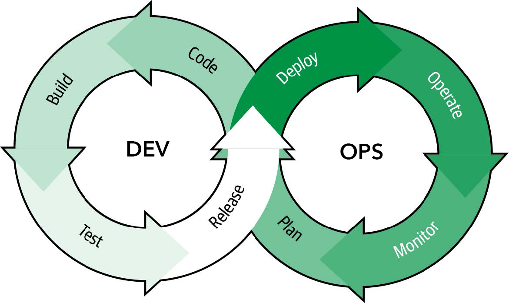
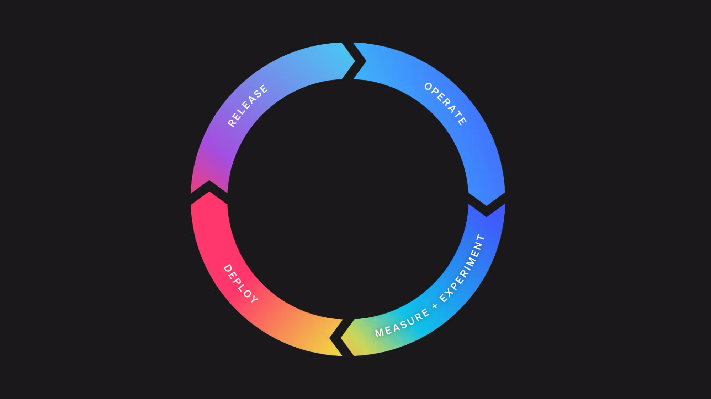

# Evolving Ops in DevOps Infinity Loop

Images can have an enormous impact on our understanding of a concept. This is hard wired in our brains. Studies have shown that it can take 1.2 – 2.4 seconds to comprehend an 8-word sentence while we process images in as little as 13 milliseconds. Thus images have a unique ability to influence our comprehension and perception.

What does this have to do with DevOps? The traditional DevOps infinity loop (pictured below) is frequently attributed to Dustin Whittle in a [post written in 2013](https://www.appdynamics.com/blog/engineering/devops-scares-me-part-2/ ). (An interesting side note is that the image itself is now broken in the original post.)

As you can see, it portrays DevOps as a sequence of phases. Visually, the completion of the prior phase is what triggers the next phase. For example, planning begins and ends before code and coding ends before the build begins and so on. However, the way this illustration was described in the text of the post focused more on the link between Dev and Ops and not the specific sequence of phases that the image has seared into our brains:

> I like to think DevOps can be explained simply as operations working together with engineers to get things done faster in an automated and repeatable way.

DevOps arguably never fell neatly into the sequential phases that the illustration lays out but, without a doubt, modern DevOps doesn't occur in a sequence of phases. These processes occur in parallel and often out of order. For example, testing may occur both before and after release if you use a test in production strategy and, if you're using feature flags, release will come after deploy.

But if DevOps does not have a linear structure, how do we make sense of it and build the processes effectively?

## Taking a Different Perspective

In our book, [Operating Continuously](https://learn.launchdarkly.com/operating-continuously/), Edith Harbaugh, Cody De Arkland and I focus in on the operations side of the loop. We lay out the best practices and processes that organizations are using to collaborate continuously and eliminate the step-by-step processes and dependencies that create the “baton handoff” motion between teams.

You'll notice that some steps have been reordered and others renamed. Let's look at how this differs from the traditional ops cycle.

* **Deploy** – The deployment process covers the workflow of moving compiled code onto a destination infrastructure or software platform. While this may seem fundamentally the same as the old model, a key differentiator here is that deploy and release are decoupled via feature flags. Wherein the old model would use a branching strategy that meant that deploys were large and infrequent, modern deploys are small and frequent using a [trunk-based development model](https://launchdarkly.com/blog/introduction-to-trunk-based-development/). This helps eliminate many of the bottlenecks – for instance, complex merge conflicts – that plagued the traditional system.
* **Release** – Most frequently, in the old model, deployment and release were linked. In fact, that is why the order was inverted in the older model, because release was about preparing code to be ready to deploy since, once code was deployed, it was typically live in production. Strategies like canary deployments existed, but required a lot of cost and effort to implement because they necessitated standing up duplicate infrastructure. Feature flags brought a fundamental shift to this way of operating by making things like [testing in production](https://launchdarkly.com/blog/testing-in-production-for-safety-and-sanity/), [beta programs](https://launchdarkly.com/blog/beta-testing-programs/), [progressive delivery](https://launchdarkly.com/guides/progressive-delivery/) and targeted rollouts relatively trivial to implement and thereby shifted the release responsibility to the ops side of the circle.
* **Operate** – Incidents play a heavy role in operations because, when incidents aren’t handled well, your operations team may find it has little time for anything else. A newer model of operations utilizing feature flags minimizes the risk of incidents via [kill switches](https://launchdarkly.com/blog/what-is-a-kill-switch-software-development/) that can mitigate an incident immediately – without rollbacks or redeploys. Increasingly, these kill switches are being automated as well, meaning incidents can be detected by an observability platform integration and resolved automatically, without the need of manual human intervention. These sorts of changes free up resources to focus on the people, processes and culture that make an organization operate smoothly and efficiently.
* **Measure and experiment** – Monitoring and observability are now blended into the operate step, creating the opportunity to implement practices that quantify the efficacy of the features we are releasing to end users more proactively. Measuring is about identifying, tracking, and learning from activities and events that occur within your application or from user interactions with it. Whereas experimentation enables us to proactively test whether we are releasing the right features to our users. Does the new code bring the performance boost we anticipated? Does a design change impact conversions? Answering these types of questions via experimentation can provide invaluable insights for our future decisions.

## Where To Go From Here

How does this all connect with the dev side of the infinity loop? Well, rather than an infinite loop, I'd think of it more like concentric circles share a common center or, even better, interconnected gears. In a gears metaphor, both circles, dev and ops, are running continuously and powering each other. Alternatively, if one side is failing to keep up or grinds to a halt, it will negatively impact the other side's ability to keep churning. Each side needs the other to turn efficiently to operate at full force.

How does this look in practice? The full book offers a lot of guidance around processes and implementation for your operations that can take many of the high level concepts discussed here and turn them into actionable steps. Best of all, it's completely free! So why not [grab your copy here](https://learn.launchdarkly.com/operating-continuously/)?