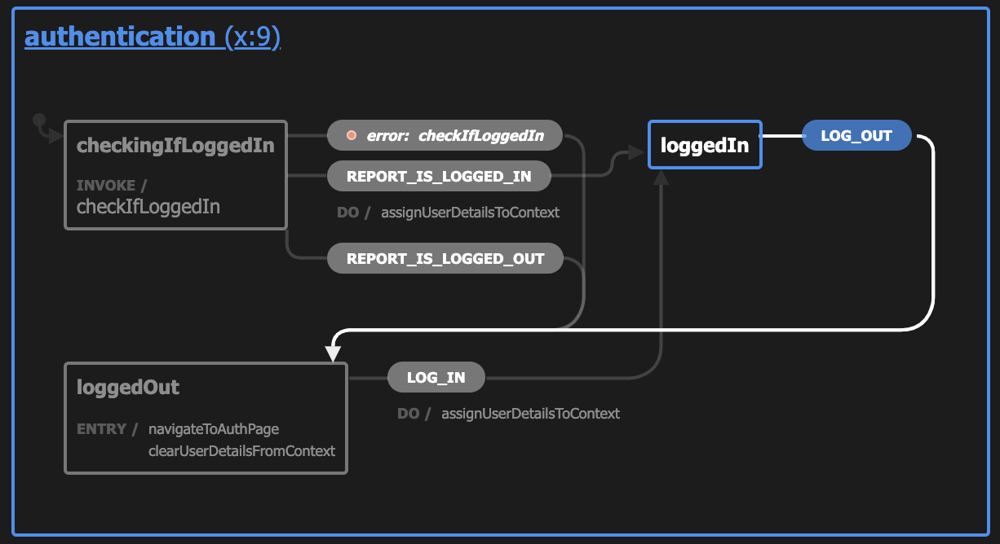

# Managing Application State with Finite State Machines

Tell me if this has ever happened to you. You're filling out a form online or logging into a system. You click a button to move to the next step and then...nothing. You sit in some transitional state, perhaps with a loading indicator, indefinitely and are eventually forced to go back or refresh to get out of that state. This might even cause you to lose your progress, which can be especially frustrating.

Oftentimes these problems are caused by two conflicting signals within a system that cause the application's UI to get stuck in a broken state. This is exactly the type of problem that state machines are designed to solve. In this post, we'll explore what state machines are and the types of problems they can solve. We'll also look at how to implement a state machine and where feature flags might play a role in testing alternate flows within a state machine.

## What are state machines?

I'll be honest, I read a lot of introductions to state machines while researching this post and most of them start by talking about mathematical abstractions and algorithms, which I found to be a little confusing at first. Essentially, a state machine is a way of representing all of the potential states of your application as well as the events or inputs that would trigger a transition to a new state and what that new state should be given specific events or inputs.

In most cases, when referring to state machines as it relates to application development (though not in all) we're referring to a state machine that is _deterministic_, meaning that, given specific inputs, a state will transition to a single subsequent state. If a state machine were _non-deterministic_, it would transition to one of multiple possible states.

In addition, we're typically talking about _finite_ state machines, meaning that there are a finite number of states. Yes, inifinite state machines are actually a thing, with the [Turing Machine](https://en.wikipedia.org/wiki/Turing_machine) being an example, but we won't deal with those here.

> If you want a good explanation of state machines on a conceptual level, including some discussion of when an infinite machine is necessary, I recommend this [FreeCodeCamp article by Mark Shead](https://www.freecodecamp.org/news/state-machines-basics-of-computer-science-d42855debc66/).
> 
> If you are looking for a good discussion of state machines from a more code-centric point of view, check out [this page in the XState documentation](https://xstate.js.org/docs/guides/introduction-to-state-machines-and-statecharts) (XState is a popular state machine library for JavaScript).

This is probably still a bit confusing, but an illustration should help clarify how a finite state machine might work. To illustrate, we'll use what's called a [state chart](https://statecharts.dev/), which is a way of representing state machines.

Imagine a typical authentication flow.

1. `checkingIfLoggedIn` (default state) - A user would start in a state where the application is verifying their log in status. If the check is successful, the `REPORT_IS_LOGGED_IN` event is fired indicating that they'd previously logged in. If it is unsuccessful, as in they have not previously logged in or an error occurs, the `REPORT_IS_LOGGED_OUT` event will fire.
2. The `REPORT_IS_LOGGED_IN` event will transition the user to the `loggedIn` state. From here, if the `LOG_OUT` event is fired (for example, if they click a log out link), then they will transition to the `loggedOut` state.
3. If the `REPORT_IS_LOGGED_OUT` event is fired, the user will transition to the `loggedOut` state. From here they can log in again, which triggers the `LOG_IN` event.

This flow would be represented by the following state chart.



If you're looking for more examples like this to understand state machines and state charts, XState has a nice [example catalogue](https://xstate-catalogue.com/).

## Creating a State Machine in XState

Let's explore how this looks in actual code. For our demos, we'll be using [XState](https://xstate.js.org/), a popular solution for creating state machines in JavaScript.

https://svelte.dev/repl/7b05d57dcdc04f49be72844e4b2825b3?version=3.44.0


```
npm i xstate @xstate/svelte --save
```

using feature flags in a state machine

solution 1: replace a specific state string with a flag

solution 2: load the entire json from a flag