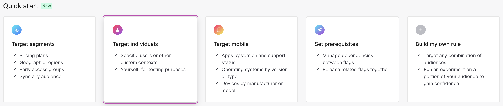
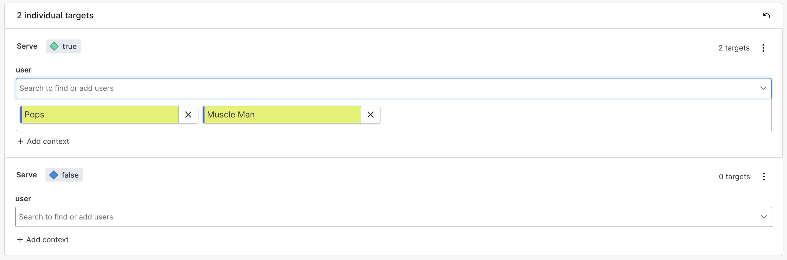
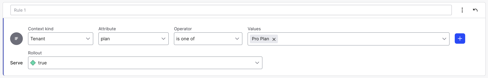
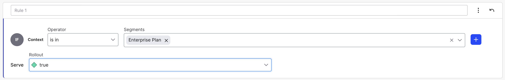
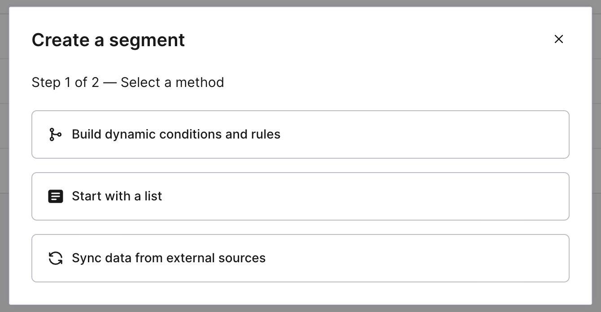
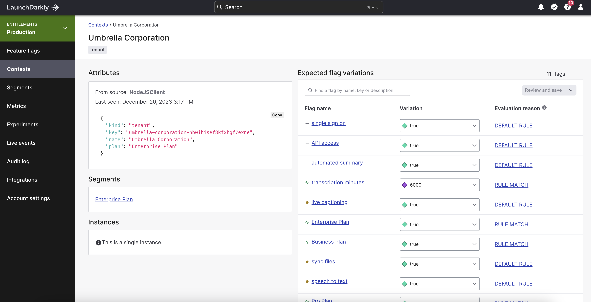

# A Beginner's Guide to Targeting with Feature Flags

A common question is, "Why should I pay for a feature management service like LaunchDarkly? What can it do that my homegrown system solution or config can't?" While the most accurate answer is "[a lot of things](https://launchdarkly.com/build-vs-buy/)," I feel that the most immediately impactful for organizations and developers is targeting.

But getting the hang of targeting might seem overwhelming if you are new to feature flags or have been trained on traditional, homegrown flags using a config file. The good news is that it's relatively straightforward (and powerful) once you get the lay of the land. This post will give you everything you need to master targeting using LaunchDarkly.

## What's the Context?

Contexts are the structure that you pass to LaunchDarkly to determine targeting. What makes contexts powerful is also what can make them daunting: they can be just about anything, and you can have as many of them as you need to.

What should be in your context? Whatever you want.

How many types of contexts should you have? However many you need.

It is so powerful yet daunting, so let's dig in deeper.

### The user context

Typically, when someone thinks about targeting, they think about a user, as in, "I want this feature enabled for this specific user or this type of user (ex. beta users)." Since this is such a standard practice, LaunchDarkly's only default context is the user context.

While there are no limitations on the kinds of data passed in a user context, it typically contains details about the current end user. You can send as much or as little information as you need for targeting purposes.

The most basic context is an anonymous user context. This context is given a unique ID but has no other identifying information.

```javascript
{
  "kind": 'user',
  "anonymous": true,
}
```

What is the point if there is no targeting data? Well, suppose you are planning to do any [percentage-based rollout](https://docs.launchdarkly.com/home/targeting-flags/rollouts/) or [experimentation](https://docs.launchdarkly.com/home/about-experimentation/). In that case, you will want these unique users to get correctly assigned to their cohort, which is only possible if they have a context.

Typically, you'll provide at least the [built-in attributes](https://docs.launchdarkly.com/home/contexts/built-in-attributes). In this case, only the `kind` and `key` attributes are necessary, but the `name` is optional, and `anonymous` defaults to `false` anyway, so it doesn't need to be specified.

```javascript
{
	kind: "user",
	key: "123userID",
	name: "Mordecai",
	anonymous: false
}
```

At this point, we could only target individual users by ID or name. We know that targe. Thankfully, you can provide any arbitrary data to the user context structure. For example, we may want their email, occupation, address, or other data that would allow us to target them by attributes.

```javascript
{
	kind: "user",
	key: "456userID",
	name: "Rigby,"
	email: "rigs@thepark.org"
	occupation: "groundskeeper"
	species: "raccoon"
	address: {
		street: "123 Park Street",
		city: "Lolliland"
	}
}
```
As you can see, contexts don't have to contain just simple data types but can include structures and arrays.

> It's crucial to note that all the examples in this tutorial are written in JavaScript, allowing you to construct contexts using JSON format. However, many SDKs require a builder class to create contexts. For example, in Python, this might look like `context = Context.builder("123userID").name("Rigby").build()`

### Multi-contexts

Targeting isn't just about users. LaunchDarkly allows you to define any context you need for your application. These could represent geolocation, organization, server environment, tenant, etc. You can even use these additional contexts to manage a [complete set of entitlements](https://launchdarkly.com/blog/managing-entitlements-in-launchdarkly/) using LaunchDarkly.

For example, in the example below, we've defined an additional `organization` and a `tenant` context, and we are passing them all to LaunchDarkly simultaneously by using a `multi` kind.

```javascript
{
	kind: "multi",
	user: {
		key: "789userID",
    name: "Benson Dunwoody",
    email: "benson@thepark.org",
    occupation: "Park Owner",
    species: "Gumball Machine"
	},
	organization: {
		key: "ThePark0123",
		name: "The Park"
	},
	tenant: {
    key: "the-park-3g6xvhyu5kl3w-ixfeosq",
    plan: "Business Plan"
	}
}
```

The importance of using multi-contexts is that it allows you to create complex targeting rules for all sorts of scenarios that don't involve a user while also not polluting the user object with properties that aren't related to the user specifically. For example, you could add a targeting rule for a specific organization using the context above that makes an exception to standard entitlements without targeting each user within that organization. Targeting multiple contexts and context types becomes especially important for [experimentation](https://docs.launchdarkly.com/home/about-experimentation/).

### Mobile contexts

A typical application requirement is to be able to target specific mobile devices, OS versions, mobile app versions, and more. Rather than requiring you to manually pass all of this information, LaunchDarkly adds [automatic environment attributes](https://docs.launchdarkly.com/sdk/features/environment-attributes) to a mobile application and mobile device context.

### Secure Mode

You may wonder (or worry) about passing certain identifying or proprietary data to LaunchDarkly. Worry not — LaunchDarkly allows the setting of all the context attributes or just specific attributes to be private.

You can do this via options upon initialization to the SDK client.

```javascript
// All attributes marked private
const options = {
  allAttributesPrivate: true
};
client = ld.init('sdk-key-123abc', options);

// Specific attributes marked private
const options = {
  privateAttributes: ['email', 'species']
};
client = ld.init('sdk-key-123abc', options);
```

...or even specify which attributes should be private when creating a context.

```javascript
const user = {
  kind: 'user',
  key: 'user-key-123abc',
  email: 'pops@thepark.org',
  privateAttributes: ['email'],
};
```

For more details about private attributes, [check the documentation](https://docs.launchdarkly.com/sdk/features/private-attributes#nodejs-server-side).

## Individual targeting

Up to this point, we've spent all our time discussing creating contexts, but let's start putting those contexts to use. We'll begin with individual targeting because it's the easiest to wrap your head around.



As its name implies, individual targeting will set a specific variation of a feature flag for a particular context instance by its key. You can add as many individual targets to a variation as possible. It's essential to know that the targeting will only work if the key is the same. So, if your system uses randomly defined user keys, this system will only work for short-term testing.



Remember that these are individual _contexts_ not individual _users_, so, for example, this could target a server environment, mobiles, organization, etc.

## Rule-based Targeting

In many cases, you'll want to target any contexts that share an attribute or attributes. In this case, you'd want to use rule-based targeting. This type of rule would be a "custom rule" within LaunchDarkly. In the example pictured below, I am targeting a variation to any tenant contexts with a "Pro Plan" plan attribute value.



Above is a simple key-value matching rule with a single value. You can match several values, not just one. You also have many options for the matching operator rather than just the "is one of," including partial, regex, and server matches. In addition, you can combine multiple rules to create more complex targeting logic. For example, I suggest looking for tenants in the Pro Plan and organizations based in North America.

## Segment targeting

Maintaining these sorts of individual targets or targeting rules on every flag in your environment can get complicated and prone to error if you have a lot of flags. The more effective method is to create a segment of users and then target the segment.

A segment in LaunchDarkly can accept the exact individual targeting or custom targeting rules we discussed above. Once a segment has rules applied, you can add a segment rule to any flag variations you want to target to that segment. The variations all happen while maintaining the targets in a single place.



You aren't limited to creating segments in LaunchDarkly via rules or individual targets. You can do things like build [list-based segments](https://docs.launchdarkly.com/home/segments/list-based-segments#larger-list-based-segments) that are imported from a file (ex. a CSV file) or even [sync segments](https://docs.launchdarkly.com/home/segments/synced-segments) from an external tool like Amplitude, Census, Fulcrum, Heap, Hightouch, RudderStack, and Twilio. 



## Targeting Insights

Ok. So now you are a targeting expert, adding segments, rules, and individual targets. How can you keep track of all of these to ensure that a particular context is in the right segments and receiving the correct flag variations? The good news is that LaunchDarkly provides a detailed view of contexts that gives you all of these insights.



The detailed view shows you the exact context that LaunchDarkly received, any segments this context is in, and the flag variation this context would receive, including the reason for this evaluation. This view eliminates any guesswork in testing your context, flag, or segment configuration.

## What's Your Target?

Go forth with this information and the encouragement you need to get started using targeting with LaunchDarkly. Targeting is the "secret sauce" of feature flags using a feature management service like LaunchDarkly. It opens up so many different capabilities that a traditional, homegrown feature flag can't do.

If you'd like to explore deeper into what you can do with targeting, here are some additional resources that I'd highly recommend:

* [Setting the Right Contexts With LaunchDarkly](https://launchdarkly.com/blog/setting-the-right-contexts-with-launchdarkly/) by Peter McCarron
* [Managing Entitlements in LaunchDarkly](https://launchdarkly.com/blog/managing-entitlements-in-launchdarkly/?q=entitlements) by me
* [Introducing Custom Contexts - Unlock Limitless Targeting Possibilities](https://youtu.be/jW_IZrGi1Tk?si=quKFl4MXheZks26C) (video) by Peter McCarron
* [Talkin Ship: Targeted Entitlements with LaunchDarkly](https://youtu.be/ZVxh9Uqds4w?si=sUIHQIrEA1-Klo61) by Cody De Arkland
