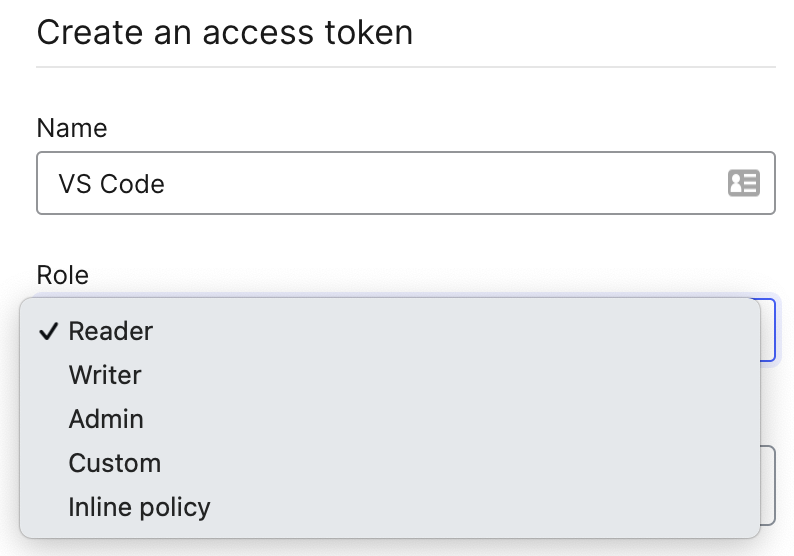
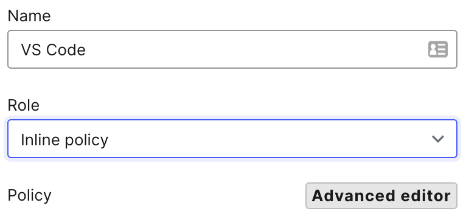
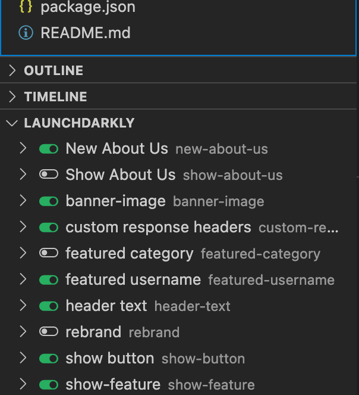
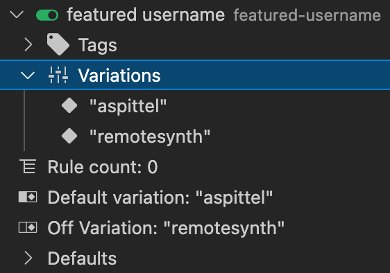
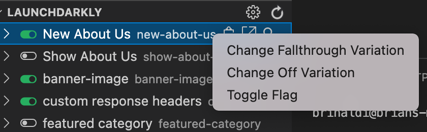
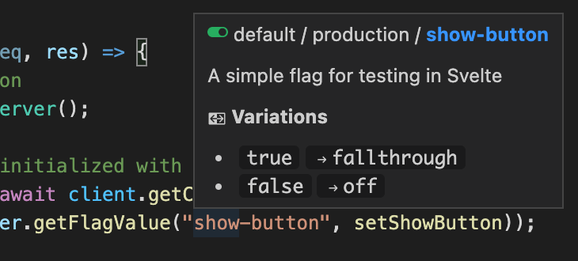

# Managing Feature Flags in Visual Studio Code


If you're like me, you spend a lot of time in Visual Studio Code and you use a lot of feature flags in your code. As you are developing and testing, this could mean you spend a lot of time switching from your code in VS Code to your flags in the LaunchDarkly dashboard. Well, what if I told you that you don't need to do that?

In this post I will brielfy explore LaunchDarkly's [Visual Studio Code extension](https://marketplace.visualstudio.com/items?itemName=LaunchDarklyOfficial.launchdarkly). We'll see how to get it set up and how to use it.

## Getting Set Up

To start with, you'll need to have a Pro or Enterprise plan on LaunchDarkly to use the extension. Assuming you have one already, let's get the extension installed and configured.

1. Open the extensions toolbar, which should be on the left of your Visual Studio Code and search for LaunchDarkly. Install the extension.
2. Next we'll need an access token from LaunchDarkly to enable the extension to connect.
   * In your LaunchDarkly dashboard, choose "Account settings" on the left hand menu and then select the "Authorization" tab and click the "Create token" button.
   * Name your token however you like (I named mine "VS Code"). On the role drop-down, choose "inline".
		
   * Next, click the button to open the "Advanced editor"
		
   * With the advanced policy editor open, we can paste in the inline policy provided in [the documentation](https://docs.launchdarkly.com/integrations/vscode#configuration) (I am providing it here as well for quick access):
		```javascript
		[
      {
        "effect": "allow",
        "actions": ["viewProject"],
        "resources": ["proj/*"]
      },
      {
        "effect": "allow",
        "actions": [s
          "updateOn",
          "updateFallthrough",
          "updateOffVariation"
          ],
        "resources": ["proj/*:env/*:flag/*"]
      }
   	 ]
		```
   * You can leave the API version as is. Go ahead click the "Save button".
   * Be sure to copy the token as it will not be accessible once you leave the page.
3. Return to VS Code and open the command pallete (Command+Shift+P) and search for the the "LaunchDarkly: Configure Settings" command. This will walk you through the steps to configure LaunchDarkly.
	* Choose to enter a new access token and paste the token you copied from the dashboard.
	* Choose the project you want to connect, then the environment and finally whether you want these settings to apply to all your workspaces or just the currently open workspace.

Assuming VS Code gave you a "LaunchDarkly configured successfully" toast message, you are good to go. So let's see how you can use it.

## Using the extension

Now that the extension is configured, you should see a LaunchDarkly pane beside your code (mine is below the Explorer, Outline and Timeline panes). It should already list all of the flags in the currently connected project and environment with a toggle beside each indicating their targeting status, with green representing those that have targeting turned on.



> Note that if you run into any issues initially loading flags in the extension, these can typically be fixed by restarting VS Code.

If you expand a particular flag, you'll also get a ton more details about it including any tags that are assigned to it, all of the variations, what the current variations value is and more.



If you click the clipboard icon next to each flag, you can easily copy the flag key to paste into your code and avoid typos. Or click the arrow icon to open the specific flag in the dashboard. More importantly, you can now turn a flag on or off without ever leaving VS Code. Right-click on the flag you want to change and then choose "Toggle flag." So there's no need to open the LaunchDarkly dashboard for toggling a flag during your development and testing.



Oh, one more thing... Want to get details for a flag you used within your code? There's no need to dig through the panel and find the flag. Just hover over the flag key in your code and you'll see details about flag.



## More to come!

The extension will already save you time and hassle. Toggling flags without leaving VS Code in and of itself is super helpful in my opinion. But we've got more in store for future versions to make it even easier to work with flags without ever leaving your IDE.